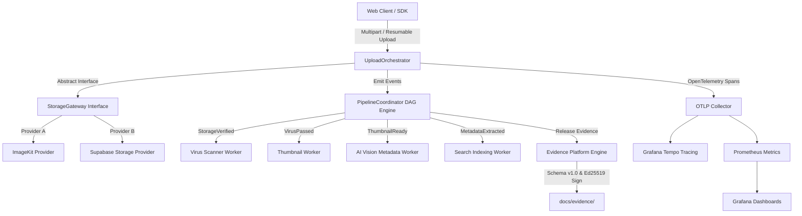

# Canonical System Architecture Specification

> **Master Platform Map & Technical Reference**  
> **Status:** Active / Production Delivery Standard  
> **Governance Authority:** [`docs/adr/`](file:///e:/main/docs/adr/) | [`docs/policies/release-policy.json`](file:///e:/main/docs/policies/release-policy.json)

Welcome to the central system architecture map for the Digital Asset Management (DAM) & Media Engineering Platform. This document connects every architectural subsystem, telemetry pipeline, DAG state engine, evidence contract, and release governance policy into a single authoritative reference.

---

## 1. High-Level Architecture Topology

The application uses an event-driven, decoupled media pipeline architecture with OTLP telemetry ingress:



---

## 2. Core Subsystems & Technical Contracts

| Subsystem | Responsibilities | Key Files / Entry Points | Verification & Tests |
| :--- | :--- | :--- | :--- |
| **Upload Ingress** | Idempotency keys, provider fallback, storage cleanup on failure | [`UploadOrchestrator.ts`](file:///e:/main/apps/web/src/services/media/UploadOrchestrator.ts)<br>[`StorageGateway.ts`](file:///e:/main/apps/web/src/services/media/StorageGateway.ts) | [`FaultInjection.test.ts`](file:///e:/main/apps/web/src/test/chaos/FaultInjection.test.ts) |
| **Pipeline DAG Coordinator** | Event deduplication, out-of-order buffering, tenant domain policy (`Marketing`, `Legal`, `Media`) | [`PipelineCoordinator.ts`](file:///e:/main/apps/web/src/services/media/PipelineCoordinator.ts) | [`PipelineChaos.test.ts`](file:///e:/main/apps/web/src/test/chaos/PipelineChaos.test.ts) |
| **Observability Telemetry** | Modular OTLP exporter factory, context propagation, collector resilience | [`TelemetryBootstrap.ts`](file:///e:/main/apps/web/src/analytics/telemetry/TelemetryBootstrap.ts)<br>[`Metrics.ts`](file:///e:/main/apps/web/src/analytics/telemetry/Metrics.ts) | [`collector-resilience.test.ts`](file:///e:/main/apps/web/src/test/telemetry/collector-resilience.test.ts) |
| **Evidence Platform Engine** | Ed25519 signing, schema v1.0 validation, EWMA statistical trend analysis | [`evidence-engine.ts`](file:///e:/main/scripts/evidence-engine.ts)<br>[`v1.json`](file:///e:/main/docs/evidence/schema/v1.json) | `npx vite-node scripts/evidence-engine.ts --verify-sig` |
| **Release Promotion Engine** | Multi-gate synthetic health, declarative policy evaluation, release decisions (`PROMOTE`, `HOLD`, `ROLLBACK`) | [`release-verification.ts`](file:///e:/main/scripts/release-verification.ts)<br>[`release-policy.json`](file:///e:/main/docs/policies/release-policy.json) | `npx vite-node scripts/release-verification.ts` |

---

## 3. Architecture Decision Records (ADRs)

Key technical choices are governed by immutable decision records linked to evidence artifacts:

- [`ADR-0001: Evidence-Driven Release Promotion Policy`](file:///e:/main/docs/adr/0001-evidence-driven-release-promotion-policy.md): Decouples deployment promotion rules into declarative configuration files ([`release-policy.json`](file:///e:/main/docs/policies/release-policy.json)).
- [`ADR-0002: Asymmetric Ed25519 Cryptographic Evidence Signatures`](file:///e:/main/docs/adr/0002-asymmetric-ed25519-evidence-signatures.md): Establishes Ed25519 private key signing and public key verification (`public.key`) for cryptographic non-repudiation.

---

## 4. Evidence Platform & Cryptographic Verification Topology

All platform claims must be backed by verifiable evidence:

1. **Schema Specification:** Bound to [`docs/evidence/schema/v1.json`](file:///e:/main/docs/evidence/schema/v1.json).
2. **Asymmetric Signing:** Signed via Ed25519 private key into [`docs/evidence/signature.json`](file:///e:/main/docs/evidence/signature.json). Verified publicly via [`docs/evidence/public.key`](file:///e:/main/docs/evidence/public.key).
3. **SHA-256 Checksums:** All archived evidence files (`EV-*.json`) are indexed in [`manifest.json`](file:///e:/main/docs/evidence/manifest.json) and [`SHA256SUMS`](file:///e:/main/docs/evidence/SHA256SUMS).
4. **Append-Only History:** Historical evidence artifacts are never mutated. Convenience pointer [`latest-release.json`](file:///e:/main/docs/evidence/latest-release.json) links to the newest verified bundle.

---

## 5. Declarative Release Promotion Policy

Release decisions are governed by [`docs/policies/release-policy.json`](file:///e:/main/docs/policies/release-policy.json):

```json
{
  "policyVersion": "1.0",
  "thresholds": {
    "architectureCoverage": { "minimumPassRate": 100 },
    "performance": { "maxAvgMsPerOp": 10.0, "maxHeapGrowthMB": 50.0 },
    "vulnerabilities": { "maxCritical": 0, "maxHigh": 0 },
    "operationalGates": {
      "requireLiveness": "ALIVE",
      "requireReadiness": "READY",
      "requireHealth": "HEALTHY",
      "requireAvailability": "SLO_ACHIEVED"
    },
    "userJourney": { "requireE2ETransactionPass": true }
  }
}
```

- **Pass All Gates:** Recommends `PROMOTE`.
- **Non-Critical Flaw:** Recommends `HOLD`.
- **Critical Failure:** Recommends `ROLLBACK`.

---

## 6. Verification & Operations CLI Reference

Run these commands to verify system state:

```bash
# 1. Execute Developer Performance Benchmark
npm run test:load:tier-a

# 2. Run Enforced JSON Schema Gate
npx vite-node scripts/evidence-engine.ts --validate

# 3. Verify Ed25519 Cryptographic Signatures
npx vite-node scripts/evidence-engine.ts --verify-sig

# 4. Run Release Verification Pipeline
npx vite-node scripts/release-verification.ts

# 5. Run Statistical EWMA & 2σ Control Limit Trend Report
npx vite-node scripts/evidence-engine.ts --trend
```

---

## 7. Capacity & Operational Sizing Model

See [`docs/architecture/capacity-model.md`](file:///e:/main/docs/architecture/capacity-model.md) for worker sizing curves, QPS targets, and observability infrastructure bounds.
