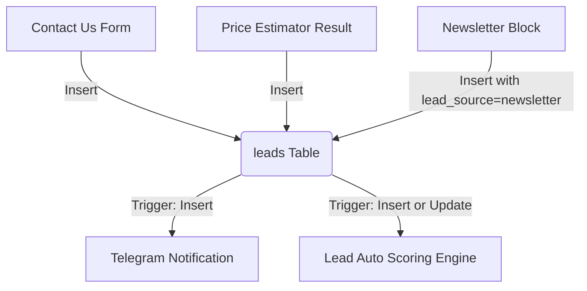

# Automation & Integrations Audit Report

This audit traces lead capture workflows, database triggers, background cron scheduling, and error handling retry mechanisms within the **Cross Angle Interior** system.

---

## 1. Lead Capture Workflow

Leads are generated through three primary frontend channels and consolidated into the `leads` table:

---

## 2. Asynchronous Database Triggers

To minimize write latency on frontend forms, lead processing is offloaded to background triggers that invoke Supabase Edge Functions:

### A. Real-time Notifications (`on_lead_insert_telegram_notify`)
* **Trigger Event**: `AFTER INSERT` on `public.leads`.
* **Execution**: Calls the database HTTP utility (`net.http_post`) to trigger the `/notify-telegram` Edge Function.
* **Benefit**: The user gets instant confirmation on the website, while notifications are queued asynchronously without blocking the user interface.

### B. Lead Scoring & Qualification (`on_lead_change_score_update`)
* **Trigger Event**: `AFTER INSERT OR UPDATE` on `public.leads` for scoring-relevant columns (e.g., budget, category, email, phone, message).
* **Execution**: Triggers the `/auto-score-lead` Edge Function, which calculates the lead score.
* **Lifecycle Rule**: Sets `closed_at` to `now()` when a lead's status changes to `won` or `lost`.

---

## 3. Scheduled Tasks & Cron Automation (`pg_cron`)

Background jobs are managed via the native PostgreSQL `pg_cron` extension, avoiding the need for external scheduling servers:

1. **Stale Lead Checker (`stale-lead-checker-every-6h`)**:
   * **Schedule**: `0 */6 * * *` (Every 6 hours).
   * **Operation**: Makes a POST request to `/functions/v1/stale-lead-checker`. Detects inactive leads, highlights urgent entries, and prepares executive summary notifications.
2. **Weekly Summary Cron (`schedule_weekly_report_cron`)**:
   * **Schedule**: Generates weekly performance statistics, pipelines, and site traffic summaries, sending them to configured report recipients.

---

## 4. Webhook Reliability & Retry Mechanisms

A major operational bottleneck in third-party integrations (e.g., CRM syncs, mail triggers) is network fragility. The platform addresses this using a dedicated queue table:

### Webhook Failures System (`webhook_failures`)
* **Purpose**: Any failed outbound integration logs an entry in `webhook_failures` containing the `webhook_url`, complete `payload`, and the `error_message`.
* **Retry Engine**:
  * Tracks `attempt_count`.
  * Computes an exponential backoff time stored in `next_retry_at`.
  * Uses a highly efficient index (`idx_webhook_failures_pending` on `next_retry_at` filtered `WHERE status = 'pending'`) to poll and retry records without loading the database.

---

## 5. Security & Reliability Recommendations

* **Dead Letter Queue (DLQ)**: Set a hard limit on attempts (e.g., `max_attempts = 5`). Once reached, transition status from `pending` to `failed` and trigger a high-priority alert so administrators can investigate.
* **Webhook Signature Verification**: Edge functions handling inbound webhooks should verify the signature payload to ensure requests originate from trusted upstream sources.
