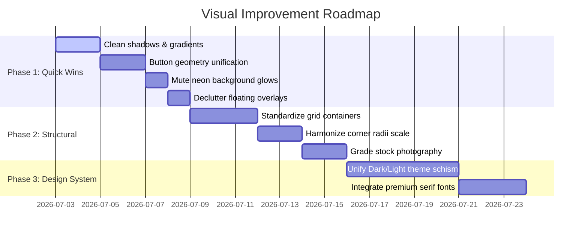

# UI/UX & Visual Audit Report: Crossangle Interior
**Lead Design Director | Wix Studio, Linear, Framer, and Awwwards-Level Agency Persona**

---

## Executive Summary

The **Crossangle Interior** digital experience is structurally sound and technically responsive, but it suffers from a division of visual identity. It currently functions as two distinct websites glued together: a **theatrical, high-contrast dark mode homepage** (Crimson `#C41230` and Gold `#D1AF6E` on Black) and an **airy, organic light-cream estimator/discovery funnel** (Sage Green `#5a705e` and Gold-Brown `#7a5c30` on Cream `#faf8f5`).

While the developer profile indicates a design-conscious approach, the execution contains significant "design debt"—particularly in mismatched typography systems, arbitrary corner radii, competing floating widgets, and lack of visual restraint. To achieve an Elite, Awwwards-level standard, the application must transition from a "component-driven template" to a **professionally art-directed, minimal, luxurious architectural canvas** that prioritizes whitespace, singular color systems, and strict component rules.

---

## Overall Premium Score: 43 / 100
*Tier: Intermediate Agency-level*

This score reflects a project with strong technical foundations (smooth transitions, GSAP horizontal scroll, responsive grids) but critical consistency gaps that prevent a luxury brand feeling.

### Scoring Breakdown
| Category | Score | Evaluative Verdict |
| :--- | :--- | :--- |
| **1. Visual Hierarchy** | 5/10 | Focal points compete; heavy text shadows and loud banners fight with architectural imagery. |
| **2. Color System** | 4/10 | Direct theme conflict (Dark/Crimson vs Light/Sage-Cream) and lack of luxury palette discipline. |
| **3. Typography** | 5/10 | Basic system serifs and sans-serifs feel generic; lack of high-end editorial kerning. |
| **4. Spacing & Rhythm** | 5/10 | Crowded section densities, inconsistent margins, and shifting container widths. |
| **5. Layout System** | 5/10 | Modular SaaS/landing layout rather than asymmetrical, magazine-style editorial layouts. |
| **6. Surface Design** | 4/10 | Over-reliance on decorative glass effects, glows, and mismatched shadow styles. |
| **7. Imagery & Visual Language** | 5/10 | Stock photos have mismatched color temperatures; lack of unified cropping/ratios. |
| **8. Component Consistency** | 3/10 | Extreme variation in buttons (sharp block vs pill vs rounded-10px) and inputs. |
| **9. Wix / Framer / Awwwards Benchmarking** | 4/10 | Missing the signature minimalism, typographic confidence, and whitespace discipline. |
| **10. Design Debt Reduction** | 3/10 | Too many competing corner radii, shadow tokens, and border styles. |

---

## 10-Dimensional Detailed Audit

### 1. Visual Hierarchy (Score: 5/10)
* **Focal Point Conflict:** On the Home Hero, the Ken Burns slide animation fights with the heavy white-to-gold header gradient text. The browser does not know whether to look at the cinematic interior render or read the text.
* **Overpowering Elements:** Floating widgets (WhatsApp button, social bar, page dots, scroll progress) are constantly active on the screen, creating visual noise that distracts from the photography.
* **Heavy-Handed Details:** The use of heavy text shadows (`text-shadow: 0 10px 38px rgba(0,0,0,0.42)`) feels dated and "development-built" rather than editorial. High-end brands rely on contrast and font-weight instead of text shadows to make elements readable.

---

### 2. Color System (Score: 4/10)
* **Theme Schism:**
  * **Homepage / About / Services:** Deep black, crimson, and bright gold.
  * **Estimator / Discovery:** Cream (`#faf8f5`), charcoal (`#1a1a1a`), sage green, and muted brown-gold (`#7a5c30`).
  * **Impact:** Breaking the color system across pages destroys brand trust. A customer enters a dark, moody studio and is suddenly redirected to a bright green-beige calculator.
* **Accent Overuse:** Crimson (`#C41230`) and Gold (`#D1AF6E`) are used as primary and secondary accents simultaneously on dark pages. In premium design, one accent must dominate while the other serves as a micro-highlight (e.g. 95% neutral/monochrome, 5% accent).
* **Surface Inconsistencies:** Multiple dark card background values (`#0d0d0c`, `#0a0a09`, `#100D0A`, `hsl(0 0% 7%)`) fight each other instead of adopting a unified surface token scale.

---

### 3. Typography (Score: 5/10)
* **Font Pairing Deficit:** The sans-serif (Inter/DM Sans) and generic browser serif fail to create a luxury brand feel. Premium editorial sites typically pair a refined display serif (e.g., *Cormorant Garamond*, *Ogg*, *Caslon*) with an ultra-clean geometric sans (e.g., *Plus Jakarta Sans*, *Helvetica Neue*, *Montserrat*).
* **Line Length:** Some body copy blocks exceed the optimal 60-70 character limit, reducing reading comfort on wide viewports (e.g., in the About page studio profile description).
* **Kerning and Editorial Contrast:** Uppercase kickers and labels lack consistent letter-spacing. Some use `tracking-[0.38em]`, others use `tracking-[0.2em]`, and others use standard spacing.

---

### 4. Spacing & Rhythm (Score: 5/10)
* **Shifting Container Widths:** The layout switches between `container-wide` (`max-w-[1600px]`), `max-w-7xl` (`1280px`), and `max-w-[1480px]`. As a result, margins and grid alignments shift horizontally as the user scrolls, creating a disorganized feel.
* **Lack of Breathing Room:** Vertical section padding is crowded. Sections feel rushed rather than relaxed. Luxury websites use spacious margins (e.g., `py-36` or `12vw` vertical margins) to let high-end photography shine.
* **Whitespace Balance:** High-density text grids are placed too close to full-bleed images, lacking a gradual transition or negative space buffer.

---

### 5. Layout System (Score: 5/10)
* **Template feeling:** The layout is highly component-driven and symmetrical. It uses standard card grids, horizontal sliders, and alternating text/image rows.
* **Missing Editorial Feeling:** It lacks asymmetrical layouts, full-bleed cinematic image sections, and offset typographic arrangements characteristic of bespoke design agencies.
* **Repetitive Grids:** The use of simple three-column grids across the portfolio teaser, style discovery teaser, and testimonials feels template-built.

---

### 6. Surface Design (Score: 4/10)
* **Excessive Glassmorphism:** The glass card styling (`backdrop-filter: blur(24px) saturate(180%)`, inset border, and shadows) is used as a generic wrapper. In high-end design, surfaces are flat, solid, or use simple, precise borders.
* **Inconsistent Corners:** Corner radii range from completely sharp (`rounded-none`) to soft (`rounded-[10px]`, `rounded-2xl`, `rounded-[3rem]`). This lacks architectural discipline.
* **Glow Overkill:** Glowing radial shadows (e.g., Crimson and Gold orbs) are placed in backgrounds, creating a gaming or futuristic SaaS feel rather than a physical, tactile architectural studio aesthetic.

---

### 7. Imagery & Visual Language (Score: 5/10)
* **Mismatched Imagery Tone:** Photography includes stock images with highly divergent color grading. Some images have warm orange tones, while others use cool blue concrete finishes.
* **Aspect Ratios:** Portfolio cards mix vertical aspect ratios (`4/5` and `3/4` layouts) in the same horizontal track, creating vertical shifts that disrupt clean horizontal lines.

---

### 8. Component Consistency (Score: 3/10)
* **The Button Mess:**
  * **Hero:** Sharp corners (`rounded-none`), crimson background, `tracking-[0.2em]`.
  * **Style Teaser:** Rounded corners (`rounded-full`), white background, `tracking-[0.2em]`.
  * **Estimator Intro:** Rounded corners (`rounded-full`), green background, `tracking-[0.15em]`.
  * **Estimator Flow:** Soft corners (`rounded-[10px]`), brown-gold background, standard capitalization.
  * **Impact:** This is the single clearest indicator of "development-built" code rather than a singular design system. Buttons should share a unified geometry.
* **Inputs & Badges:** Different input border styles (`border-white/10` vs `border-[#e8e4dd]`) and hover states are used across the public form and the estimator flow.

---

### 9. Premium Score & Benchmarking (Score: 4/10)
* **What Wix Studio / Framer Premium Templates / Awwwards do differently:**
  * **Extreme Visual Discipline:** They establish one layout grid, one typography scale, and one button styling, maintaining it throughout the entire journey.
  * **Subtlety:** Backgrounds are solid black, off-black, or warm off-white. They do not use neon glows, text gradients, or complex animations.
  * **Tactile Aesthetics:** They focus on real materials (high-resolution architectural images, clean hairline dividers, subtle parallax) rather than digital-only effects.

---

### 10. Design Debt (Score: 3/10)
* **Radius Scale Debt:** Over 6 different corner radius values are used in the codebase.
* **Color System Debt:** Mismatched colors across main routes (pure black/crimson vs cream/sage).
* **Overlay Debt:** Too many floating widgets fighting for user clicks.
* **Typographic Debt:** Inconsistent tracking on uppercase elements.

---

## Top 20 Issues Ranked by Impact

| Rank | Issue | Category | Impact | Effort | Description |
| :--- | :--- | :--- | :--- | :--- | :--- |
| **1** | Color & Theme Divide | Color System | Critical | Medium | Dark mode homepage vs Light cream estimator breaks brand identity. |
| **2** | Button Style Fragmentation | Component | Critical | Low | Mixing `rounded-none`, `rounded-full`, and `rounded-[10px]` shapes. |
| **3** | Heavy Heading Text Shadows | Visual | High | Low | Text shadows feel dated and muddy the luxury photography. |
| **4** | Shifting Container Widths | Spacing | High | Medium | Grid columns shift width horizontally as you scroll. |
| **5** | Conflicting Accent Colors | Color System | High | Low | Crimson and Gold fighting for dominance on dark pages. |
| **6** | Inconsistent Corner Radii | Surface | High | Low | Incoherent rounding across cards, buttons, and sections. |
| **7** | Generic Typographic System | Typography | High | Medium | Default font styles lack premium editorial feel. |
| **8** | Shifting Background Grays | Color System | High | Low | Mixing `#0d0d0c`, `#0a0a09`, `#100D0A`, and HSL grays. |
| **9** | Shaded Text Gradients | Visual | Medium | Low | Gradient fills make headers look like a SaaS app, not an architecture studio. |
| **10** | Floating Widget Overlap | Hierarchy | Medium | Low | WhatsApp, social bar, progress dots, and page scroll occupy the screen. |
| **11** | Inconsistent Section Padding | Spacing | Medium | Low | Vertical margins feel crowded and vary from 90px to 144px. |
| **12** | Stock Image Color Mismatch | Imagery | Medium | Low | Unsplashed photography displays contradictory warm/cool filters. |
| **13** | Shifting Input Border Styles | Component | Medium | Low | Form fields use different borders and radii depending on the route. |
| **14** | Heavy Glassmorphism | Surface | Medium | Low | Glass cards with saturation and thick borders look over-designed. |
| **15** | Background Neon Glows | Surface | Medium | Low | Tech-like radial glows detract from organic interior architecture. |
| **16** | Mismatched Aspect Ratios | Imagery | Medium | Low | Project cards in the horizontal track have uneven heights. |
| **17** | Missing Editorial Layouts | Layout | Medium | High | Symmetrical layout elements make the site feel like a template. |
| **18** | Inconsistent Tracking | Typography | Low | Low | Tracking varies from `0.15em` to `0.38em` on uppercase headers. |
| **19** | Long Line Lengths | Typography | Low | Low | Text blocks span too wide, lowering readability on desktops. |
| **20** | Inconsistent Star Ratings | Component | Low | Low | Star rating designs differ in glowing and static weights. |

---

## Actionable Improvement Plan

### Phase 1: Quick Wins (High Impact, Low Effort)
1. **Remove Heading Text Shadows & Gradients:**
   * Strip out heavy text shadows and gradient fills on all `h1` and `h2` elements. Replace with solid, clean color and increase font-weight / contrast.
2. **Consolidate Button Geometry:**
   * Choose a single geometric shape for all primary buttons. For a premium architectural studio, **sharp corners (`rounded-none`)** or **subtle corners (`rounded-[4px]`)** convey a structural, high-end feeling. Eliminate all `rounded-full` buttons.
3. **Mute background glows:**
   * Reduce the opacity of background radial colors (e.g. `var(--home-glow-crimson)` and `var(--home-glow-gold)`) by 70% or remove them entirely to focus attention on the core photography.
4. **Clean up Floating Overlays:**
   * Restrict floating social bars and section nav dots to the homepage only, or merge them. Ensure they do not load on calculator or discovery pages to declutter the workspace.

### Phase 2: Structural Improvements (Medium Effort)
1. **Standardize Layout Widths:**
   * Create a single grid container standard (e.g. `max-w-7xl` or a custom `max-w-[1440px]` with `px-8` side margins) and apply it to the Header, Footer, and all page body sections.
2. **Harmonize Corner Radii:**
   * Define three explicit radii values in `index.css`:
     * `radius-sm`: `2px` (for checkboxes, inputs)
     * `radius-md`: `6px` (for standard cards)
     * `radius-lg`: `12px` (for large image cards)
   * Eliminate all large rounded corners (`rounded-[3rem]`) which look bubbly rather than premium.
3. **Audit and Grade Photography:**
   * Pass all Unsplash images through a unified dark/warm color grade filter (e.g., lower saturation, slight warm shift) so the visual language is coherent.

### Phase 3: Design System Improvements (Long-Term)
1. **Unify the Theme (The Core Schism):**
   * Transition the entire website to a **disciplined dark system** (deep charcoal backgrounds, warm limestone text, and subtle champagne gold/wine accents) OR a **monochrome light system** (warm linen background, off-black text, and structured dark headers).
   * Do not mix bright dark pages with cream sage-green calculators.
2. **Editorial Typography Integration:**
   * Import a high-end display serif font (e.g. *Cormorant Garamond* via Google Fonts) for all main headings (`h1`, `h2`) and a clean grotesque sans (e.g. *Plus Jakarta Sans*) for body text.

---

## Prioritized Implementation Roadmap

> [!NOTE]
> All suggested commands for execution will follow once this initial audit is reviewed and aligned. No files have been modified yet.
