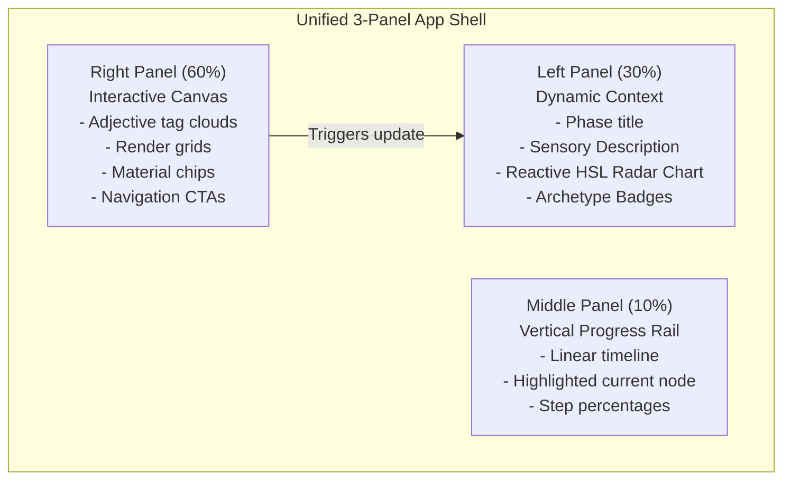
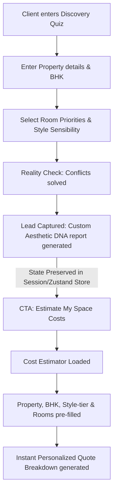
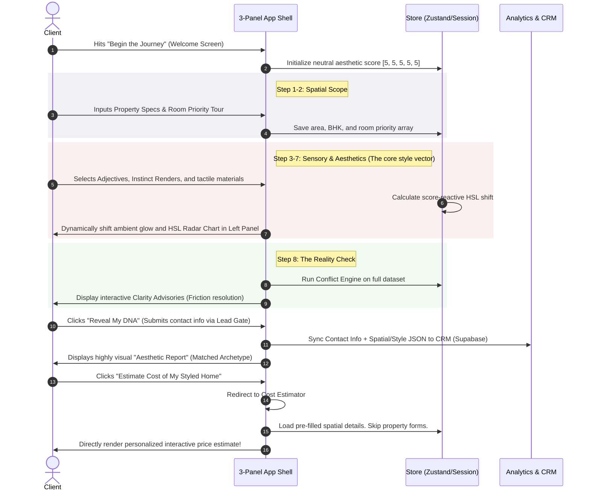

# Executive Architectural Alignment & Aesthetics Refinement Plan

## Bridging "Dream Home Brief" (kiro-p1/kiro-p2) with existing Discovery & Estimator Add-ons

---

### Executive Vision

This plan establishes a comprehensive strategy to harmonize the aesthetics, layout, and data pipelines of the **Style Discovery Engine** and the **Interior Cost Estimator**. By learning from the elite interactive UX of `kiro-p1` and `kiro-p2` ("Dream Home Brief"), we will transform our standalone style quiz into an intelligent, high-converting "Client Clarity Funnel."

The objective is to unify their layouts, introduce tactile visual details (warm gold accents, procedurally layered grain noise, and score-reactive lighting), and seamlessly bridge the data-flow so that a client's aesthetic profile pre-populates the budget estimator instantly.

---

## 1. Structural Comparison & Core Learnings

Below is a detailed technical analysis comparing the target models (`kiro-p1` & `kiro-p2`) with our existing workspace add-ons.

| Aspect | kiro-p1 / kiro-p2 ("Dream Home Brief") | Existing Discovery Engine | Existing Cost Estimator | Actionable Target Architecture |
| :--- | :--- | :--- | :--- | :--- |
| **Primary Goal** | Structured spatial, lifestyle, and project brief preparation. | 5D Aesthetic Vector and Archetype Scoring (`[m, w, s, t, n]`). | Instant, multi-tiered pricing estimation. | **Unified Style-Clarity & Budget Estimator Engine**. |
| **Layout Paradigm** | Clean 2-panel grid or single-page view; `kiro-p2` implements a Left Progress Sidebar. | 72px ultra-compact vertical Left Dot-Nav + Right-aligned quiz content. | **Fixed 3-Panel Split**: Left (30% Context), Middle (10% Progress), Right (60% Form). | **Universal 3-Panel Split**: Re-architect Discovery to use the Estimator's luxurious 30/10/60 structure. |
| **Color System** | Warm ink base (`#080808`, `#0f0f0f`) with luxury warm-gold accents (`#c8a96e`). | Deep warm-ink (`bg-site-bg`, `#0F0F10`) with striking crimson (`#E35336`). | Deep dark-mode theme, using crimson accents (`#E35336`) and border-lines. | **Luxury Obsidian-Gold System**: Primary CTAs in crimson, secondary accents & states in premium Gold (`#c8a96e`). |
| **Interactive Magic** | Flat cards, option grids, clean text areas, active tag chips. | Score-reactive ambient light grids, procedural grain overlay, floating particles. | Horizontal progress bars, ready-state active pulsing buttons. | **Immersive Tactile Experience**: procedural paper-noise, floating particles, and score-reactive glows on all views. |
| **Conflict & Friction** | Real-time **Conflict Engine** checking budget vs style, space vs area, cooking vs kitchen. | None (smooth aesthetic questions). | Instant validation alerts if fields are missing. | **Advisory Banner / Clarity Check**: Integrate a visually stunning "Reality Check" phase into the style quiz. |

---

## 2. Core Aesthetic & Layout Alignment Plan

We will align the Discovery Add-on layout and styles with the Cost Estimator and the "Dream Home Brief" design system.

### 2.1 The Unified 3-Panel Split Layout

We will transform `DiscoveryEngine.tsx` to match the exact 3-panel split format currently used by the `CostEstimator.tsx`. This creates absolute structural consistency across both add-ons.



- **Left Panel (30%):** Provides dynamic background context. In the style quiz, this will display the current phase description, aesthetic traits (e.g. *Warmth*, *Minimalism*), and an elegant, real-time HSL Radar Chart that shifts and draws its points dynamically as the user makes selections.
- **Middle Panel (10%):** A minimalist progress rail featuring a glowing colored track indicating completion.
- **Right Panel (60%):** The main interactive playground, displaying cards, grids, sliders, and navigation buttons.

### 2.2 Dynamic Interactive Elements

To make the user interface feel extremely premium, we will incorporate three dynamic design details inspired by `kiro-p2`:

#### A. Procedural Grain/Noise Layer

A static dark background can feel sterile. We will implement an SVG-based noise overlay to create a premium, tangible paper-like texture.

```css
.noise-overlay {
  position: fixed;
  inset: 0;
  pointer-events: none;
  z-index: 1;
  opacity: 0.035;
  background-image: url("data:image/svg+xml,%3Csvg xmlns='http://www.w3.org/2000/svg' width='300' height='300'%3E%3Cfilter id='n'%3E%3CfeTurbulence type='fractalNoise' baseFrequency='0.75' numOctaves='4' stitchTiles='stitch'/%3E%3C/filter%3E%3Crect width='300' height='300' filter='url(%23n)' opacity='1'/%3E%3C/svg%3E");
  background-size: 300px 300px;
}
```

#### B. Score-Reactive Ambient Light Coordinates

The ambient backdrop will possess "visual consciousness." Based on the dominant aesthetic trait in the user's score vector, the background radial glow coordinates will shift dynamically:

- Dominant **Warmth**: Soft Amber (`rgba(200, 162, 95, 0.05)`)
- Dominant **Minimalism**: Cool Silver (`rgba(220, 220, 230, 0.05)`)
- Dominant **Novelty**: Deep Amethyst (`rgba(160, 80, 200, 0.05)`)
- Dominant **Social**: Seaforest Teal (`rgba(100, 180, 160, 0.05)`)

#### C. Floating Score Particles

Subtle background particles will float upward behind the content, reacting to progress. When a user completes a stage, a burst of micro-particles will drift upward, representing the "synthesis of spatial vectors."

---

## 3. Convergence of Aesthetic & Utility (Step Enrichment)

To elevate the Discovery Add-on from a simple aesthetic questionnaire to an advanced spatial compiler, we will integrate three vital stages from the "Dream Home Brief" (`kiro-p1`/`kiro-p2`) directly into the flow:

### 3.1 Step additions to style quiz

1. **Property Specifications (`PropertyDetails`):** Preceding the style questions, the client quickly selects property type, carpet area, city, and BHK.
2. **Room Prioritisation Tour (`RoomPriorityTour`):** Clients walk through standard/optional residential rooms (Living, Master Bedroom, Pooja Room, Balcony), sorting them into *Must-Have*, *Nice-to-Have*, or *Skip* with dynamic cards.
3. **The "Reality Check" (Clarity Advisories):** Immediately before the full results are revealed, the system runs a conflict matrix to check for design contradictions.

### 3.2 The Real-Time Conflict Engine

If the client has selected luxurious finishes (e.g. Italian marble) but input a modest budget, or requested a minimal look with high storage needs, the **Reality Check** phase highlights these visual advisories.

> [!TIP]
> Presenting conflicts in a beautiful, non-judgmental "Clarity Advisory Card" drastically raises design-studio credibility. It demonstrates professional expertise before the client ever speaks to a designer.

#### Visualizing a "Reality Check" Conflict Card

```
+────────────────────────────────────────────────────────────────────────────+
|  🔴 HARD CONFLICT — SPATIAL CONSTRAINTS                                    |
|  Too Many Must-Have Rooms for carpet area                                  |
|                                                                            |
|  Your room wishlist (7 must-have spaces) exceeds what your 1,200 sqft      |
|  carpet area can comfortably host. Squeezing every room in will compromise |
|  natural light and walking space.                                          |
|                                                                            |
|  [!] SUGGESTION:                                                           |
|  Consider combining functions: set Dining as 'Nice-to-Have' and integrate  |
|  it into the Living Area, or combine the Study with the Guest Bedroom.     |
|                                                                            |
|  [ I Understand, Keep Anyway ]                                             |
+────────────────────────────────────────────────────────────────────────────+
```

---

## 4. Flawless Funnel Data-Handoff Flow

To optimize conversion, the style quiz and estimator must operate as a unified, frictionless system.

When a client finishes their Style Discovery journey, they are presented with a final result showing their matched Archetype (e.g., *Warm Modernist*). When they click the CTA to "Estimate My Space Costs," the client is directed to the Cost Estimator with fields **pre-filled**, entirely bypassing manual re-entry.



### Technical State Handoff Scaffolding

We will coordinate state between the Discovery context and the Estimator Zustand store via a unified cache layer:

```typescript
// Shared local storage keys and state contract
export interface DiscoveryHandoff {
  propertyType: "apartment" | "villa" | "rowhouse" | "";
  carpetAreaSqft: number | "";
  city: string;
  currentBhk: string;
  preferredStyle: string; // e.g. "modern_minimal", "luxury_modern"
  prioritizedRooms: Array<{ id: string; name: string; priority: "must_have" | "nice_to_have" | "skip" }>;
}

export const preserveDiscoveryData = (data: DiscoveryHandoff) => {
  sessionStorage.setItem("crossangle_discovery_handoff", JSON.stringify(data));
};

export const retrieveDiscoveryData = (): DiscoveryHandoff | null => {
  const raw = sessionStorage.getItem("crossangle_discovery_handoff");
  return raw ? JSON.parse(raw) : null;
};
```

---

## 5. Detailed Step-by-Step Revamped Workflow

Here is the exact progression of the revamped Style Discovery journey using our cohesive layout:



---

## 6. Comprehensive Step-by-Step Visual Representation

This section shows the visual layout of each step inside the new 3-panel split layout:

### Step 1: Spatial & Property Setup

- **Left Panel (30%):** Standard static branding. Explains that spatial scope affects the style choices (e.g. apartments benefit from space-expanding light palettes).
- **Middle Panel (10%):** Progress track highlighting node 01.
- **Right Panel (60%):** Option cards for Property Type (Apartment, Villa, Independent) and inputs for City & Carpet Area.

### Step 2: Interactive Room Priority Tour

- **Left Panel (30%):** Spatial Counter. Shows a live tally of selected "Must-Have" rooms and calculates the recommended minimum carpet area dynamically.
- **Middle Panel (10%):** Progress track highlighting node 02.
- **Right Panel (60%):** Masonry grid of room cards with emojis. Click to toggle priorities:
  `Must-Have` (Active/White) | `Nice-to-Have` (Gold border) | `Skip` (Dull/Gray)

### Step 3: Aesthetic Instinct & Tactile Materials

- **Left Panel (30%):** **Aesthetic HSL Radar Chart**. As user selects styles, the chart's shape shifts in real-time, mapping their DNA. Background color subtly shifts into an amber glow.
- **Middle Panel (10%):** Progress track highlighting node 03.
- **Right Panel (60%):** Grid of high-fidelity visual renders. Multi-select top 3 images that visually resonate.

### Step 4: The Reality Check (Clarity Advisories)

- **Left Panel (30%):** Shows a warning icon with text: "Engineering check in progress."
- **Middle Panel (10%):** Progress track highlighting node 07.
- **Right Panel (60%):** Displays evaluated conflict banners (e.g. Budget vs Luxury, Open Kitchen vs Heavy Cooking) with detailed "Suggested Resolutions" and an acknowledgement button ("I understand, proceed").

### Step 5: Matched Archetype Dashboard & Cost Estimator Handoff

- **Left Panel (30%):** Shows a beautiful radar polygon of their aesthetic DNA.
- **Middle Panel (10%):** Highlight node 08 (Completion).
- **Right Panel (60%):**
  - Matched Style Badge (e.g., **"The Warm Modernist"**).
  - List of signature textures (Timber, Woven Linen).
  - Actionable CTA: `[ Estimate My Design Cost — Pre-filled ]` (Leads directly to pre-populated Estimator).

---

## 7. Actionable Scaffolding & Code Implementation Details

To implement this alignment, we must add a pre-fill adapter to the `useCalculatorStore.ts` store. Below is the structural layout for updating the store to load the Discovery details on mount.

```typescript
// ── apps/web/src/addons/calculators/hooks/useCalculatorStore.ts ──
import { create } from "zustand";

interface CalculatorState {
  formData: {
    propertyType: string;
    carpetAreaSqft: number | "";
    city: string;
    bhk: string;
    budgetBracket: string;
    timeline: string;
    selectedRooms: string[];
    stylePreference: string;
  };
  discoveryApplied: boolean;
  discoveryName: string;
  discoveryRationale: string;
  
  applyDiscoveryData: () => void;
  dismissDiscovery: () => void;
  // ... other actions
}

export const useCalculatorStore = create<CalculatorState>((set, get) => ({
  formData: {
    propertyType: "",
    carpetAreaSqft: "",
    city: "",
    bhk: "",
    budgetBracket: "",
    timeline: "",
    selectedRooms: [],
    stylePreference: "",
  },
  discoveryApplied: false,
  discoveryName: "",
  discoveryRationale: "",

  applyDiscoveryData: () => {
    try {
      const saved = sessionStorage.getItem("crossangle_discovery_handoff");
      if (saved) {
        const handoff = JSON.parse(saved);
        set((state) => ({
          formData: {
            ...state.formData,
            propertyType: handoff.propertyType,
            carpetAreaSqft: handoff.carpetAreaSqft,
            city: handoff.city,
            bhk: handoff.currentBhk,
            stylePreference: handoff.preferredStyle,
            selectedRooms: handoff.prioritizedRooms
              .filter((r: any) => r.priority !== "skip")
              .map((r: any) => r.id),
          },
          discoveryApplied: true,
          discoveryName: handoff.archetype || "Your Custom Style",
          discoveryRationale: `Pre-filled based on your ${handoff.archetype} style quiz preferences.`,
        }));
      }
    } catch (e) {
      console.error("Failed to load discovery data", e);
    }
  },

  dismissDiscovery: () => set({ discoveryApplied: false }),
}));
```

---

## 8. Phased Actionable Roadmap

Here are the concrete development waves to roll out this aesthetic and layout alignment:

### Wave 1: Token & Theme Standardisation

- Extract the gold brand token (`#c8a96e`) and add it to our tailwind theme configurations as `site-gold`.
- Scaffold the Procedural Noise filter component (`NoiseOverlay.tsx`) and place it inside the core App Shell.
- Standardise form border shapes, active card selection outlines, and transition animations (`framer-motion`) across both add-ons.

### Wave 2: Layout Unified Re-scaffolding

- Modify `DiscoveryEngine.tsx` to adopt the 3-panel split layout components.
- Standardise progress sidebar components. Unify `ProgressSidebar` to render vertical tracks with active node states in both add-ons.
- Bind the real-time HSL Radar Chart widget to the Left Panel in the style quiz layout.

### Wave 3: Feature Integration & Data Bridge

- Import `PropertyDetails` and `RoomPriorityTour` into the style quiz stages.
- Port the Conflict Rules and evaluate helper (`conflictEngine.ts`) into the Discovery core directory.
- Build the **Reality Check** interactive stage displaying advisories with acknowledgement callbacks.
- Integrate the session caching bridge so style quiz submissions write to the `crossangle_discovery_handoff` session storage key.
- Inject the `applyDiscoveryData` helper into the Estimator's store mounting event.

### Wave 4: Validation & UAT Testing

- Perform UI tests using the browser subagent to verify alignment at desktop, tablet, and mobile breakpoints.
- Ensure that pre-fill data is cleanly read by the Estimator and does not create state validation issues.
- Deploy the enhanced funnel for user acquisition.
