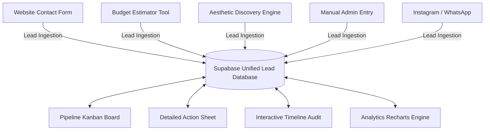

# ✦ CROSSANGLE INTELLIGENCE ✦
## Enterprise CRM Operations Center — Core User Manual & System Audit
**Document Version:** v2.6-Standardized  
**Author:** Principal Solutions Architect & Lead Systems Auditor  
**Review Level:** Elite / FAANG-level  

---

## <div id="table-of-contents"></div>📑 TABLE OF CONTENTS
1. [1. System Overview & Core Working Principles](#system-overview)
2. [2. Complete Workspace Navigation & Tab Architecture](#workspace-navigation)
3. [3. Component & Interactive Button Directory](#component-directory)
4. [4. Relational Data Logics & Automated Rules](#relational-logics)
5. [5. Operational Lead Management Workflows](#operational-workflows)
6. [6. Team Productivity, Best Practices & Validation Rules](#team-productivity)
7. [7. Reporting, Analytics & Business Intelligence](#reporting-analytics)
8. [8. Comprehensive Onboarding Troubleshooting Matrix](#troubleshooting-matrix)

---

## <div id="system-overview"></div>1. SYSTEM OVERVIEW & CORE WORKING PRINCIPLES

### 1.1 The "Single Source of Truth" (SSOT) Concept
The **CrossAngle CRM Operations Center** operates under a strict **Single Source of Truth (SSOT)** paradigm. In high-volume lead environments, team members often face data fragmentation—where details reside in emails, phone call logs, chat transcripts, or spreadsheet copies. SSOT guarantees that:
* **Unique Identity:** Every prospect is indexed under a single immutable UUID generated by the Supabase database.
* **Unified Profile:** A lead profile contains all fields: name (auto-capitalized on save), lowercased validated email, phone, city, budget value in INR, aesthetic style quiz data, source attributes, and assignment parameters.
* **Consolidated Logs:** Every system action—from manual page views and email copy operations to drag-and-drop stage updates—is written in real-time to the `lead_activities` table. No action occurs off the record.



### 1.2 Core Architectural Design & Operational Mindset
To eliminate "what-do-I-do-next" decision paralysis, the CRM transitions from a passive database into an **Action-First Operations Center**. The operational mindset is guided by:
1. **Dynamic Prioritization:** Leads are automatically assigned a **Lead Score** (0–100) based on criteria like budget size, project category, intent timeline, contact availability, source quality, and activity recency.
2. **Temperature-Coded Urgency:** The system aggregates scores into visual **Temperature Indicators** (Hot 🔥 ≥ 70, Warm 🌡️ 40–69, Cold ❄️ 0–39). Trainees are trained to prioritize **Hot Leads** immediately.
3. **Hygiene & Validation Gates:** Staff cannot advance a lead to an advanced pipeline stage without populating critical qualification data. The system actively blocks sloppy drag-and-drop transitions.
4. **Context-Aware Recommendations:** The system dynamically computes the next operational step based on the current stage and displays it in a dedicated header banner inside the detail view.

[Back to Table of Contents](#table-of-contents)

---

## <div id="workspace-navigation"></div>2. COMPLETE WORKSPACE NAVIGATION & TAB ARCHITECTURE

The CRM layout splits the workspace into a left-hand navigation sidebar (managing workspaces, active saved-view filters, and pipeline stages) and a primary content viewport.

```
┌────────────────────────────────────────────────────────────────────────┐
│ CROSSANGLE INTELLIGENCE                       [Logged-in User] [Logout]│
├───────────────────┬────────────────────────────────────────────────────┤
│ WORKSPACE         │  Leads                                             │
│ ☼ Today     [ 0 ] │  All your leads from every source, in one place.   │
│ ✉ Priority  [ 0 ] │  [New Today] [Hot Leads] [Unassigned] [Avg Reply]  │
│ 👥 Leads          │                                                    │
│ ☑ Tasks     [14]  │  [Board] [List]   [Search leads...]  [Filters]     │
│ 📊 Analytics      │                                                    │
│ ⚙ Settings       │  [All] [Today] [Assigned] [Hot] [Quiet] [Clear]    │
│                   ├────────────────────────────────────────────────────┤
│ STAGES            │                                                    │
│ • New Inquiry [14]│   New Inquiry 14  │ In Conversation 0 │ Quote Sent │
│ • Conversation[0] │  ┌──────────────┐ │ ┌───────────────┐ │ ┌────────┐ │
│ • Meeting     [0] │  │ John Doe     │ │ │               │ │ │        │ │
│ • Quote Sent  [0] │  │ WEB 🔥       │ │ │  Drag leads   │ │ │        │ │
│ • Unassigned      │  │ Unassigned   │ │ │  here...      │ │ │        │ │
│ • Won         [0] │  └──────────────┘ │ └───────────────┘ │ └────────┘ │
│ • Lost        [0] │                                                    │
└───────────────────┴────────────────────────────────────────────────────┘
```

### 2.1 The CRM Navigation Sidebar
The left navigation sidebar is divided into two sections: **Workspace Views** and **Stages**.

#### Section A: Workspace Views
* **Today (Shortcode: `today`):** Filters to display only leads created since midnight (`00:00:00`). Objective: Catch incoming leads instantly.
* **Priority (Shortcode: `hot`):** Displays leads with a Lead Score of **70 or above** (Hot 🔥). These represent high-budget, short-timeline, high-intent projects.
* **Leads (Static Route: `/admin/crm/leads`):** The primary workspace. Allows toggling between pipeline board (Kanban) and list views.
* **Tasks (Shortcode: `needs_action`):** Lists all open leads that have **no next action planned**. Prevents any prospect from getting stuck.
* **Analytics (Static Route: `/admin/crm/analytics`):** Performance reports on conversion rates, lead distribution, stale lead queues, and pipeline valuation.
* **Settings (Static Route: `/admin/crm/settings`):** Configuration hub to customize pipeline stages, manage data backups, or upload CSV files.

#### Section B: Stages
Lists the 7 pipeline stages with dynamic counts showing how many leads currently reside in each column. Clicking a stage focuses the main workspace exclusively on those leads.

[Back to Table of Contents](#table-of-contents)

---

## <div id="component-directory"></div>3. COMPONENT & INTERACTIVE BUTTON DIRECTORY

### 3.1 Primary Header & Control Bar Components
The main leads page header contains universal triggers for creating, filtering, and exporting data.

| Component Name | UI Element / Label | Action Type | Practical Use Case & Logic |
| :--- | :--- | :--- | :--- |
| **Export Trigger** | `Download for Excel` | Secondary Button | Generates a clean CSV file format of all leads matching current filters. Auto-downloads with a timestamp. |
| **Lead Creator** | `+ Add lead` | Primary CTA (Gold) | Opens the slide-out sheet in a blank state to manually record a fresh prospect. |
| **Pipeline Toggle** | `Board` / `List` | Segmented Switch | Toggles display between the Kanban visual columns and a searchable list view. |
| **Search Box** | `Search by name...` | Text Input Field | Queries the Supabase database on `name`, `email`, or `phone`. Debounced to fire 300ms after typing stops. |
| **Filter Dropdown**| `Filters [count]` | Multi-select Dropdown | Filters active leads by specific pipeline stage or intake channel. Displays active filter count in a gold badge. |
| **Sorter Dropdown**| `Sort by...` | Dropdown Menu | Orders the leads list. Options: Best score, Newest first, Oldest first, Name (A-Z), Stage index. |
| **Saved View Chips**| `Today` / `Assigned` / `Hot` / `Gone quiet 14d+` | Rounded Pills | One-click filter toggles to quickly segment leads. Selected chip highlights with a gold border. |
| **Clear Filters** | `Clear filters` | Dashed Button | Resets all active filters, searches, and sort modes to system defaults in one click. |

---

### 3.2 Kanban Column & Pipeline Board Components
The Kanban Board displays leads as cards arranged in columns from left to right.

```
+--------------------+      +--------------------+      +--------------------+
|  New Inquiry [14]  |      | In Conversation [0]|      | Meeting Planned [0]|
+--------------------+      +--------------------+      +--------------------+
| [LeadCard #1]      |      |                    |      |                    |
| [LeadCard #2]      |      |   Drag leads       |      |   Drag leads       |
| ...                |      |   here to          |      |   here to          |
| + Add lead here    |      |   move them        |      |   move them        |
+--------------------+      +--------------------+      +--------------------+
```

#### Column Headers
Each column features a stage name, total card count, and a colored border indicating its status.
* **Plus Button (`+ Add lead here`):** Positioned at the bottom of each column. Instantly opens the creation sheet with that column's stage pre-selected.

---

### 3.3 The Unified Lead Card (LeadCard.tsx)
Each Lead Card provides a high-density, glanceable overview of key information.

```
┌──────────────────────────────────────────┐
│ [WEB] John Doe                       (•) │ <-- Temp dot (red/amber/blue)
│ ☎ +919876543210    [MapPin] Jamshedpur   │
│ Living Room + Kitchen · ₹15L             │ <-- Intent + Budget
│ ┌──────────────────────────────────────┐ │
│ │ [Clock] Schedule Site Visit      [>] │ │ <-- Next Action Pill
│ └──────────────────────────────────────┘ │
│ [Avatar] Unassigned         [Clock] 2d   │ <-- Assignee + Age
└──────────────────────────────────────────┘
```

#### Interactive Elements
1. **Card Container:** Clickable. Opens the full lead details drawer.
2. **Hover Actions:** Moving your cursor over a card raises its shadow and border contrast, signaling it is draggable.
3. **Temperature Dot:** Positioned in the upper right. Hovering reveals a tooltip displaying the numeric score and temperature level.
4. **Action Pill:**
   * If a **Next Action** is set: Displays a button with a clock icon. Clicking opens the details sheet. If it is a Hot lead, it turns amber with an alarm icon.
   * If **No Next Action** is set: Renders a red badge labeled `No follow-up set`. Click to assign a task and clear the alert.

---

### 3.4 The Lead Detail Sheet Drawer (LeadDetailSheet.tsx)
The slide-out drawer provides comprehensive tools to edit, track, and contact prospects.

```
┌────────────────────────────────────────────────────────┐
│ Stage: [ New ] -- [ Conversation ] -- [ Meeting ] ...  │ <-- Stepper Bar
├────────────────────────────────────────────────────────┤
│ [WEB]  [Hot 🔥] John Doe                                │
│ ☎ +919876543210  ✉ john@gmail.com  [MapPin] Jamshedpur │
├────────────────────────────────────────────────────────┤
│ ! Recommended Action:                                  │
│   Capture budget, city, and preferred meeting time.    │ <-- Action Banner
├────────────────────────────────────────────────────────┤
│ [ Details ]    [ Activity Logs ]    [ Email Drafts ]   │ <-- Tab Selectors
├────────────────────────────────────────────────────────┤
│ TYPE: [ Living Room ]       BUDGET: [ ₹15,000,000 ]    │
│ TIMELINE: [ 3 Months]       ASSIGNEE: [ Auto ]         │
│ NOTES: [ Client prefers neutral colors...            ] │
├────────────────────────────────────────────────────────┤
│ [Delete]                             [Discard] [Save]  │ <-- Footer Buttons
└────────────────────────────────────────────────────────┘
```

#### Dynamic Action Components
* **Stage Stepper Bar:** Positioned at the top. Displays a horizontal path of stages. Completed stages show a green checkmark, while the active stage is highlighted in blue. Click any stage to move the lead.
* **Quick-Contact Buttons:** Grouped next to the contact info.
  * **Call:** Launches your device's default dialer with the client's number.
  * **WhatsApp:** Opens WhatsApp Web pointing to `https://wa.me/[phone]`.
  * **Email:** Focuses the **Email Drafts** tab to communicate directly.
* **Recommended Action Banner:** A gold card that calculates what step to take next based on the lead's current stage.
* **Detail Tabs:**
  1. **Details:** Edit fields for budget, category, move-in timeline, and client notes.
  2. **Activity Logs:** Renders a vertical timeline showing every update, view, and email draft copy event.
  3. **Email Drafts:** Displays pre-written templates (Initial Inquiry, Follow-Up, Meeting Request) that auto-fill details like name and project type. Click **Send via CrossAngle** or **Copy Draft** to use them.

[Back to Table of Contents](#table-of-contents)

---

## <div id="relational-logics"></div>4. RELATIONAL DATA LOGICS & AUTOMATED RULES

To prevent bad data from muddying your pipeline, the system enforces automated scoring, health checks, and strict validation rules.

### 4.1 Automated Lead Scoring Breakdown (Max: 100 Points)
The database calculates a lead's potential value by summing scores across six categories:

```
                  ┌──────────────────────────────┐
                  │    Lead Score (Max: 100)     │
                  └──────────────┬───────────────┘
  ┌───────────────┬──────────────┼───────────────┬───────────────┐
  ▼               ▼              ▼               ▼               ▼
Budget        Category       Timeline         Quality         Source
(Max 30)      (Max 20)       (Max 20)        (Max 10)        (Max 15)
```

1. **Budget (Max 30 Points):** Evaluated from the client's budget.
   * `₹50L+` = 30 points
   * `₹30L - ₹49L` = 25 points
   * `₹15L - ₹29L` = 20 points
   * `₹10L - ₹14L` = 15 points
   * `₹5L - ₹9L` = 10 points
   * Less than `₹5L` = 5 points
2. **Category / Project Type (Max 20 Points):**
   * Full Home Interior / Commercial Office = 20 points
   * Renovation = 15 points
   * Single Room Consultation = 10 points
3. **Intent Timeline (Max 20 Points):** Parses text for urgency.
   * "Urgent", "ASAP", "Immediately", "This Month" = 20 points
   * "Soon", "Next Month", "2-3 Months" = 15 points
   * "Planning", "Exploring", "Next Year" = 5 points
4. **Contact Quality (Max 10 Points):**
   * Both validated Email and Phone provided = 10 points
   * Email only = 5 points
5. **Source Quality (Max 15 Points):**
   * Referral = 15 points
   * Website Contact Form / Estimator Tool = 12 points
   * Style Quiz = 10 points
   * Social Media (Instagram/Facebook) = 8 points
   * Paid Search Ads = 6 points
6. **Recency Bonus (Max 5 Points):** Encourages fast responses by decaying over time.
   * Activity within 1 day = +5 points
   * Activity within 3 days = +4 points
   * Activity within 7 days = +3 points
   * Activity within 14 days = +1 point
   * Over 14 days = 0 points

---

### 4.2 Lead Temperature Priority
Scores are automatically categorized into three priority levels:

| Temperature | Score Range | UI Indicators | Operational SLA |
| :--- | :--- | :--- | :--- |
| **Hot 🔥** | `70` to `100` | Red badge + glowing red dot. Red border on detail panels. | Must be contacted within **2 hours** of capture. |
| **Warm 🌡️**| `40` to `69` | Amber badge + amber dot. | Must be contacted within **12 hours**. |
| **Cold ❄️** | `0` to `39` | Blue badge + blue dot. | Must be contacted within **24 hours**. |

---

### 4.3 Lead Health & Staleness Thresholds
The system tracks the days since a lead's last update. If a lead remains inactive past its stage's limit, it is marked as **Stale** and flagged in the Analytics dashboard.

$$\text{Staleness Limit (Days)} = \begin{cases} 2 & \text{New Stage} \\ 7 & \text{In Conversation} \\ 14 & \text{Meeting Planned} \\ 7 & \text{Quote Sent} \\ 7 & \text{Closing} \end{cases}$$

---

### 4.4 Automated Loss & Win Logics
* **Closed-Won:** Moving a lead to `Won` prompts you to record a closing note, automatically updating its forecast value to **100% committed**.
* **Closed-Lost:** Moving a lead to `Lost` requires selecting a loss reason from a standardized list (e.g., Budget, Location, No Response) to help optimize future campaigns.

[Back to Table of Contents](#table-of-contents)

---

## <div id="operational-workflows"></div>5. OPERATIONAL LEAD MANAGEMENT WORKFLOWS

Follow this step-by-step workflow to guide leads smoothly from capture to conversion.

```
       [ 1. CAPTURE & HYGIENE ]
   Incoming lead registered from web, 
  estimator, or manual entry. System auto-
  capitalizes name and lowercases email.
                 │
                 ▼
       [ 2. DUPLICATE CHECK ]
  Duplicates flagged on dashboard via red
 banner. If duplicate, merge data; otherwise, 
         proceed to triage.
                 │
                 ▼
       [ 3. INTAKE TRIAGE ]
  Check Lead Score & Temperature. Assign a 
  representative to Hot and Warm leads.
                 │
                 ▼
     [ 4. SYSTEMATIC ENGAGEMENT ]
   Use Detail Sheet quick CTAs to Call,
   WhatsApp, or Email via templated drafts.
                 │
                 ▼
      [ 5. STAGE TRANSITION ]
  Advance stages from New Inquiry to Quote 
 Sent. Fill out required fields at each step.
                 │
                 ▼
        [ 6. PIPELINE CONVERSION ]
   Mark lead as Won or Lost. Input closing 
     notes or loss reason to close.
```

### Stage 1: Capture & Hygiene
Leads are ingested from web forms, the budget estimator, or manual admin entry. 
* **Hygiene Rule:** The system automatically formats text fields on save:
  * Name: Auto-capitalized (e.g., `john doe` becomes `John Doe`).
  * Email: Converted to lowercase and validated.

### Stage 2: Duplicate Check
The system automatically checks email and phone fields against existing records.
* **Exact Duplicate:** Matches an existing email.
* **Likely Duplicate:** Matches an existing phone number (ignoring spaces and dashes).
* **Action:** If flagged, review the existing card via the red warning banner and merge notes instead of creating a new contact.

### Stage 3: Intake Triage
Open the Kanban board and check the **New Today** dashboard card.
* Sort by **Best Score** or **Newest First**.
* Check the lead's temperature dot. Identify Hot 🔥 leads and assign a team member immediately to clear the unassigned queue.

### Stage 4: Systematic Engagement
Open the lead's details drawer.
* Read the **Recommended Action Banner** for context.
* Use the quick-contact buttons to reach out via phone, WhatsApp, or email drafts.
* Record notes from your conversation in the **Internal Notes** text box.

### Stage 5: Stage Transition & Data Enforcement
As the project progresses, move the lead through columns on the Kanban board.
* **Stage Gate Validation:** The system requires specific details before allowing stage updates (e.g., moving to **Meeting Planned** requires a verified phone number and city). Fill out these fields to complete the transition.

### Stage 6: Pipeline Conversion
* **Conversion-Won:** Move the card to **Won**. Enter a closing note explaining what worked to update the reports.
* **Conversion-Lost:** Move the card to **Lost**. Select a loss reason (e.g., `no_budget`, `lost_to_competitor`) to help refine sales strategies.

[Back to Table of Contents](#table-of-contents)

---

## <div id="team-productivity"></div>6. TEAM PRODUCTIVITY, BEST PRACTICES & VALIDATION RULES

### 6.1 The 4 Trainee Golden Rules for Data Integrity
To keep client data clean and accurate, all staff must follow these four core rules:

```
+--------------------------------------------------------------------------+
|                        THE 4 GOLDEN RULES OF CRM HYGIENE                 |
+--------------------------------------------------------------------------+
|                                                                          |
|  [1] ALWAYS SET A NEXT ACTION                                            |
|      Never leave a lead without a next step. If a lead shows a red       |
|      "No follow-up set" badge, assign a follow-up date and task.         |
|                                                                          |
|  [2] FILL OUT DETAILS IN ORDER                                           |
|      Input name, email, phone, city, and category during your first      |
|      client call to keep reports accurate.                               |
|                                                                          |
|  [3] USE STANDARDIZED INR BUDGET FORMATS                                 |
|      Always type budgets using clear numbers (e.g., "15L", "30L", "2Cr") |
|      so the system can correctly compute pipeline values.                |
|                                                                          |
|  [4] ALWAYS RECORD AN ACTIVITY NOTE ON EVERY CHANGE                       |
|      Log a quick summary after every interaction to keep the team        |
|      aligned on the project's status.                                    |
|                                                                          |
+--------------------------------------------------------------------------+
```

### 6.2 Data Field Validation Checklist
Ensure all entries meet these requirements before saving:
* **Name:** Must be at least 2 characters long.
* **Email:** Must use a valid format (e.g., `user@domain.com`).
* **Phone Number:** Numeric characters only, including area code.
* **Loss Reason:** Mandatory when moving a lead to Lost.

[Back to Table of Contents](#table-of-contents)

---

## <div id="reporting-analytics"></div>7. REPORTING, ANALYTICS & BUSINESS INTELLIGENCE

The **CrmAnalytics** dashboard provides real-time insights into your team's performance and pipeline health.

```
┌────────────────────────────────────────────────────────────────────────┐
│  CRM Analytics Summary                                                 │
├───────────────────┬───────────────────┬────────────────┬───────────────┤
│ Pipeline Value    │ Committed         │ Hot Leads      │ Deals Won     │
│ ₹85.6L            │ ₹32.0L            │ 5              │ 12            │
│ ₹42.3L weighted   │ Won + Negotiation │ 35% of pipeline│ 78% win rate  │
└───────────────────┴───────────────────┴────────────────┴───────────────┘
```

### 7.1 Understanding Key Metrics
* **Pipeline Value:** The sum of all active project budgets. The weighted value adjusts this total based on how likely each stage is to close (e.g., a "Closing" lead is weighted higher than a "New Inquiry").
* **Committed:** The revenue secured from successfully closed deals.
* **Win Rate:** The percentage of closed deals marked as Won.
* **At Risk:** High-priority Hot leads that have gone over **7 days** without an update.
* **Stale Leads:** Open leads that have passed their stage's inactivity limit.

### 7.2 Visualizing Your Pipeline
* **Pipeline Funnel:** A chart showing lead volume at each stage to help identify where deals tend to stall.
* **Lead Source Breakdown:** A pie chart displaying which channels (e.g., Website, Instagram, Referrals) generate the most inquiries.
* **Temperature & Score Distribution:** Charts showing the overall quality and engagement levels of your current pipeline.
* **Stale Lead Queue:** An action-list showing exactly which inactive leads need immediate attention.

[Back to Table of Contents](#table-of-contents)

---

## <div id="troubleshooting-matrix"></div>8. COMPREHENSIVE ONBOARDING TROUBLESHOOTING MATRIX

| Issue / Error Message | Probable System Cause | Recommended Operator Action |
| :--- | :--- | :--- |
| **"Cannot advance to stage: Phone / City required"** | You attempted to move a lead on the board before capturing key details. | Open the lead's details drawer, input a valid phone number and city, save your changes, then try moving the card again. |
| **"Cannot advance to Won: Note required"** | You attempted to close a deal as Won without writing a summary. | Open the details drawer, navigate to **Internal Notes**, add a summary explaining what worked, save, and mark the lead as Won. |
| **"Cannot advance to Lost: Loss Reason required"** | You attempted to close a lead as Lost without selecting a reason. | Select a standardized reason from the dropdown menu in the details drawer to save and close the lead. |
| **Duplicate Lead Banner displays on dashboard** | A duplicate email or phone number was detected. | Click the warning banner to view the matching lead. Merge the new notes into the existing card, then delete the duplicate. |
| **A Hot Lead's card shows a red "No follow-up set" badge** | The lead has no next step scheduled. | Click the card, select a follow-up task and date under **Next Step**, and save to clear the warning. |
| **"Pipeline Value" displays as an em-dash (`—`)** | No budget values have been set for your open leads. | Update your active leads with standard budget numbers (e.g., "15L", "30L") to populate the pipeline value calculation. |
| **"Access Denied: You do not have permission"** | Your user account does not have permission to edit or delete leads. | Contact your Super Admin to review your workspace permissions and roles. |

[Back to Table of Contents](#table-of-contents)
