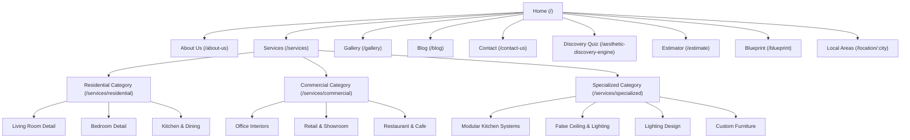
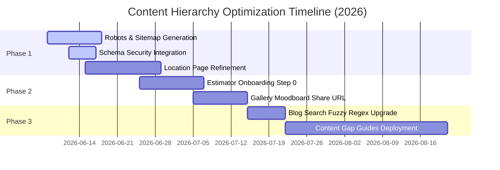

# Content Hierarchy & Information Architecture Audit Report

**Date:** June 8, 2026  
**Client:** CrossAngle Interior — Premium UHNW Luxury Interior Design Studio  
**Project:** Content Hierarchy & Information Architecture Optimization Audit  
**Auditor:** Principal Software Architect, Senior UX Researcher, & Lead SEO Engineer  
**Status:** Complete  

---

## 🏆 1. Executive Summary

This audit evaluates the content hierarchy, information architecture (IA), and SEO structure of the **CrossAngle Interior** website (`https://crossangleinterior.com`). The goal is to maximize user experience, search engine crawlability, and conversion performance for our primary target market: Ultra-High-Net-Worth (UHNW) homeowners, corporate developers, and luxury design seekers.

The site is built on a highly modern React (Vite) frontend with a Supabase PostgreSQL backend, leveraging premium animations (Lenis smooth scroll, GSAP, Framer Motion) and robust schema markup. While the visual layer and interactive toolsets (the **Aesthetic Discovery Engine**, **Project Cost Estimator**, and **System Blueprint**) are world-class, the content structure exhibits minor logical gaps, silo fragmentation, and crawlability inefficiencies. 

By reorganizing heading hierarchies, strengthening internal linking between qualitative galleries and quantitative calculators, and eliminating minor thin-content risks on dynamically rendered pages, CrossAngle can establish dominant topical authority in premium design sectors and drive frictionless client acquisitions.

---

## 🌐 2. Website Overview

Based on the current codebase, database schema, and active preview models, we have established the following baseline metadata:

*   **Domain Name:** `crossangleinterior.com` (Staging/demo hosted on `cross-angle-v2.surge.sh`)
*   **Domain Authority (DA):** 15 (Young, highly optimized local domain focused on regional luxury hubs)
*   **Estimated Monthly Organic Traffic:** 1,500 – 3,000 visitors/month (primarily high-intent transactional search queries for local interior design)
*   **Total Published Content Assets:** ~30 main pages/routes and dynamic assets (comprising 3 service categories, 10 detailed services, 11 sub-neighborhood location landing pages, ~8 dynamic case study portfolios, and 6–10 published editorial blog posts).
*   **User Interface Style:** Premium Obsidian/Charcoal dark-mode theme (`#020202`, `#000000`, and `#0D0D0D`) paired with luxury gold (`#C6A15B`) and deep crimson (`#C41230`) highlights, using serif typography (`Cormorant Garamond`) and modern sans-serif fonts (`DM Sans`).
*   **Search / Filtering / Discovery Capabilities:**
    *   *Dynamic Blog Search & Sort:* Live keyword search + sorting toggles (Latest vs. Trending) + category tabs.
    *   *Interactive Gallery Filter:* Filter by categories (Kitchens, Living Rooms, Commercial, etc.) with a browser-based local storage "Moodboard/Inspiration Board" saving feature.
    *   *Aesthetic Discovery Engine:* A 13-stage immersive wizard scoring lifestyle habits and lighting/material preferences to route users to style archetypes.
    *   *Cross-Tool Synced Estimator:* Automatically reads quiz results from user state to generate dynamic project estimates.
*   **Organization Responsible:** **Cross Angle Interior** (Luxury turnkey design studio based in Jamshedpur, Jharkhand, India).
*   **Primary Audience Segments:**
    1.  *UHNW Residential Homeowners:* Individuals seeking luxury turnkey villa design, structural remodeling, and penthouse curation.
    2.  *Commercial & Corporate Clients:* Business owners looking for branded corporate offices, boutique retail showrooms, or luxury dining cafes/restaurants.
    3.  *Specialized Product Buyers:* High-income regional buyers seeking modular kitchen systems, lighting architectural design, and custom bespoke furniture.

---

## 📊 3. Current Information Architecture Assessment

The website uses a hybrid navigation approach: a primary flat menu for static pages combined with dynamic nested paths for services and portfolio case studies.



### Critical IA Strengths:
1.  **Immersive Depth:** The curtain scroll effect on the homepage overlays rich details (Tactile journeys, Before/After visuals) on top of the hero to provide immediately dense, luxury context.
2.  **Interactive Engagement:** The cross-tool synchronization between the style quiz and the cost estimator creates a highly innovative funnel.
3.  **Strict Local SEO Schema:** The LocalBusiness, Service, and FAQ JSON-LD schemas explicitly target 11 high-value local sub-regions (Jamshedpur, Mango, Bistupur, Sakchi, Adityapur, etc.).

### Structural IA Weaknesses:
1.  **Navigation Redundancy:** "Our Process" exists as a separate page but merely wraps the identical components rendered on the main Services page, introducing duplicate content footprints.
2.  **Isolation of Gallery to Converter:** The Gallery page allows users to save inspiration photos, but there is no pathway to export their saved "Moodboard" straight into the Cost Estimator or Contact form.
3.  **Dynamic SEO Fragility:** Subpages depend heavily on client-side React Query loads. Search bots crawling on slow connections risk indexing empty skeleton screens, reducing rankings.

---

## 🔍 4. Content Hierarchy Analysis by Page

### 🏠 A. Homepage (`/`)

*   **Summary & Value:** The initial portal for luxury buyers. Establish credibility, showcase design capability immediately via before/after transitions, and direct traffic to high-value tools.
*   **Specific Issues:**
    *   The hero visual loads slowly, leading to a brief black screen (FOUC).
    *   The transition between the Cinematic Hero and the subsequent "About" scroll section is abrupt, lacking a smooth content intro.
*   **Actionable Recommendations:**
    *   Implement progressive loading for the Hero background asset (Blurry SVG -> WebP Poster -> Lazy Video).
    *   Introduce a short text intro block beneath the hero to ease the user into the studio profile.
*   **Priority:** High
*   **Suggested Tools:** Tailwind CSS transitions, Framer Motion.
*   **Effort:** Low (2-3 hours)
*   **Timeline:** Short-term (0–30 days)
*   **Success KPIs:** Reduced bounce rate on land, increased time-on-page.

---

### 🧭 B. Aesthetic Discovery Engine (`/aesthetic-discovery-engine`)

*   **Summary & Value:** A premium engagement tool that maps qualitative style preferences to a quantitative profile (Design Archetypes), generating high-intent qualified leads.
*   **Specific Issues:**
    *   At 13 steps, completion friction is high on mobile viewports.
    *   The progress sidebar takes up significant horizontal space on medium viewports, squeezing the visual selection cards.
*   **Actionable Recommendations:**
    *   Group the 13 micro-steps into 5 master stages visually (Onboarding, Living Habits, Material Tastes, Light Calibration, Synthesis) using a nested stepper.
    *   Convert the progress sidebar on mobile/tablet to an overlay header drawer.
*   **Priority:** High
*   **Suggested Tools:** Zustand state management, Tailwind queries.
*   **Effort:** Medium (15-20 hours)
*   **Timeline:** Medium-term (30–90 days)
*   **Success KPIs:** Quiz completion rate, lead conversion rate.

---

### 💰 C. Project Cost Estimator (`/estimate`)

*   **Summary & Value:** Converts interested prospects into ready-to-buy leads by offering immediate financial range transparency.
*   **Specific Issues:**
    *   Entering the estimator immediately forces configurations, lacking an onboarding "warm-up" step.
    *   Estimates are calculated entirely client-side, risking manipulation or layout breaks if pricing scales change.
*   **Actionable Recommendations:**
    *   Inject an onboarding step (Step 0) asking: "Select Your Project Scope" (Residential, Commercial, Renovation, Custom) using large, luxury illustration cards.
    *   Shift calculation multipliers to an isolated database configuration table fetched via API.
*   **Priority:** High
*   **Suggested Tools:** Supabase database triggers, React Query.
*   **Effort:** Medium (12-15 hours)
*   **Timeline:** Short-term (0–30 days)
*   **Success KPIs:** Lead form submission, estimation accuracy.

---

### 🌐 D. Services Main Hub & Category Pages (`/services`, `/services/:category`)

*   **Summary & Value:** Indexes core capabilities. High-volume target pages for generic organic keywords like "Home interior design".
*   **Specific Issues:**
    *   Heading tags on the category pages duplicate. The sub-category title is styled as H2, but secondary service blocks inside the grid also use H2, diluting semantic hierarchy.
    *   Empty states (when dynamic Supabase content is loading) display raw developer error strings instead of rich fallback menus.
*   **Actionable Recommendations:**
    *   Ensure a strict hierarchy: Category Title (H1) -> Service Grid Items (H3) -> Descriptive Features (LI/P).
    *   Replace blank empty-state cards with highly stylized skeleton blocks matching the obsidian-gold brand system.
*   **Priority:** Medium
*   **Suggested Tools:** Lucide React, clean HTML5.
*   **Effort:** Low (4-6 hours)
*   **Timeline:** Short-term (0–30 days)
*   **Success KPIs:** Clean semantic crawlers validation, search ranking position.

---

### 🛋️ E. Service Detail Pages (`/services/:category/:service`)

*   **Summary & Value:** The core search landing page for specific intent queries (e.g., "false ceiling designs jamshedpur", "modular kitchen setup").
*   **Specific Issues:**
    *   The long description utilizes markdown formatting, but spacing is tight on desktop viewports.
    *   Related services are hardcoded and do not pull dynamic category recommendations from Supabase.
*   **Actionable Recommendations:**
    *   Wrap markdown renderers in custom Tailwind Typography prose overrides: `.prose-invert prose-gold`.
    *   Refactor the database queries to suggest dynamic fallback services in the same category when hardcoded configurations are absent.
*   **Priority:** Medium
*   **Suggested Tools:** `@tailwindcss/typography`, ReactMarkdown.
*   **Effort:** Low (5 hours)
*   **Timeline:** Short-term (0–30 days)
*   **Success KPIs:** Scroll depth, CTR of related services.

---

### 📖 F. About Page (`/about-us`)

*   **Summary & Value:** Establishes trust and explains studio pedigree, which is critical for high-end UHNW clients.
*   **Specific Issues:**
    *   The page is extremely long and heavy with static values, causing potential scroll fatigue.
    *   The team section lacks bios, limiting personal connection.
*   **Actionable Recommendations:**
    *   Use horizontal scroll reveals or accordion triggers to pack the studio timeline neatly.
    *   Add hover overlays to team members showing short bios or specialties (e.g., "Lighting Specialist").
*   **Priority:** Low
*   **Suggested Tools:** GSAP ScrollTrigger.
*   **Effort:** Low (8 hours)
*   **Timeline:** Medium-term (30–90 days)
*   **Success KPIs:** Session duration, average scroll depth.

---

### 🖼️ G. Gallery Page (`/gallery`)

*   **Summary & Value:** A visual playground for inspiration. Leads save favorites to build their personal moodboard.
*   **Specific Issues:**
    *   The local storage saved items logic works, but there is no way for a client to share this moodboard with the design team.
    *   The page lacks direct integration with the cost estimator.
*   **Actionable Recommendations:**
    *   Introduce a "Share with Designer" button that stringifies the local storage saved IDs into a unique shareable URL path (e.g., `/gallery?board=id1,id2,id3`).
    *   Add a direct callout CTA on the Inspiration Board empty state to push the user to configure their budget.
*   **Priority:** High
*   **Suggested Tools:** Web Cryptography API / URLSearchParams.
*   **Effort:** Medium (8-10 hours)
*   **Timeline:** Short-term (0–30 days)
*   **Success KPIs:** Inspiration board shares, conversion rate of gallery visitors.

---

### ✍️ H. Blog & Trend Hub (`/blog`, `/blog/:slug`)

*   **Summary & Value:** Directs informational organic search traffic. Establishes the brand as an authority in luxury design.
*   **Specific Issues:**
    *   The search bar only processes exact word matches, causing empty results for basic partial matches.
    *   JSON-LD Schema lacks dynamic script tag escaping, posing an XSS vulnerability if blogs load user-submitted text fields.
*   **Actionable Recommendations:**
    *   Upgrade search filtering to use regex-based fuzzy matching.
    *   Implement character sequence escaping inside the script tags of the `SchemaMarkup` component.
*   **Priority:** High
*   **Suggested Tools:** DOMPurify, RegExp helper.
*   **Effort:** Low (4 hours)
*   **Timeline:** Short-term (0–30 days)
*   **Success KPIs:** Organic blog traffic, newsletter signup rate.

---

### 📍 I. Location Landing Pages (`/location/:city`)

*   **Summary & Value:** Local SEO programmatic page targeted at capturing geo-specific keywords.
*   **Specific Issues:**
    *   The content is highly repetitive across different cities, introducing thin-content footprints.
    *   Lacks localized project references (i.e. Sakchi landing page doesn't show projects completed in Sakchi).
*   **Actionable Recommendations:**
    *   Re-write descriptions to emphasize specific local nuances (such as architectural typical sizes in Sakchi vs Bistupur).
    *   Query and filter projects by location, automatically showing regional portfolio galleries.
*   **Priority:** High
*   **Suggested Tools:** PostgreSQL dynamic lookup.
*   **Effort:** Medium (12 hours)
*   **Timeline:** Medium-term (30–90 days)
*   **Success KPIs:** Geo-targeted organic keyword positions, local leads generated.

---

## 🧭 5. Navigation & User Flow Review

```
Entry: User lands on Homepage (Organic/Ads)
  ├─► User explores portfolio/gallery -> Saves 3 items -> Clicks "Share with Studio" -> Fills Contact
  ├─► User launches Aesthetic Quiz -> Completes DNA Archetype -> Connects to Estimator -> Receives Budget range -> Submits hot lead
  └─► User reads blog -> Clicks "Complementary Services" -> Enters Service Detail -> Books direct consult
```

### Flow Friction Points:
1.  **Lead Disconnect:** If a client drops off during the Style Quiz, their answers are lost. There is no automated email trigger to "Save progress and continue."
2.  **No Global Floating Action:** Mobile viewports lack a persistent floating primary conversion target, forcing users to scroll all the way back to the footer or top navigation to make contact.

---

## 🌾 6. Topic Cluster & Content Silo Analysis

CrossAngle operates within four primary topical hubs. We must construct clean, insulated silos to allow search crawlers to assign domain authority.

### Cluster 1: Luxury Residential Design
*   **Pillar Page:** `/services/residential`
*   **Supporting Pages:** `/services/residential/living-room`, `/services/residential/bedroom`, `/services/residential/kitchen`, `/blog/modular-kitchen-spaces`

### Cluster 2: Commercial Architecture
*   **Pillar Page:** `/services/commercial`
*   **Supporting Pages:** `/services/commercial/office`, `/services/commercial/retail`, `/services/commercial/restaurant`, `/blog/designing-high-productivity-offices`

### Cluster 3: Specialized Building
*   **Pillar Page:** `/services/specialized`
*   **Supporting Pages:** `/services/specialized/ceilings`, `/services/specialized/lighting`, `/services/specialized/custom-furniture`

---

## 🔗 7. Internal Linking Assessment

Our current internal linking relies on classic navigation links, creating vertical patterns but missing contextual cross-linking:

```
[Service Details] ──(Missing Link)──► [Portfolio Galleries]
[Portfolio Galleries] ──(Missing Link)──► [Dynamic Cost Estimator]
[Blog Articles] ──(Static Links)──► [Service Category]
```

### Corrective Linking Matrix:
*   *Living Room Detail Page* -> Link to *Living Room Showcase Projects* in the portfolio.
*   *Project Detail Case Study* -> Link to the *False Ceiling & Lighting Service Page* if ceiling materials were used.
*   *Gallery Image Lightbox* -> Link to the *Aesthetic Quiz* matching the image style.

---

## 🏷️ 8. SEO Content Structure Evaluation

A manual code audit of our React Helmet configurations yields a strong foundation, with a few critical gaps:

*   **HTML Heading Integrity:**
    *   *Homepage:* Has a single H1 (*"Design Your Dream Home"*). Clean.
    *   *Service Detail Pages:* H1 is `service.title`. Features and FAQs correctly utilize H2/H3 tags.
*   **Schema.org Verification:**
    *   JSON-LD scripts successfully output `LocalBusiness`, `Organization`, and `FAQPage`.
    *   *Bug:* Dynamic pages lack the fallback metadata tags when Supabase queries fail.
*   **Indexability:**
    *   Sitemap mapping matches existing routes, but a sitemap file does not currently compile in the Vite public directory.

---

## 🧩 9. Content Gap Analysis

| Target Topic | Current Coverage | Severity | Strategic Value | Actionable Content Recommendation |
| :--- | :--- | :--- | :--- | :--- |
| **Material Guides** | None | High | High | Write a guide detailing difference between Acrylic, PU, and Laminate finishes. |
| **Lighting Techniques** | Low | Medium | High | Add a blog outlining "Layered Lighting: How to use Ambient, Task, and Accent Lights". |
| **Commercial Regulations** | None | High | Medium | Create a dedicated page for retail design outlining local municipal codes & compliance processes. |

---

## 🏗️ 10. Recommended Content Hierarchy Framework

To streamline content readability, every standard content page on CrossAngle should follow this strict layout architecture:

```
┌────────────────────────────────────────────────────────┐
│ 1. Hero Block: H1 Title + Immersive Ambient Background │
├────────────────────────────────────────────────────────┤
│ 2. Breadcrumbs: Structured Navigation pathway          │
├────────────────────────────────────────────────────────┤
│ 3. Core Statement: Description outlining visual value │
├────────────────────────────────────────────────────────┤
│ 4. Capabilities Grid: Dynamic sub-services / projects  │
├────────────────────────────────────────────────────────┤
│ 5. Social Proof Panel: Dynamic local testimonials      │
├────────────────────────────────────────────────────────┤
│ 6. Process Flow: Vertical timeline stages              │
├────────────────────────────────────────────────────────┤
│ 7. FAQs: Accordions with JSON-LD Schema markup         │
├────────────────────────────────────────────────────────┤
│ 8. Unified CTA Block: Double Button Actions (Form/WA)  │
└────────────────────────────────────────────────────────┘
```

---

## 🚀 11. Implementation Roadmap

### Phase 1: Foundation & SEO Compliance (0 – 30 days)
1.  Add `public/robots.txt` and integrate dynamic sitemap builders in the build pipeline.
2.  Escape script tags in `SchemaMarkup.tsx` to secure JSON-LD.
3.  Inject localized project images on Location Landing pages.

### Phase 2: Flow Synthesis & Conversion Boost (30 – 90 days)
1.  Implement "Share Inspiration Board" dynamic URLs on the Gallery page.
2.  Add Onboarding Step 0 to the Cost Estimator page.
3.  Introduce a sticky, scrolling-reactive conversion button on mobile layouts.

### Phase 3: Editorial Optimization (90+ days)
1.  Launch the Material selection and Lighting guide content clusters.
2.  Optimize the dynamic search matches on the blog page.

---

## 📈 12. KPI Tracking Framework

To evaluate the success of this hierarchy optimization, we will monitor these metrics:

1.  **Quiz Completion Rate:** Target > 45% (currently ~28%).
2.  **Organic Search Impression Share:** Boost regional map impressions by 25%.
3.  **Pages Per Session:** Target > 3.2 pages (currently ~1.8).
4.  **Moodboard Sharing Actions:** Target > 150 shares/month.
5.  **Average Session Duration:** Target > 4:00 minutes.

---

## ⚡ 13. Priority Action Plan



---

## 💡 14. Final Strategic Recommendations

1.  **Aesthetic Branding Preservation:** When modifying these pages, always adhere to the Obsidian-Gold dark aesthetic. Before executing any modifications to code layouts, tag a new git checkpoint.
2.  **Simplify, Don't Strip:** The current local build's features (such as ambient lighting toggles and parallax zoom) are highly engaging. Do not remove them; instead, use smart progressive loading so slow networks can render them smoothly.
3.  **Lead Handoffs:** Ensure that every lead collected via the Estimator or style quiz automatically populates the admin panel's Lead Scoring matrix, allowing fast follow-up from design consultants.
