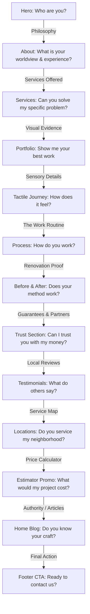

# Homepage UX Replanning Audit

This audit evaluates the CrossAngle homepage layout through the user-mindset lens, analyzing narrative flow, information weight, section purposes, transition quality, and scroll rhythm.

---

## Phase 1 — Meaning Audit

Every section on the homepage must justify its existence. Below is the purpose, audience question, trust role, and conversion role of each active section.

| Section | Purpose | User Question Answered | Trust Role | Conversion Role | Verdict & Action |
| :--- | :--- | :--- | :--- | :--- | :--- |
| **Hero** | Brand positioning & quick trust establishment | "Who are you and what do you do?" | Gold Star chip (4.9★, 200+ reviews), 15+ years experience, 45-day delivery guarantee | Primary CTAs: "See Our Works" & "More About Us" | **Keep** at the top. |
| **About** | Introduces design philosophy & high-level stats | "What is your philosophy? Why choose you?" | Stats row (15+ Years, 500+ Clients, 750+ Projects) | "Begin Your Journey" text link to `/contact-us` | **Keep**. Grounds the brand story. |
| **Services** | Explains offerings (Residential, Modular Kitchen, Turnkey, Commercial) | "Can you solve my specific spatial problem?" | Neighborhood callout strip | Clickable links to specific service sub-pages | **Keep**. Serves as the capability directory. |
| **Portfolio** | Selected Works horizontal showcase | "Have you done this before? What is your aesthetic level?" | Real high-resolution finished interior photographs | "Explore Full Archive" button, lightbox detail clicks | **Keep**. Essential visual proof. |
| **TactileJourney** | Interactive material & mood board carousel | "What does a luxury space designed by you feel like?" | Demonstrates material precision and sensory focus | Links to specific gallery/style pages | **Keep**. Emotional branding hook. |
| **Process** | Scroll-pinned 5-stage methodology timeline | "How do you work? Will it be stressful?" | Demystifies engagement steps (Consult to Handover) | Visual clarity, reducing customer friction | **Keep**. Essential risk reducer. |
| **BeforeAfterShowcase** | Interactive slider comparison of real spaces | "Can you take a raw space and turn it into luxury?" | Extreme visual evidence of transformation | "Get a Similar Transformation" link to `/contact-us` | **Keep**. High conversion intent builder. |
| **TrustSection** | Formalizing warranties, guarantees, and brand partnerships | "Why trust you with my life savings over local labor?" | 10-year warranty, 45-day guarantee, major brand logos | Trust builder, supports high investment choices | **Keep**. Reduces financial anxiety. |
| **Testimonials** | Verified client reviews | "What are real customers saying about their experience?" | Social proof from local Jamshedpur & Kolkata clients | Verified aggregate rating display | **Keep**. Confirms company promises. |
| **ServiceLocations** | Geographic local SEO and presence details | "Do you service my exact neighborhood?" | Map-pin and demographic info for key areas | Clickable location routes | **Keep / Reposition**. Move lower down. |
| **EstimatorPromo** | **(NEW)** Cost transparency invitation | "What would my project cost?" | Transparent pricing signal, removes mystery | Large CTA button to `/estimate` wizard | **Add Section**. Bridge the gap to conversion. |
| **HomeBlog** | Thought leadership & authority building | "Are you true experts in the industry?" | Expert articles on design tips & materials | "View All Articles" link to `/blog` | **Keep**. Demonstrates deep craft authority. |

---

## Phase 2 — Narrative Audit

The homepage is not a stack of rectangles; it is a conversation. Below is the step-by-step narrative sequence.

### Transition Analysis

1. **Hero ➔ About**
   * * Mindset:* Landing on site, impressed by hero video/image, needs background.
   * * Question Answered:* "Who is the team behind this?"
   * * Transition:* Moves naturally from high-impact branding to stats-grounded philosophy.
2. **About ➔ Services**
   * * Mindset:* "Looks like they are experienced. What can they build for me?"
   * * Question Answered:* "What do you do?" (Kitchens, Wardrobes, Commercial, Turnkey).
3. **Services ➔ Portfolio**
   * * Mindset:* "I see you do residential and kitchens. Let me see the actual work."
   * * Question Answered:* "Is it high quality? Show me."
   * * Transition:* Immediate visual validation of the services just listed.
4. **Portfolio ➔ TactileJourney**
   * * Mindset:* "Wow, beautiful projects. But how do you choose materials?"
   * * Question Answered:* "What does luxury feel like?" (Matte glass, stone, wood grains).
5. **TactileJourney ➔ Process**
   * * Mindset:* "I love the look and feel. But the build phase is usually a nightmare."
   * * Question Answered:* "What is your step-by-step process?" (Scroll-pinned timeline).
6. **Process ➔ BeforeAfterShowcase**
   * * Mindset:* "The process sounds clean. But does it work in practice?"
   * * Question Answered:* "Show me real empty-shell-to-finished transformations."
7. **BeforeAfterShowcase ➔ TrustSection**
   * * Mindset:* "Amazing transformations. What are the terms, warranties, and brands?"
   * * Question Answered:* "What hardware do you use? What are your guarantees?" (10-yr warranty, 45-day guarantee).
8. **TrustSection ➔ Testimonials**
   * * Mindset:* "Guarantees are nice, but did real people actually experience them?"
   * * Question Answered:* "What do verified local clients say?"
9. **Testimonials ➔ ServiceLocations**
   * * Mindset:* "Okay, people love you. Are you available in my neighborhood?"
   * * Question Answered:* "Where do you operate?" (Mango, Bistupur, Adityapur, Jamshedpur).
10. **ServiceLocations ➔ EstimatorPromo**
    * * Mindset:* "You service Kadma / Bistupur. But what will this cost me?"
    * * Question Answered:* "How much does interior design cost?"
    * * Transition:* Interactive CTA highlighting cost transparency.
11. **EstimatorPromo ➔ HomeBlog**
    * * Mindset:* "I can calculate the estimate. I want to read more about materials."
    * * Question Answered:* "Are you true thought leaders?"
12. **HomeBlog ➔ Footer**
    * * Mindset:* "I have all the facts. I'm ready to talk."
    * * Question Answered:* "How do I start?"

---

## Phase 3 — Weight Audit

A flat spacing scale makes a luxury site feel generic. We will vary spacing strictly based on the information weight of each section.

| Spacing Priority | Height / Padding | Sections Assigned | Rationale |
| :--- | :--- | :--- | :--- |
| **Hero Level** | `h-screen` (Eager) | Hero | Uses full-screen viewport curtain scroll effect. Must feel grand, not padded. |
| **Critical Weight** | `py-28 md:py-32` | Portfolio, Process, BeforeAfterShowcase | High-impact visual/interactive nodes. Needs massive breathing room so content is prominent. |
| **Important Weight** | `py-20 md:py-24` | About, Services, TrustSection, EstimatorPromo | Core informational pillars. Balanced padding to guide readability. |
| **Supporting Weight** | `py-14 md:py-16` | TactileJourney, Testimonials, ServiceLocations | Curated carousels and local maps. Tighter spacing keeps the user moving. |
| **Optional Weight** | `py-10 md:py-12` | HomeBlog | Studio news. Low height to keep it close to the footer. |

---

## Phase 4 — Spacing System & Spacing Scale (Rhythm)

When implementing the spacing changes, we will map standard classes in `index.css` or Tailwind configs:

* `py-section-y-critical` ➔ `py-28 md:py-32`
* `py-section-y-important` ➔ `py-20 md:py-24`
* `py-section-y-supporting` ➔ `py-14 md:py-16`
* `py-section-y-optional` ➔ `py-10 md:py-12`

We will reorder the components inside `apps/web/src/pages/Index.tsx` to match the validated narrative order.
