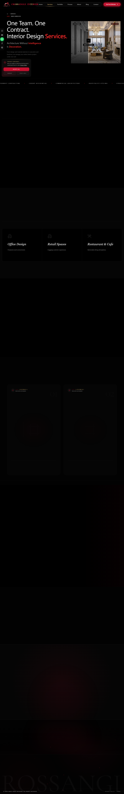
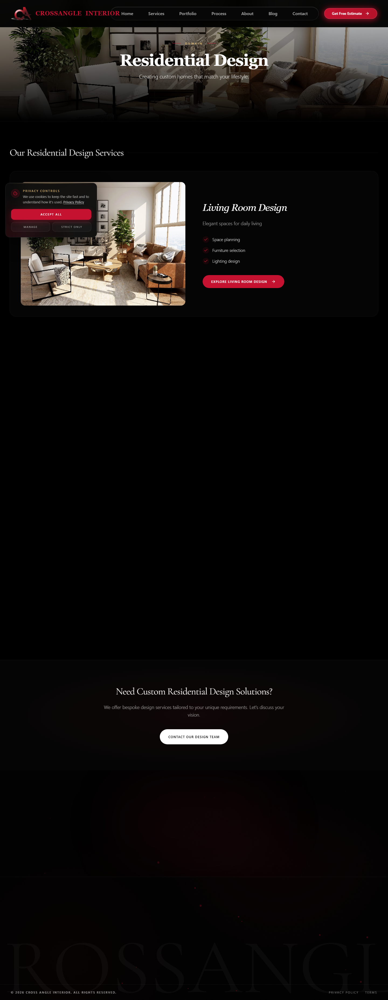
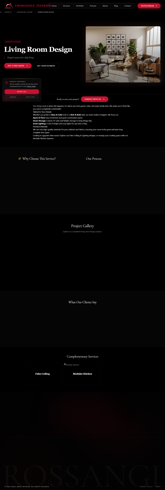

# Performance & Web Vitals Audit Summary

**Date:** 2026-06-17 01:31
**Tool:** Playwright + PerformanceObserver
**Viewport:** 1440x900

| Page | Est. Perf | FCP | LCP | CLS | DOM | Resources | H1/H2/H3 | Img no alt |
| ------ | ----------- | ----- | ----- | ----- | ----- | ----------- | ---------- | ------------ |
| homepage | 100/100 | 1.5s | 2.3s | 0.0204 | 567 | 182 (17867 KB) | 1/2/3 | 0 |
| services-hub | 100/100 | 0.4s | 1.6s | 0.0003 | 999 | 179 (7563 KB) | 1/10/3 | 0 |
| service-category | 100/100 | 0.4s | 1.6s | 0.0000 | 471 | 163 (156 KB) | 1/3/3 | 0 |
| service-detail | 100/100 | 0.4s | 1.9s | 0.0000 | 538 | 175 (1025 KB) | 1/7/6 | 0 |

---

## homepage

- **URL:** <http://localhost:8080/>
- **Title:** Crossangle Interior | Premium Interior Design Studio in Jamshedpur

### Web Vitals

| Metric | Value | Threshold |
| -------- | ------- | ----------- |
| FCP | 1.5s | < 1.8s Good, < 3.0s Needs Improve |
| LCP | 2.3s | < 2.5s Good, < 4.0s Needs Improve |
| CLS | 0.0204 | < 0.1 Good, < 0.25 Needs Improve |

### Technical Metrics

- DOM Size: 567 elements (max depth: 14)
- Total Resources: 182 (17867 KB)
- Images: 9 | Scripts: 163
- JS Heap: 48.1 MB

### Content Audit

- **H1:** 1 | **H2:** 2 | **H3:** 3
- **Images:** 8 total, 0 without alt text

---

## services-hub

- **URL:** <http://localhost:8080/services>
- **Title:** Services | CrossAngle Interior

### Web Vitals

| Metric | Value | Threshold |
| -------- | ------- | ----------- |
| FCP | 0.4s | < 1.8s Good, < 3.0s Needs Improve |
| LCP | 1.6s | < 2.5s Good, < 4.0s Needs Improve |
| CLS | 0.0003 | < 0.1 Good, < 0.25 Needs Improve |

### Technical Metrics

- DOM Size: 999 elements (max depth: 18)
- Total Resources: 179 (7563 KB)
- Images: 8 | Scripts: 163
- JS Heap: 37.8 MB

### Content Audit

- **H1:** 1 | **H2:** 10 | **H3:** 3
- **Images:** 7 total, 0 without alt text

---

## service-category

- **URL:** <http://localhost:8080/services/residential>
- **Title:** Residential Design services | Cross Angle Interior

### Web Vitals

| Metric | Value | Threshold |
| -------- | ------- | ----------- |
| FCP | 0.4s | < 1.8s Good, < 3.0s Needs Improve |
| LCP | 1.6s | < 2.5s Good, < 4.0s Needs Improve |
| CLS | 0.0000 | < 0.1 Good, < 0.25 Needs Improve |

### Technical Metrics

- DOM Size: 471 elements (max depth: 15)
- Total Resources: 163 (156 KB)
- Images: 4 | Scripts: 154
- JS Heap: 45.2 MB

### Content Audit

- **H1:** 1 | **H2:** 3 | **H3:** 3
- **Images:** 5 total, 0 without alt text

---

## service-detail

- **URL:** <http://localhost:8080/services/residential/living-room>
- **Title:** Living Room Design - Residential Design | Cross Angle Interior

### Web Vitals

| Metric | Value | Threshold |
| -------- | ------- | ----------- |
| FCP | 0.4s | < 1.8s Good, < 3.0s Needs Improve |
| LCP | 1.9s | < 2.5s Good, < 4.0s Needs Improve |
| CLS | 0.0000 | < 0.1 Good, < 0.25 Needs Improve |

### Technical Metrics

- DOM Size: 538 elements (max depth: 14)
- Total Resources: 175 (1025 KB)
- Images: 7 | Scripts: 162
- JS Heap: 40.1 MB

### Content Audit

- **H1:** 1 | **H2:** 7 | **H3:** 6
- **Images:** 7 total, 0 without alt text

---
