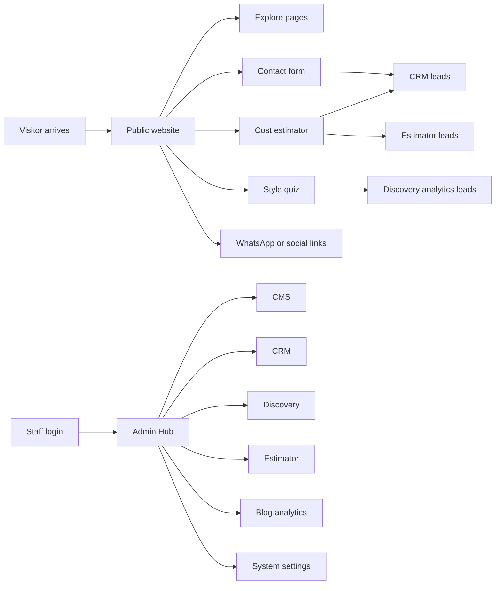
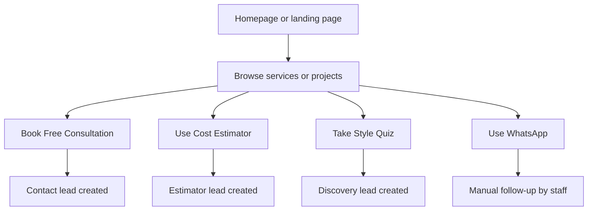
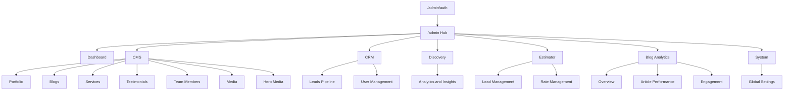
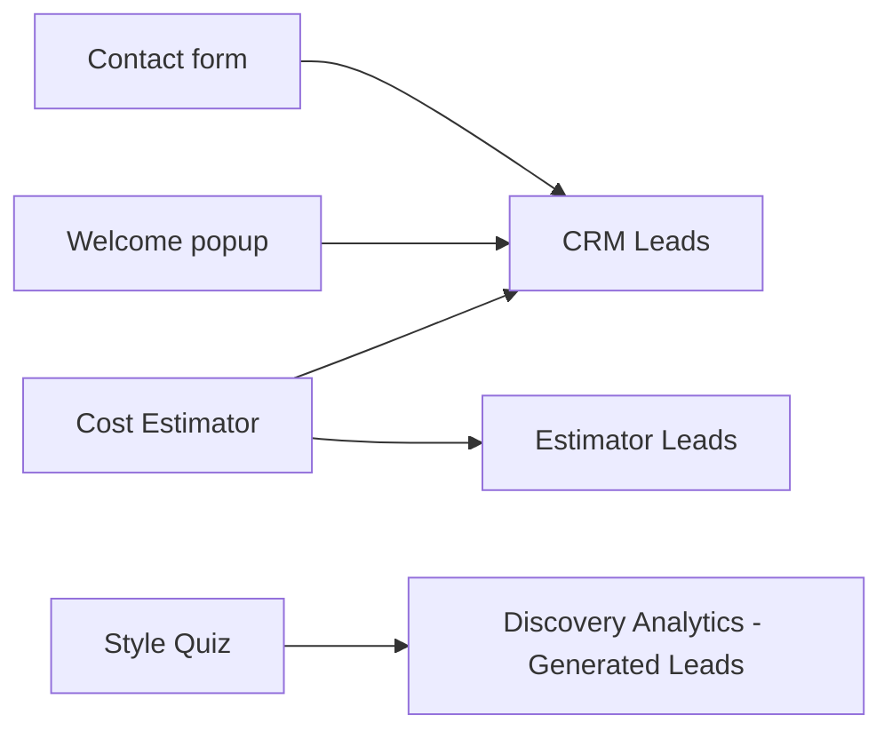
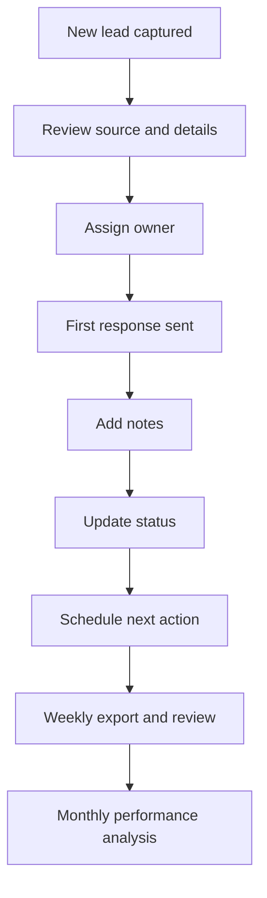

# Cross Angle Interior Website User Manual

**Version:** 2.0  
**Prepared for:** Client owners, operations staff, sales staff, and content editors  
**Branch basis:** Current branch snapshot reviewed on March 24, 2026  
**Primary formats:** Markdown for digital use, PDF for print distribution

---

## Table of Contents

1. [Purpose and Branch Summary](#1-purpose-and-branch-summary)
2. [Roles and Access Levels](#2-roles-and-access-levels)
3. [Public Website Navigation](#3-public-website-navigation)
4. [Admin and Staff Navigation](#4-admin-and-staff-navigation)
5. [Lead Capture Features: Step-by-Step Instructions](#5-lead-capture-features-step-by-step-instructions)
6. [Guidelines for How Visitors Can Interact with the Website](#6-guidelines-for-how-visitors-can-interact-with-the-website)
7. [Best Practices for Managing and Analyzing Captured Leads](#7-best-practices-for-managing-and-analyzing-captured-leads)
8. [Troubleshooting and Operational Notes](#8-troubleshooting-and-operational-notes)
9. [Digital and Print Accessibility Guidance](#9-digital-and-print-accessibility-guidance)
10. [Appendix: Quick Reference Checklists](#10-appendix-quick-reference-checklists)

---

## 1. Purpose and Branch Summary

This manual explains how to use the website and admin console that exist in the current branch. It is intended to help:

- Client owners understand the full website and admin experience.
- Staff members process leads, update content, and review analytics.
- Visitors follow the clearest path for contacting the business.

### 1.1 Current Platform Summary

The branch currently contains two main experiences:

| Experience | Main entry points | Main purpose |
| --- | --- | --- |
| Public website | `/`, `/services`, `/gallery`, `/about-us`, `/blog`, `/contact-us`, `/estimate`, `/style-quiz` | Brand presentation, service discovery, trust building, lead capture |
| Admin console | `/admin/auth`, `/admin`, `/admin/dashboard`, `/admin/cms/*`, `/admin/crm/*`, `/admin/discovery/*`, `/admin/estimator/*`, `/admin/blog/*`, `/admin/system/*` | Content management, lead handling, analytics, user control, system settings |

### 1.2 Lead Sources Present in This Branch

The current branch captures leads from multiple touchpoints:

| Lead source label | Visitor touchpoint | Staff review location |
| --- | --- | --- |
| `website_contact` | Contact form on `/contact-us` | CRM Leads at `/admin/crm/leads` |
| `welcome_popup` | Homepage popup on `/` | CRM Leads at `/admin/crm/leads` |
| `estimator` | Cost Estimator on `/estimate` | Estimator Leads at `/admin/estimator/leads` and CRM Leads |
| `discovery_engine` | Style Quiz on `/style-quiz` | Discovery Analytics at `/admin/discovery/analytics` |

### 1.3 High-Level Website Map

---

## 2. Roles and Access Levels

### 2.1 Who Uses the Platform

| Role | Typical user | Main responsibilities |
| --- | --- | --- |
| Visitor | Prospective client | Browse services, review portfolio, submit an inquiry, use estimator, take style quiz |
| Admin | Client owner or senior operator | Full platform control, lead review, settings, pricing, user access, content approvals |
| Editor or Staff | Sales, marketing, operations, content staff | Manage content, process leads, review discovery data, update portfolio and blog items |

### 2.2 Access Notes for Staff

- All staff must authenticate at `/admin/auth`.
- Admin users have the broadest access, including system settings, user administration, and rate management.
- Editors and operational staff can generally work inside Dashboard, CMS, CRM Leads, Discovery Analytics, Estimator Leads, and Blog Analytics.
- If a page redirects back to `/admin`, that usually means the account does not have permission for that module.

### 2.3 Recommended Internal Ownership

| Area | Suggested owner |
| --- | --- |
| Dashboard and daily monitoring | Client owner or operations lead |
| CRM Leads | Sales or customer response team |
| Estimator Leads | Sales lead or project qualification team |
| Discovery Analytics | Marketing, design strategy, or business development |
| CMS and portfolio updates | Marketing or content editor |
| Settings, pricing, and user access | Client owner or senior admin |

---

## 3. Public Website Navigation

### 3.1 Main Navigation for Visitors

The public header currently shows these core menu items:

| Navigation label | Route | What the visitor can do there |
| --- | --- | --- |
| Home | `/` | See the brand story, services overview, process, portfolio highlights, and testimonials |
| Services | `/services` | Explore residential, commercial, and specialized service categories |
| Projects | `/gallery` | Review project imagery and case-study style work samples |
| About | `/about-us` | Read company background and team positioning |
| Blog | `/blog` | Read educational and trust-building content |
| Book Free Consultation | `/contact-us` | Open the main inquiry and consultation path |

### 3.2 What Visitors See on the Homepage

The homepage currently includes the following major sections:

- Hero section
- About section
- Services section
- Process section
- Portfolio section
- Trust section
- Before and After showcase
- Testimonials

Additional homepage navigation aids:

- A floating WhatsApp button appears on the right side.
- A fixed social bar appears on larger screens and as a bottom bar on mobile.
- Section navigation dots appear after the visitor scrolls down.
- A welcome popup can appear on the homepage to collect contact details.

### 3.3 Where Visitors Go Based on Intent

| Visitor goal | Recommended path |
| --- | --- |
| "I want to speak with someone now" | Click `Book Free Consultation` or open `/contact-us` |
| "I need a rough budget first" | Open `/estimate` |
| "I am not sure about my style yet" | Open `/style-quiz` |
| "I want proof of work" | Browse `/gallery`, service pages, and `/blog` |
| "I have a quick question" | Use WhatsApp or social links |

### 3.4 Mobile Navigation

On mobile devices:

- The main menu collapses into a hamburger menu.
- The same core page links remain available.
- The consultation button remains visible inside the mobile menu.
- The social bar moves to the bottom of the screen and can hide while scrolling.

### 3.5 Visitor Journey Diagram

---

## 4. Admin and Staff Navigation

### 4.1 Login Flow

Follow these steps to enter the admin area:

1. Go to `/admin/auth`.
2. Enter the registered email and password.
3. If the password is forgotten, use the recovery flow on the same screen.
4. After successful login, the system opens the Admin Hub at `/admin`.

### 4.2 How the Admin Area Is Structured

The current branch no longer uses the older left-sidebar admin structure. It now uses:

- A top bar with logo, breadcrumb, alerts, refresh, and account controls.
- An Admin Hub launcher page with module tiles.
- Module pages with tabbed navigation inside each module.

### 4.3 What Staff See in the Top Bar

The top bar is used for:

- Returning to the Admin Hub
- Seeing breadcrumb context
- Opening account and settings controls
- Logging out securely

### 4.4 Admin Hub Modules

| Module | Primary route | What it is used for |
| --- | --- | --- |
| Intelligence Hub | `/admin/dashboard` | KPI overview, activity summary, lead totals, site-level monitoring |
| CMS | `/admin/cms/portfolio` | Website content management |
| CRM | `/admin/crm/leads` | Lead handling and user administration |
| Blog Analytics | `/admin/blog/overview` | Blog reporting and engagement review |
| Discovery Engine | `/admin/discovery/analytics` | Quiz performance and generated lead review |
| Estimator Engine | `/admin/estimator/leads` | Estimate-specific lead review and pricing control |
| System Configuration | `/admin/system/settings` | Global settings and site-wide controls |
| Team Access | `/admin/system/team-members` | Public team profile management for the website |

**Note:** User account permissions are managed in CRM `User Management`, while the Hub tile labeled `Team Access` currently opens the public team member management screen.

**Note:** If the Hub shows tiles that do not open a live page in this branch, treat them as reserved or future-facing modules rather than daily operating tools.

### 4.5 CMS Module Tabs

The CMS module currently contains:

| Tab | Route | Main use |
| --- | --- | --- |
| Portfolio | `/admin/cms/portfolio` | Add and manage project entries |
| Blogs | `/admin/cms/blogs` | Create and edit blog content |
| Services | `/admin/cms/services` | Maintain service pages and supporting details |
| Testimonials | `/admin/cms/testimonials` | Manage client reviews |
| Team Members | `/admin/cms/team` | Maintain public team listings |
| Media | `/admin/cms/media` | Upload and organize media assets |
| Hero Media | `/admin/cms/hero` | Manage homepage hero slides and media |

### 4.6 CRM Module Tabs

| Tab | Route | Main use |
| --- | --- | --- |
| Leads Pipeline | `/admin/crm/leads` | Review, filter, export, and update lead records |
| User Management | `/admin/crm/users` | Invite, suspend, or manage admin users |

### 4.7 Discovery, Estimator, Blog, and System Tabs

| Module | Available tabs |
| --- | --- |
| Discovery Engine | Analytics and Insights |
| Estimator Engine | Lead Management, Rate Management |
| Blog Analytics | Overview, Article Performance, Engagement |
| System Configuration | Global Settings |

### 4.8 Admin Navigation Diagram

---

## 5. Lead Capture Features: Step-by-Step Instructions

### 5.1 Contact Form on `/contact-us`

**Purpose:** Capture consultation-ready inquiries from visitors who already want direct contact.

**Visitor fields currently collected:**

- First Name
- Last Name
- Email Address
- Phone Number
- Project message

**How a visitor uses it:**

1. Open `/contact-us`.
2. Scroll to the "Send Us a Message" section.
3. Enter name, email, phone number, and project description.
4. Click `Send Message`.
5. Wait for the success confirmation message.

**How staff should handle it:**

1. Open `/admin/crm/leads`.
2. Search by the visitor's name, email, or phone number.
3. Confirm that the source is marked as Website or `website_contact`.
4. Open the lead detail sheet.
5. Add internal notes and update the lead status.
6. Start first contact and log the response action.

### 5.2 Homepage Welcome Popup on `/`

**Purpose:** Capture lightweight early-stage interest from visitors who have not yet filled a full inquiry form.

**Current behavior in this branch:**

- The popup appears on the homepage after roughly 5 seconds for visitors who have not previously dismissed it.

**Visitor fields currently collected:**

- Email Address
- Phone Number

**How a visitor uses it:**

1. Visit the homepage.
2. Wait for the popup to appear.
3. Enter email and phone number.
4. Click `Get Free Consultation`.

**How staff should handle it:**

1. Open `/admin/crm/leads`.
2. Filter for new leads.
3. Identify records marked with source `welcome_popup`.
4. Contact these visitors with a short introductory message.
5. Move high-quality records into the next action stage quickly, because popup leads are often early but warm.

### 5.3 Cost Estimator on `/estimate`

**Purpose:** Capture budget-aware visitors and qualify them with project scope, size, and timeline data.

**Current visitor flow in this branch:**

| Step | What the visitor provides |
| --- | --- |
| 1. Property Type | Apartment, villa, office, independent floor, turnkey, or renovation |
| 2. Property Details | Area, room count, floors, project stage, and other relevant layout details |
| 3. Location | State, city, and city tier |
| 4. Investment Scope | Budget amount and comfort level |
| 5. Service Level | Selected service package and, when needed, execution tier |
| 6. Bespoke Add-ons | Kitchen, wardrobes, false ceiling, smart home, custom furniture, lighting |
| 7. Timeline and Contact | Start timing, name, email, and phone |
| 8. Results | Estimated min and max budget range |

**How a visitor uses it:**

1. Open `/estimate`.
2. Complete each step in order using the progress rail.
3. Provide accurate area, location, and budget information.
4. Add contact details in the final step.
5. Click `Get Estimate`.
6. Review the estimate result screen.

**What the system records:**

- Property type
- Area and scope details
- City and city tier
- Budget amount
- Selected service and execution tier
- Start timing
- Contact details
- Estimated price range
- Calculated lead score

**How staff should handle it:**

1. Open `/admin/estimator/leads` to review estimate-specific records.
2. Sort or scan for the newest entries first.
3. Review estimate range, area, property type, and lead score.
4. Open `/admin/crm/leads` to continue general follow-up and status tracking.
5. If pricing assumptions need adjustment, an admin can open `/admin/estimator/rates`.

### 5.4 Style Quiz on `/style-quiz`

**Purpose:** Capture design-oriented visitors who are still discovering their aesthetic direction.

**Current experience in this branch:**

- Guided multi-stage quiz
- Aesthetic scoring
- Archetype result generation
- Lead gate before full results
- Analytics and generated lead review for staff

**How a visitor uses it:**

1. Open `/style-quiz`.
2. Start the guided quiz.
3. Complete the reflection, lifestyle, visual, language, emotional, material, light, and pattern stages.
4. Review the preview state.
5. Enter full name and email, and optionally phone, at the lead gate.
6. Click `Reveal My Results`.
7. Review the personalized result once the lead gate is complete.

**What the system records:**

- Name
- Email
- Optional phone number
- Aesthetic archetype
- Scoring signals
- Raw quiz answers
- Session and completion analytics

**How staff should handle it:**

1. Open `/admin/discovery/analytics`.
2. Review the dashboard metrics first.
3. Switch to the `Generated Leads` view.
4. Open individual records and review city, project type, timeline, and contact data if available.
5. Use the analytics view to understand where visitors drop off in the quiz journey.

### 5.5 Lead Source Routing Diagram

---

## 6. Guidelines for How Visitors Can Interact with the Website

### 6.1 Best Visitor Paths by Intent

Use the following guidance when advising visitors or when training staff to guide them:

| If the visitor wants to... | Direct them to... |
| --- | --- |
| Discuss a live project | `/contact-us` |
| Get a fast budget range | `/estimate` |
| Explore design style first | `/style-quiz` |
| Review proof of quality | `/gallery`, `/services`, `/blog` |
| Start with a quick conversation | WhatsApp |

### 6.2 Guidance Staff Can Share with Visitors

- Encourage visitors to mention city, area, budget, and desired start date.
- Encourage visitors to browse Services and Projects before submitting an inquiry.
- If a visitor is unsure what they need, send them to the Style Quiz first.
- If a visitor is mainly cost-sensitive, send them to the Estimator first.
- If a visitor wants immediate human contact, send them directly to Contact or WhatsApp.

### 6.3 Good Visitor Behavior That Improves Lead Quality

- Use real names, phone numbers, and working email addresses.
- Include at least a short summary of the project.
- Provide realistic budget expectations when possible.
- State whether the project is residential, commercial, renovation, or turnkey.
- Mention when the project should begin.

### 6.4 Recommended Staff Response Language

- Thank the visitor for reaching out.
- Confirm receipt of the inquiry.
- State the expected response window.
- Ask for any missing information in one message rather than several short follow-ups.
- Recommend the next step: call, consultation, estimate review, or design discussion.

---

## 7. Best Practices for Managing and Analyzing Captured Leads

### 7.1 Daily Lead Management Routine

Recommended daily order:

1. Open `/admin/dashboard` for a quick KPI review.
2. Open `/admin/crm/leads` and process all new general leads.
3. Open `/admin/estimator/leads` and review estimate-specific submissions.
4. Open `/admin/discovery/analytics` and review newly generated quiz leads.
5. Assign ownership for each live opportunity before the day ends.

### 7.2 CRM Best Practices

- Search by email or phone before creating or contacting a lead to avoid duplicates.
- Add notes after every call, email, or WhatsApp interaction.
- Keep the status current so the pipeline view remains trustworthy.
- Use one owner per lead whenever possible.
- Keep names, phone numbers, and city fields standardized for reporting.

### 7.3 Status and Pipeline Discipline

Because teams often customize closing terms, use one consistent internal pipeline language and stick to it across exports and reviews.

Recommended working flow:

- New
- Contacted
- Qualified
- Proposal
- Negotiation or final review
- Won or Closed
- Lost

### 7.4 Lead Prioritization

Prioritize in this order:

1. High-score estimator leads with clear budget and timeline.
2. Contact-form leads that include both phone and a detailed project message.
3. Discovery leads that indicate a real project, city, and response readiness.
4. Welcome-popup leads that need qualification before deep follow-up.

### 7.5 Weekly Analysis Checklist

At least once each week:

- Export CRM leads as CSV from `/admin/crm/leads`.
- Review estimator volume and estimate ranges from `/admin/estimator/leads`.
- Review discovery completion rate and generated leads from `/admin/discovery/analytics`.
- Compare lead volume by source.
- Compare conversion quality by source.
- Note which service category or page type is attracting the best leads.

### 7.6 Monthly Review Checklist

At least once each month:

- Compare month-over-month lead volume.
- Compare estimator leads against contact-form leads.
- Review discovery quiz drop-off stages.
- Review response speed and close rate.
- Refresh CTA wording if one lead source is underperforming.
- Review whether pricing rates still reflect real market positioning.

### 7.7 Reporting Metrics Worth Tracking

Use a small core metrics set:

- Total new leads
- Leads by source
- Leads by service type
- Average first response time
- Estimate lead count
- Discovery completion rate
- Qualified-to-proposal rate
- Proposal-to-win rate

### 7.8 Lead Operations Diagram

---

## 8. Troubleshooting and Operational Notes

### 8.1 Staff Cannot Log In

- Confirm the user is going to `/admin/auth`.
- Use the recovery flow if the password is unknown.
- Confirm the user account is still active.
- If login succeeds but a page redirects to `/admin`, check role permissions.

### 8.2 A Lead Is Missing from CRM

- Refresh the page.
- Clear filters and search terms.
- Search by both email and phone.
- Check the correct source screen:
- Contact and popup leads belong in CRM.
- Estimator leads belong in Estimator Leads and also feed CRM.
- Discovery leads belong in Discovery Analytics.

### 8.3 Duplicate Leads Appear

- Search before taking action.
- Keep one main record as the working record.
- Copy useful notes into the retained record.
- Mark the duplicate internally so reporting stays clean.

### 8.4 A Visitor Says the Estimator Did Not Open Correctly

- Send the direct estimator URL: `/estimate`.
- Confirm the visitor is not using an outdated or bookmarked link.
- If needed, direct them to the contact form as a fallback.

### 8.5 A Team Member Cannot Access Settings or Rate Management

- These areas should be treated as admin-controlled functions.
- Confirm the account has the proper access level.

### 8.6 Diagram Rendering Notes

- Mermaid diagrams display well in Markdown viewers that support Mermaid.
- Before sending a printed PDF to the client, verify that the export tool renders diagrams correctly.
- If the PDF tool does not render Mermaid, replace diagrams with screenshots or exported images.

---

## 9. Digital and Print Accessibility Guidance

### 9.1 Digital Use Recommendations

- Keep this manual in the `docs` folder as the source of truth.
- Export a PDF copy for client sharing.
- Keep headings numbered so staff can reference sections quickly in calls or meetings.
- Preserve route names like `/contact-us` and `/admin/crm/leads` in the digital version for quick lookup.

### 9.2 Print Use Recommendations

- Print on A4 portrait unless large tables require landscape pages.
- Add page numbers in the footer of the PDF export.
- Keep each major section on a fresh page when possible.
- Verify that diagrams are readable in grayscale or convert them to image assets first.

### 9.3 Recommended File Formats

| Use case | Recommended format |
| --- | --- |
| Internal editing | Markdown |
| Client digital distribution | PDF |
| Staff onboarding pack | PDF plus link to live Markdown |
| Printed handout | PDF exported with page numbers |

### 9.4 Optional Screenshot Plan

If the client later requests a more visual version, add screenshots for:

- Admin Hub landing page
- CRM Leads list view
- CRM Leads board view
- Estimator results screen
- Discovery lead gate screen
- Contact page form

---

## 10. Appendix: Quick Reference Checklists

### 10.1 Daily Staff Checklist

- Check Dashboard.
- Review new CRM leads.
- Review Estimator Leads.
- Review Discovery Generated Leads.
- Update notes and statuses.
- Assign next actions before logging out.

### 10.2 Visitor Support Checklist

- Confirm receipt of the inquiry.
- Thank the visitor.
- Ask for missing city, area, budget, or timeline details.
- Route them to the right next step.
- Record the action in notes.

### 10.3 Content Update Checklist

- Confirm the correct CMS tab.
- Make the content update.
- Review the public page after saving.
- Check linked media and hero assets.
- Notify the owner if the update affects a campaign or live CTA.

### 10.4 Lead Review Checklist by Source

| Source | First screen to open | First thing to verify |
| --- | --- | --- |
| Contact form | `/admin/crm/leads` | Message quality and contact details |
| Welcome popup | `/admin/crm/leads` | Phone and email validity |
| Estimator | `/admin/estimator/leads` | Budget range, area, and service type |
| Style quiz | `/admin/discovery/analytics` | Lead details plus completion context |

---

**Document owner recommendation:** Client owner or operations lead  
**Next review recommendation:** Update this manual whenever admin routes, lead sources, or staff workflows change
