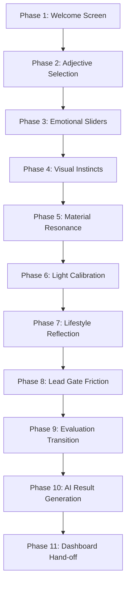
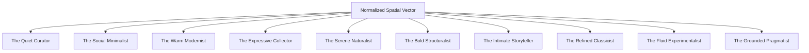

# Interior Discovery Engine: Product & Technical Specification

## Modern Aesthetic Qualification Platform for Luxury Interior Design

---

### Executive Vision & Strategy

The **Interior Discovery Engine** is a high-fidelity visual and emotional qualification platform designed to align high-value clients with curated interior design archetypes. Rather than employing traditional, text-heavy surveys that incur high drop-off rates, the engine uses visual cognition, semantic associations, tactile preferences, and structured micro-interactions to build a five-dimensional aesthetic score.

By translating visceral user preferences (e.g., choice of material, lighting mood, semantic adjectives, and visual renders) into structured mathematical attributes, the engine accomplishes three goals:

1. **Unparalleled Client Delight**: Engages the user in an elegant, interactive journey that reflects the premium caliber of Crossangle's design studio.
2. **Deep Behavioral Intelligence**: Generates a detailed 5D aesthetic vector mapping the client's relationship with space.
3. **High-Intent Lead Qualification**: Introduces a psychologically optimized "Lead Gate" at the peak of user curiosity to capture highly qualified contact info for the CRM.

---

## 1. Product Requirements Document (PRD)

### 1.1 User Journey & Phase Flow

The system operates on an 11-phase modular flow. The transition from one stage to another accumulates scoring vectors.



#### Phase-by-Phase Breakdown

1. **Phase 1: Welcome Screen (Initialization)**
   - **User Experience**: Premium, editorial hero interface featuring a high-contrast aesthetic. Brief copy sets the expectation of a self-discovery process.
   - **System Action**: Instantiates the core user session and sets the five aesthetic dimensional traits to a neutral baseline: `[minimalism: 5, warmth: 5, social: 5, structure: 5, novelty: 5]`.

2. **Phase 2: Adjective Selection (Semantic Mapping)**
   - **User Experience**: A tag cloud of 15 semantic design adjectives (e.g., *Calm*, *Luxurious*, *Moody*, *Organic*). The user must select exactly 3-5 tags.
   - **System Action**: Applies pre-allocated vector updates to the dimensional scores based on selected tags.

3. **Phase 3: Emotional Anchors (Fluid Range Sliders)**
   - **User Experience**: Four bespoke horizontal range sliders measuring abstract preference axis controls.
   - **System Action**: Tracks absolute slider coordinates. Normalizes the values to center around 5, and applies inversion adjustments for dimensions like `minimalism`.

4. **Phase 4: Visual Instincts (18 Renders)**
   - **User Experience**: A 3x6 masonry grid of 18 high-fidelity photorealistic renders representing a range of interior layouts, materials, and styles. The user selects their top 3 images based on initial visual instinct.
   - **System Action**: Multiplies visual selections by their respective style dimension weights to skew the overall vector.

5. **Phase 5: Material Resonance (Tactile Choice)**
   - **User Experience**: A selection of 5 tactile material cards (e.g., Brushed Concrete, Warm Timber, Woven Linen, Matte Metal).
   - **System Action**: Adds concrete weight vectors that reinforce physical preferences.

6. **Phase 6: Light Calibration (Environmental Lighting)**
   - **User Experience**: A choice of 4 ambient lighting environmental states (e.g., Golden Hour, Cool Daylight, Dramatic Spotlight).
   - **System Action**: Shifts scores to reflect lighting preferences (e.g., cozy/social vs dramatic/minimalist).

7. **Phase 7: Lifestyle Reflection (Contextual Questionnaire)**
   - **User Experience**: Two multi-choice contextual questions targeting the actual usage of the space (e.g., entertainment frequency, workspace needs).
   - **System Action**: Skews vectors according to functional demands (e.g., high social score for active hosting).

8. **Phase 8: Lead Gate (Psychological Friction)**
   - **User Experience**: Just before displaying the custom report, the user is presented with a high-friction form requiring name, email, phone, and optional project requirements.
   - **System Action**: Locks the report view. Validates input and triggers a synchronous payload sync to Supabase.

9. **Phase 9: Evaluation Transition (Score Computation)**
   - **User Experience**: Elegant visual loader displaying pseudo-analytical steps (e.g., "Analyzing spatial vectors...", "Mapping material matrix...").
   - **System Action**: Executes core score centering, compression, clamping, and applies archetype matching formulas.

10. **Phase 10: AI Result Generation & Aesthetic Report**
    - **User Experience**: A highly detailed, custom-tailored aesthetic profile. Includes matching percentage, style signature, recommended materials, and actionable design strategies.
    - **System Action**: Pulls custom copy for the matching archetype and displays dynamic visual recommendations.

11. **Phase 11: Main Dashboard Hand-off**
    - **User Experience**: Dynamic CTA directing the qualified user to book a consultation or browse a matched portfolio.
    - **System Action**: Saves matching analytics and prepares the lead for automatic CRM routing.

---

## 2. Technical Requirements Document (TRD)

### 2.1 Core Scoring Algorithm & Mathematics

The system maps user actions onto a five-dimensional vector space:
$$V = [m, w, s, t, n]$$
Where:

- $m$: **Minimalism** (Simplicity vs. Eclecticism/Complexity)
- $w$: **Warmth** (Cozy/Organic vs. Cool/Industrial)
- $s$: **Social** (Hosting/Open vs. Private/Intimate)
- $t$: **Structure** (Symmetrical/Ordered vs. Relaxed/Fluid)
- $n$: **Novelty** (Experimental/Bold vs. Timeless/Classic)

#### Mathematical Transformations

1. **Initial Vector State ($V_0$):**
   $$V_0 = \begin{bmatrix} 5 \\ 5 \\ 5 \\ 5 \\ 5 \end{bmatrix}$$

2. **Accumulation phase ($V_{\text{raw}}$):**
   Given a set of user selections $S$, where each selection $i \in S$ carries a dimensional weight vector $\Delta W_i$:
   $$V_{\text{raw}} = V_0 + \sum_{i \in S} \Delta W_i$$

3. **Centering & Compression ($V_{\text{compressed}}$):**
   To prevent rapid drift to extreme bounds (1 or 9) and preserve sensitivity, raw scores are centered around 5, compressed by a factor of $0.7$, and re-scaled:
   $$V_{\text{centered}} = V_{\text{raw}} - 5$$
   $$V_{\text{compressed}} = V_{\text{centered}} \times 0.7$$

4. **Clamping & Normalization to 1–9 Integer Scale ($V_{\text{normalized}}$):**
   Each dimension $d \in V_{\text{compressed}}$ is scaled, mapped back to the 1-9 range, and rounded:
   $$V_{\text{normalized}} = \text{round}\left( \max\left(1, \min\left(9, 5 + d \times 5\right) \right) \right)$$

---

### 2.2 Exhaustive Parameter Mapping Matrices

#### 2.2.1 Adjective Weights (Phase 2)

The exact mathematical vector shifts applied upon selecting any of the 15 adjectives:

| Adjective | Minimalism ($m$) | Warmth ($w$) | Social ($s$) | Structure ($t$) | Novelty ($n$) |
| :--- | :---: | :---: | :---: | :---: | :---: |
| **Calm** | 0 | +1 | -1 | 0 | 0 |
| **Structured** | 0 | 0 | 0 | +2 | 0 |
| **Bold** | -1 | 0 | +1 | 0 | 0 |
| **Playful** | 0 | +1 | +1 | 0 | 0 |
| **Elegant** | +1 | 0 | 0 | +1 | 0 |
| **Moody** | +1 | -1 | 0 | 0 | 0 |
| **Warm** | 0 | +2 | 0 | 0 | 0 |
| **Minimal** | +2 | 0 | 0 | 0 | 0 |
| **Eclectic** | -2 | 0 | +1 | 0 | 0 |
| **Soft** | 0 | +1 | 0 | -1 | 0 |
| **Grounded** | 0 | +1 | 0 | +1 | 0 |
| **Luxurious** | 0 | +1 | 0 | +1 | 0 |
| **Organic** | -1 | +2 | 0 | 0 | 0 |
| **Modern** | +1 | 0 | 0 | +1 | 0 |
| **Timeless** | +1 | 0 | 0 | +2 | 0 |

#### 2.2.2 Emotional Range Sliders (Phase 3)

Sliders map values between $0$ and $10$. They are processed as direct coordinates, with **Minimalism** undergoing inversion logic before aggregation:

- **Warmth**: Directly maps $0 \to 10$ to Warmth score ($w$).
- **Social**: Directly maps $0 \to 10$ to Social score ($s$).
- **Structure**: Directly maps $0 \to 10$ to Structure score ($t$).
- **Minimalism (Inversion Logic)**:
  $$m_{\text{derived}} = 10 - m_{\text{slider\_value}}$$

#### 2.2.3 Visual Instinct Renders (Phase 4)

The 18 photorealistic visual options map to the following dimensional vectors:

| Card ID | Visual Theme | Minimalism ($m$) | Warmth ($w$) | Social ($s$) | Structure ($t$) | Novelty ($n$) |
| :---: | :--- | :---: | :---: | :---: | :---: | :---: |
| **1** | Bare Concrete Minimal Loft | +3 | -1 | 0 | +2 | +1 |
| **2** | Sunny Mid-Century Lounge | 0 | +3 | +1 | 0 | +2 |
| **3** | Japandi Soft Timber Bedroom | +2 | +2 | 0 | 0 | +1 |
| **4** | Symmetrical Classical Library | +3 | 0 | 0 | +3 | 0 |
| **5** | Bold Bauhaus Dining Area | 0 | +1 | 0 | +2 | +2 |
| **6** | Cozy Mediterranean Kitchen | -1 | +3 | 0 | 0 | +2 |
| **7** | Brutalist Open-Air Patio | 0 | 0 | +2 | +1 | +1 |
| **8** | Vibrant Bohemian Salon | -2 | +2 | +3 | 0 | +2 |
| **9** | Monochromatic Nordic Workspace | +2 | +1 | 0 | 0 | +1 |
| **10** | High-End Glass Pavilion | +3 | +1 | 0 | +2 | 0 |
| **11** | Neo-Classical Salon | 0 | +2 | +1 | +3 | +2 |
| **12** | Avant-Garde Fluid Art Studio | 0 | +1 | 0 | 0 | +3 |
| **13** | Rustic Farmhouse Gathering | 0 | +3 | +2 | +1 | +1 |
| **14** | High-Tech Minimalist Suite | +3 | 0 | 0 | +3 | +2 |
| **15** | Wabi-Sabi Clay & Stone Bath | +2 | +2 | 0 | +1 | 0 |
| **16** | Maximalist Retro-Future Den | -1 | +3 | +2 | 0 | +3 |
| **17** | Modernist Steel Office | +2 | 0 | 0 | +2 | +1 |
| **18** | Balanced Urban Apartment | +2 | +1 | 0 | +2 | +1 |

#### 2.2.4 Material Resonance (Phase 5)

Tactile choices skew the aesthetic parameters towards their physical characteristics:

| Material | Minimalism ($m$) | Warmth ($w$) | Social ($s$) | Structure ($t$) | Novelty ($n$) |
| :--- | :---: | :---: | :---: | :---: | :---: |
| **Brushed Concrete** | +3 | -1 | 0 | 0 | +1 |
| **Warm Timber** | 0 | +3 | 0 | +1 | 0 |
| **Polished Stone** | +1 | 0 | 0 | +3 | 0 |
| **Woven Linen** | 0 | +2 | +1 | 0 | 0 |
| **Matte Metal** | +2 | 0 | 0 | +2 | +2 |

#### 2.2.5 Light Calibration (Phase 6)

Environmental light styles map to visual mood:

| Light State | Minimalism ($m$) | Warmth ($w$) | Social ($s$) | Structure ($t$) | Novelty ($n$) |
| :--- | :---: | :---: | :---: | :---: | :---: |
| **Golden Hour** | 0 | +3 | +1 | 0 | 0 |
| **Cool Daylight** | +2 | 0 | 0 | +1 | +1 |
| **Soft Candlelight** | 0 | +2 | -1 | 0 | 0 |
| **Dramatic Spotlight** | -1 | 0 | 0 | +2 | +3 |

#### 2.2.6 Lifestyle Reflection (Phase 7)

Functional questions mapping:

- **Question 1: "How do you intend to share your space?"**
  - *Option A: Private sanctuary, deeply intimate.* $\to [m: +2, w: +1, s: -2, t: 0, n: 0]$
  - *Option B: Flexible zones for small gatherings.* $\to [m: 0, w: +1, s: +2, t: +1, n: 0]$
  - *Option C: Grand statements, frequent hosting.* $\to [m: -1, w: 0, s: +3, t: +2, n: +1]$
  - *Option D: Fluid transitions, hybrid routines.* $\to [m: +1, w: 0, s: +1, t: -2, n: +2]$

- **Question 2: "What is your primary relationship with objects?"**
  - *Option A: Few, highly curated artifacts.* $\to [m: +3, w: -1, s: 0, t: +2, n: 0]$
  - *Option B: Ever-evolving collections.* $\to [m: -2, w: +1, s: +1, t: 0, n: +3]$
  - *Option C: Balanced, clean order.* $\to [m: +1, w: +1, s: 0, t: +3, n: 0]$
  - *Option D: Focus on tactile warmth.* $\to [m: 0, w: +3, s: 0, t: +1, n: 0]$

---

### 2.3 Archetype Matching Functions

The normalized vector $S = [m, w, s, t, n]$ is evaluated against ten specialized matching equations. The archetype returning the highest scalar score is chosen.



#### Matching Equations & Metadict Configurations

1. **The Quiet Curator**
   - **Target Formula**:
     $$f(S) = 1.5m + (10 - s) + t + (5 - n)$$
   - **Traits**: `["Intentional", "Restrained", "Thoughtful", "Peaceful"]`
   - **Material Bias**: "Stone & Linen"
   - **Strategy**: "Embrace negative space. Prioritize single-source architectural statement lighting and allow natural surfaces to showcase their organic textures."

2. **The Social Minimalist**
   - **Target Formula**:
     $$f(S) = 1.4s + m + (10 - t) + 0.5w$$
   - **Traits**: `["Open", "Welcoming", "Effortless", "Adaptable"]`
   - **Material Bias**: "Linen & Timber"
   - **Strategy**: "Design flexible, modular seating layouts. Use low-slung, floating joinery to keep spatial boundaries fluid and welcoming for dynamic hosting."

3. **The Warm Modernist**
   - **Target Formula**:
     $$f(S) = 1.3w + t + 0.8m + (5 - n)$$
   - **Traits**: `["Balanced", "Grounded", "Refined", "Comfortable"]`
   - **Material Bias**: "Timber & Stone"
   - **Strategy**: "Layer rich wood paneling against crisp architectural plaster. Integrate built-in ambient lighting to maintain a warm yet highly ordered spatial grid."

4. **The Expressive Collector**
   - **Target Formula**:
     $$f(S) = w + s + 1.3(10 - m) + n$$
   - **Traits**: `["Bold", "Expressive", "Warm", "Story-driven"]`
   - **Material Bias**: "Mixed Textures"
   - **Strategy**: "Create asymmetrical salon walls and bespoke display alcoves. Combine contrasting fabrics, vintage furniture, and highly custom light fixtures."

5. **The Serene Naturalist**
   - **Target Formula**:
     $$f(S) = 1.5w + 0.8m + (10 - n) + 0.6(8 - s)$$
   - **Traits**: `["Earthy", "Organic", "Calm", "Grounded"]`
   - **Material Bias**: "Raw Wood & Clay"
   - **Strategy**: "Incorporate low-VOC clay plaster walls and raw-edge wooden details. Focus layout around views of nature and natural light patterns."

6. **The Bold Structuralist**
   - **Target Formula**:
     $$f(S) = 1.6t + n + 0.8(10 - w) + 0.5m$$
   - **Traits**: `["Architectural", "Dramatic", "Precise", "Commanding"]`
   - **Material Bias**: "Concrete & Metal"
   - **Strategy**: "Emphasize clean lines and structural junctions. Integrate cast concrete elements with polished chrome accents, relying on spotlights for high-contrast light."

7. **The Intimate Storyteller**
   - **Target Formula**:
     $$f(S) = 1.2w + 1.2s + 0.8n + 0.8(10 - m)$$
   - **Traits**: `["Nostalgic", "Layered", "Personal", "Inviting"]`
   - **Material Bias**: "Vintage Textiles & Brass"
   - **Strategy**: "Form clustered, cozy seating nooks. Accentuate with antique brass details, hand-knotted textiles, and soft, glowing lighting setups."

8. **The Refined Classicist**
   - **Target Formula**:
     $$f(S) = 1.3t + 1.2(10 - n) + 0.6w + 0.5m$$
   - **Traits**: `["Timeless", "Elegant", "Symmetrical", "Luxurious"]`
   - **Material Bias**: "Marble & Hardwood"
   - **Strategy**: "Implement symmetrical floor layouts, classical paneling details, and premium materials like Calacatta marble to establish a sense of enduring order."

9. **The Fluid Experimentalist**
   - **Target Formula**:
     $$f(S) = 1.8n + (10 - t) + 0.5s + 0.4(8 - m)$$
   - **Traits**: `["Experimental", "Dynamic", "Curious", "Unconventional"]`
   - **Material Bias**: "Resin & Recycled Materials"
   - **Strategy**: "Implement modular, highly mobile partition systems and dynamic colored lighting accents. Play with bold curves and high-gloss synthetics."

10. **The Grounded Pragmatist**
    - **Target Formula**:
      This archetype serves as a balancer, matching users who avoid stylistic extremes:
      $$f(S) = \text{Balance} + 0.5w + 0.5t$$
      Where:
      $$\text{Balance} = 10 - \left( |m-5| + |w-5| + |s-5| + |t-5| + |n-5| \right) \times 0.4$$
    - **Traits**: `["Practical", "Comfortable", "Honest", "Unpretentious"]`
    - **Material Bias**: "Solid Wood & Cotton"
    - **Strategy**: "Prioritize functional storage, ergonomics, and highly durable textiles. Arrange layouts to facilitate seamless daily routines."

---

## 3. System Architecture & Schema Specifications

### 3.1 Supabase Relational Database Schemas

The engine integrates directly with the existing Supabase Postgres instance via two tables: `public.quiz_results` and `public.leads`.

```text
  +------------------+                    +--------------------+
  |   quiz_results   |                    |       leads        |
  +------------------+                    +--------------------+
  | id (PK)          |                    | id (PK)            |
  | slug             |                    | name               |
  | archetype        |                    | email              |
  | scores           |                    | phone              |
  | signals          |                    | status             |
  | ai_result        |                    | lead_source        |
  | lead_id (FK)-----+------------------->| archetype          |
  | created_at       |                    | form_data          |
  +------------------+                    +--------------------+
```

#### Table: `public.quiz_results`

Stores computed spatial vectors, user signals, and generated style profiles.

| Column | Type | Constraints | Default | Comment |
| :--- | :--- | :--- | :--- | :--- |
| `id` | `uuid` | Primary Key | `gen_random_uuid()` | Unique identifier for the quiz result |
| `slug` | `text` | Unique | *None* | URL slug for client-facing report sharing |
| `archetype` | `text` | Not Null | *None* | The matched style archetype string |
| `scores` | `jsonb` | Not Null | *None* | Key-value store of the 5 spatial dimension traits |
| `signals` | `jsonb` | Nullable | *None* | Array of raw input choices for behavior tracking |
| `ai_result` | `jsonb` | Nullable | *None* | Generated content payload (Styling Directives, pieces) |
| `lead_id` | `uuid` | Foreign Key | *None* | Links to `public.leads.id` |
| `created_at` | `timestamptz` | Not Null | `now()` | Generation timestamp |

#### Table: `public.leads`

Captures demographic and project details submitted during Phase 8.

| Column | Type | Constraints | Default | Comment |
| :--- | :--- | :--- | :--- | :--- |
| `id` | `uuid` | Primary Key | `gen_random_uuid()` | Primary identifier |
| `name` | `text` | Not Null | *None* | Prospect full name |
| `email` | `text` | Not Null | *None* | Primary communication channel |
| `phone` | `text` | Nullable | *None* | Optional phone contact |
| `status` | `enum` | Not Null | `'new'` | Lead lifecycle state (`new`, `qualified`, etc.) |
| `lead_source` | `enum` | Nullable | *None* | Identifies origin (e.g., `'style_quiz'`) |
| `archetype` | `text` | Nullable | *None* | Denormalized matched archetype name for CRM sorting |
| `form_data` | `jsonb` | Nullable | *None* | Holds raw input payload for comprehensive audit |

---

### 3.2 JSON Structure Contracts

#### Contract 1: `quiz_results.ai_result`

A strict JSON contract detailing aesthetic classifications and design recommendations:

```json
{
  "$schema": "https://json-schema.org/draft/2020-12/schema",
  "title": "AestheticResultPayload",
  "type": "OBJECT",
  "required": ["matchedArchetype", "compatibilityScore", "stylingDirectives", "spaceRecommendations", "signaturePieces"],
  "properties": {
    "matchedArchetype": {
      "type": "STRING",
      "example": "The Warm Modernist"
    },
    "compatibilityScore": {
      "type": "INTEGER",
      "minimum": 0,
      "maximum": 100,
      "example": 94
    },
    "stylingDirectives": {
      "type": "ARRAY",
      "items": { "type": "STRING" },
      "example": [
        "Contrast rich walnut wood tones with textured travertine surfaces.",
        "Emphasize built-in spatial lighting over direct overhead spotlights."
      ]
    },
    "spaceRecommendations": {
      "type": "OBJECT",
      "required": ["livingRoom", "bedroom", "materialsPalette"],
      "properties": {
        "livingRoom": { "type": "STRING" },
        "bedroom": { "type": "STRING" },
        "materialsPalette": {
          "type": "ARRAY",
          "items": { "type": "STRING" }
        }
      }
    },
    "signaturePieces": {
      "type": "ARRAY",
      "items": {
        "type": "OBJECT",
        "required": ["itemName", "description", "aestheticJustification"],
        "properties": {
          "itemName": { "type": "STRING" },
          "description": { "type": "STRING" },
          "aestheticJustification": { "type": "STRING" }
        }
      }
    }
  }
}
```

#### Contract 2: `leads.form_data`

Detailed schema capturing the raw quiz choices made during execution for CRM auditing:

```json
{
  "$schema": "https://json-schema.org/draft/2020-12/schema",
  "title": "LeadFormDataPayload",
  "type": "OBJECT",
  "required": ["rawAnswers", "interactionMetrics"],
  "properties": {
    "rawAnswers": {
      "type": "OBJECT",
      "required": ["adjectives", "sliders", "visualCards", "material", "lighting", "lifestyle"],
      "properties": {
        "adjectives": {
          "type": "ARRAY",
          "items": { "type": "STRING" }
        },
        "sliders": {
          "type": "OBJECT",
          "required": ["warmth", "social", "minimalism", "structure"],
          "properties": {
            "warmth": { "type": "NUMBER" },
            "social": { "type": "NUMBER" },
            "minimalism": { "type": "NUMBER" },
            "structure": { "type": "NUMBER" }
          }
        },
        "visualCards": {
          "type": "ARRAY",
          "items": { "type": "INTEGER" },
          "minItems": 3,
          "maxItems": 3
        },
        "material": { "type": "STRING" },
        "lighting": { "type": "STRING" },
        "lifestyle": {
          "type": "ARRAY",
          "items": { "type": "STRING" }
        }
      }
    },
    "interactionMetrics": {
      "type": "OBJECT",
      "required": ["timeElapsedSeconds", "backbuttonClicks"],
      "properties": {
        "timeElapsedSeconds": { "type": "INTEGER" },
        "backbuttonClicks": { "type": "INTEGER" }
      }
    }
  }
}
```

---

## 4. Architectural & Security Critiques

An audit of the current workspace reveals several areas of technical debt, architectural risks, and security issues.

### 4.1 Shadcn UI Codebase Bloat & Component Duplication

- **The Issue**: There are identical copies of UI components located in both `src/components/ui` and `src/components/common/ui`.
- **Architectural Debt**:
  - **Bloat**: Increases the final production bundle size with redundant React code.
  - **Style Regressions**: Custom adjustments applied to a button in `src/components/ui/button.tsx` do not carry over to references import from `src/components/common/ui/button.tsx`.
- **Remediation**: Consolidate all common components into a single, clean directory (`src/components/ui`), and update imports across the codebase.

### 4.2 Scattered Scoring Calculations

- **The Issue**: Scoring math and weight vector accumulations are calculated in-line within the React UI components of each quiz phase.
- **Architectural Debt**:
  - **Violation of SRP**: React visual layout files should not manage coordinate transformations or vector calculations.
  - **Brittle Code**: Modifying or testing the scoring logic requires traversing UI files.
- **Remediation**: Extract all matrix operations, mappings, and normalized formulas into a dedicated core engine helper (`src/utils/styleEngine.ts`), keeping components purely focused on UI layout and animation.

### 4.3 High-Friction Lead Gate Strategy

- **The Issue**: Placing a mandatory form requiring name, email, and phone *prior* to revealing the client's archetype report introduces a barrier that can increase drop-off rates.
- **Remediation**: Implement a progressive profiling model. Display a high-level summary of their archetype instantly, and lock the detailed material palette, custom styling strategy, and downloadable PDF report behind the lead capture step.

### 4.4 Analytics Tracking Deficit

- **The Issue**: The current quiz flow lacks analytics logging. Skips, restarts, back-button steps, and individual option selections are not recorded.
- **Remediation**: Deploy PostHog tracking handlers on step transitions. Log partial quiz drops to a custom analytics table to identify and fix high-friction phases.

### 4.5 Security and Row-Level Security (RLS) Advisory

- **Critical Risk**: Row Level Security (RLS) is disabled on 17 public tables:
  - `public.project_views`
  - `public.project_views_*` (sharded calendar tables)
  - `public.comments`
  - `public.analytics_events`
  - `public.webhook_failures`
- **Impact**: Without active RLS, anyone possessing the public `anon` API key can read, modify, or truncate these database tables. This leaves the system vulnerable to spam injects or database manipulation.
- **Remediation SQL (To be applied with appropriate policies)**:

  ```sql
  ALTER TABLE public.comments ENABLE ROW LEVEL SECURITY;
  ALTER TABLE public.analytics_events ENABLE ROW LEVEL SECURITY;
  ALTER TABLE public.project_views ENABLE ROW LEVEL SECURITY;
  ```

- **Parameter Tampering Risk**: If the slug-based redirect for `quiz_results` lacks authorization checks, malicious actors could scrape generated lead details simply by guessing or iterating URL slugs. The system must enforce cryptographic token checks or restrict access to matched session cookies.

---

## 5. Multi-Tenant White-Label SaaS Refactoring Blueprint

To transform the **Interior Discovery Engine** from a single-studio product into a scalable, multi-tenant white-label SaaS platform, the engine must decouple its aesthetic rules and branding guidelines from the core codebase.

### 5.1 Decoupled Tenant Database Architecture

We must introduce a `tenants` lookup table and assign a `tenant_id` foreign key to both `leads` and `quiz_results`.

```text
  +------------------+                    +--------------------+
  |     tenants      |                    |    quiz_results    |
  +------------------+                    +--------------------+
  | id (PK)          |                    | id (PK)            |
  | subdomain        |                    | tenant_id (FK)------> [tenants.id]
  | brand_config     |                    | scores             |
  | quiz_config      |<-----+             | archetype          |
  +------------------+      |             +--------------------+
                            |             
                            |             +--------------------+
                            |             |       leads        |
                            |             +--------------------+
                            |             | id (PK)            |
                            +------------>| tenant_id (FK)------> [tenants.id]
                                          | name               |
                                          +--------------------+
```

#### SQL Schema Migrations

```sql
-- 1. Create Tenants Table
CREATE TABLE public.tenants (
    id uuid PRIMARY KEY DEFAULT gen_random_uuid(),
    name text NOT NULL,
    subdomain text UNIQUE NOT NULL,
    brand_config jsonb NOT NULL DEFAULT '{}'::jsonb,
    quiz_config jsonb NOT NULL DEFAULT '{}'::jsonb,
    created_at timestamptz NOT NULL DEFAULT now()
);

-- 2. Add tenant_id to Quiz Results with Indexes
ALTER TABLE public.quiz_results ADD COLUMN tenant_id uuid REFERENCES public.tenants(id) ON DELETE CASCADE;
CREATE INDEX idx_quiz_results_tenant ON public.quiz_results(tenant_id);

-- 3. Add tenant_id to Leads with Indexes
ALTER TABLE public.leads ADD COLUMN tenant_id uuid REFERENCES public.tenants(id) ON DELETE CASCADE;
CREATE INDEX idx_leads_tenant ON public.leads(tenant_id);

-- 4. Enable Tenant-Level Row Level Security
ALTER TABLE public.quiz_results ENABLE ROW LEVEL SECURITY;
ALTER TABLE public.leads ENABLE ROW LEVEL SECURITY;

CREATE POLICY tenant_isolation_quiz ON public.quiz_results
    USING (tenant_id = (SELECT id FROM public.tenants WHERE subdomain = current_setting('request.jwt.claims', true)::jsonb->>'subdomain'));
```

### 5.2 Dynamic Client Configurations (`brand_config`)

Instead of bundling local static files, the React app will query the backend database using the active tenant subdomain to load customized rules:

```json
{
  "brand": {
    "primaryColor": "hsl(215, 25%, 27%)",
    "secondaryColor": "hsl(35, 12%, 89%)",
    "fontFamily": "Outfit, sans-serif",
    "buttonRoundness": "4px"
  },
  "customLabels": {
    "welcomeTitle": "Discover Your Studio Archetype",
    "leadGateHook": "We are preparing your custom interior report. Provide details below to unlock your comprehensive digital guide."
  }
}
```

### 5.3 Extensible Styling Configuration (`quiz_config`)

The tenant can overwrite default archetype formulas, imagery lists, and coordinate parameters:

```json
{
  "archetypeFormulas": {
    "The Quiet Curator": "1.8 * m + (10 - s) + t",
    "The Serene Naturalist": "1.6 * w + 0.9 * m"
  },
  "materialCards": [
    {
      "name": "Polished Terra Cotta",
      "weights": { "minimalism": -1, "warmth": 3, "social": 1 }
    }
  ],
  "visualInstinctRenders": [
    {
      "id": 1,
      "imageUrl": "https://cdn.white-label-saas.com/render1.jpg",
      "weights": { "minimalism": 2, "structure": 2, "novelty": 1 }
    }
  ]
}
```

By querying these configurations during initial load (Phase 1), the engine can dynamically adjust calculations, branding styles, and report output—providing a fully custom aesthetic experience for any interior design studio on the platform.

---

## 6. Admin Configuration & Dynamic CRUD System

### 6.1 Overview

The Discovery Engine's quiz content (adjectives, materials, lights, archetypes) is now fully manageable from the admin panel without code changes. Configuration is stored in Supabase and loaded dynamically at runtime.

### 6.2 Admin Panel Access

**Route**: `/admin/discovery/config`  
**Access**: `super_admin` role only  
**Module**: Discovery Engine → Configuration tab

### 6.3 Configurable Sections

| Sub-tab | DB Key | What it controls | Operations |
| --- | --- | --- | --- |
| Adjectives | `discovery_adjectives` | 15 semantic design words shown in Phase 2 | Add / Remove / Reorder |
| Materials | `discovery_materials` | 5 tactile material cards (name, description, HSL color, score weights) | Add / Edit / Remove |
| Lighting | `discovery_lights` | 4 ambient light options (name, description, background color, score weights) | Add / Edit / Remove |
| Archetypes | `discovery_archetypes` | Personality result profiles (name, tagline, traits, materialBias, strategy) | Add / Edit / Remove |

### 6.4 Storage Architecture

All discovery configuration uses the shared `estimator_flow_config` table:

```sql
CREATE TABLE public.estimator_flow_config (
  id          uuid PRIMARY KEY DEFAULT gen_random_uuid(),
  key         text NOT NULL UNIQUE,        -- e.g. 'discovery_adjectives'
  data        jsonb NOT NULL DEFAULT '{}',  -- the config payload
  updated_at  timestamptz NOT NULL DEFAULT now(),
  updated_by  uuid REFERENCES auth.users(id)
);
```

**RLS**: Public read (quiz needs runtime access), admin-only write.

### 6.5 Runtime Loading via `useFlowConfig` Hook

```typescript
import { useFlowConfig } from "@/hooks/useFlowConfig";

// In any quiz step component:
const { data: adjectives } = useFlowConfig<string[]>("discovery_adjectives");
// Falls back to hardcoded ADJECTIVE_OPTIONS if no DB row exists
```

### 6.6 Fallback Strategy

If no database row exists for a given key, the system falls back to the hardcoded defaults in `src/constants/discovery.ts`. This ensures the quiz always works even before any admin configuration is saved.

---

## 7. Session Persistence & Resume

### 7.1 Mechanism

The engine persists quiz progress to `sessionStorage` on every stage transition. If a user navigates away and returns, they are prompted to resume from where they left off.

### 7.2 Saved State

```typescript
interface SavedSession {
  stage: Stage;
  mode: "quick" | "deep";
  scores: AestheticScores;
  signals: UserSignals;
  sessionId: string | null;
}
```

### 7.3 Lifecycle

- **Save**: On every stage change (Welcome < stage < Results)
- **Load**: On component mount — if saved session exists, show resume prompt
- **Clear**: On quiz completion (Results stage) or explicit reset

---

## 8. Analytics & Tracking Infrastructure

### 8.1 PostHog Integration

The engine fires structured events via the `useAnalytics()` hook:

| Event | Trigger | Payload |
| --- | --- | --- |
| `quiz_started` | User begins quiz | `{ mode, sessionId }` |
| `quiz_step_viewed` | Stage transition | `{ stage, sessionId }` |
| `quiz_step_completed` | User completes a stage | `{ stage, duration, sessionId }` |
| `quiz_completed` | Results generated | `{ archetype, scores, sessionId, totalDuration }` |

### 8.2 Admin Analytics Dashboard

**Route**: `/admin/discovery/analytics`

Displays:

- Quiz completion funnel (drop-off per stage)
- Archetype distribution (which results are most common)
- Completion rate over time
- Average time per stage

---

## 9. Current Implementation Phase Flow (Actual)

The production code uses a 13-stage enum (differs slightly from the original 11-phase PRD):

```typescript
enum Stage {
  Welcome = 0,        // Hero screen + mode selection
  Reflection = 1,     // Open-ended reflection prompt
  Lifestyle = 2,      // Lifestyle questions (2 multi-choice)
  VisualInstinct = 3, // 18-image grid selection
  AdjectiveSelection = 4, // Tag cloud (3-5 selections)
  EmotionalMapping = 5,   // Fluid range sliders
  MaterialResonance = 6,  // Tactile material cards
  LightCalibration = 7,   // Ambient light selection
  PatternPreview = 8,     // Synthesis preview
  Analysis = 9,           // Score computation + loading animation
  MiniResult = 10,        // Teaser result before lead gate
  LeadCapture = 11,       // Lead form (name, email, phone)
  Results = 12,           // Full archetype report
}
```

**Key difference from PRD**: Stages 1 (Reflection) and 10 (MiniResult) were added post-PRD to improve engagement and reduce lead gate friction by showing a preview before requiring contact details.

---

## 10. File Structure

```text
src/addons/discovery/
├── components/
│   ├── DiscoveryEngine.tsx      # Main orchestrator (state machine)
│   ├── WelcomeScreen.tsx        # Stage 0
│   ├── ReflectionPrompt.tsx     # Stage 1
│   ├── LifestyleReflection.tsx  # Stage 2
│   ├── VisualInstinct.tsx       # Stage 3
│   ├── AdjectiveSelection.tsx   # Stage 4
│   ├── EmotionalMapping.tsx     # Stage 5
│   ├── MaterialResonance.tsx    # Stage 6
│   ├── LightCalibration.tsx     # Stage 7
│   ├── PatternPreview.tsx       # Stage 8
│   ├── AnalysisPhase.tsx        # Stage 9
│   ├── MiniResultPreview.tsx    # Stage 10
│   ├── LeadGatePhase.tsx        # Stage 11
│   ├── ResultsReveal.tsx        # Stage 12
│   └── ProgressBar.tsx          # Dot navigation sidebar
├── core/
│   ├── archetype.ts             # Archetype definitions + matching
│   ├── normalization.ts         # Score centering/compression/clamping
│   ├── scoring.ts               # Initial scores + addScores utility
│   └── weights.ts               # Weight constants
├── flow/
│   ├── persistence.ts           # Session save/load/clear
│   ├── session.ts               # Initial signals + reset
│   └── transitions.ts           # Stage transition logic
├── pages/
│   ├── DiscoveryPage.tsx        # Public quiz page
│   ├── BlueprintPage.tsx        # Style blueprint view
│   └── SharedResultPage.tsx     # Shareable result URL
└── index.ts                     # Module exports

src/constants/discovery.ts       # Static defaults (adjectives, images, materials, lights)
src/types/discovery.ts           # TypeScript interfaces & enums
src/hooks/useFlowConfig.ts       # Dynamic config loader (DB + fallback)
src/pages/admin/AdminDiscoveryConfig.tsx  # Admin CRUD interface
```
