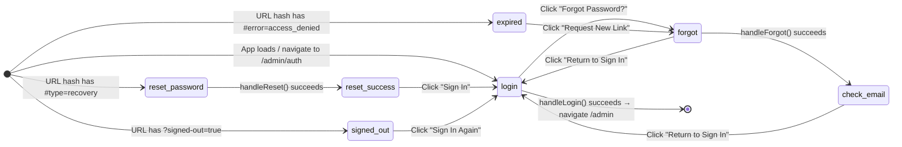
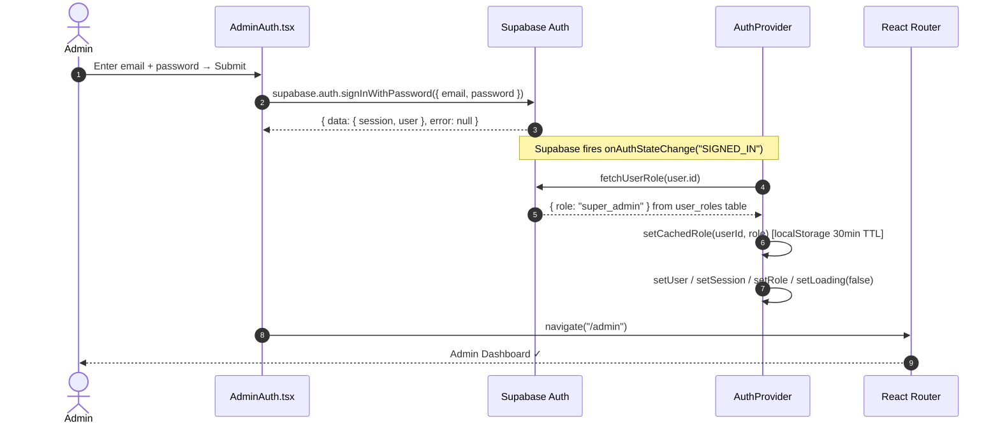
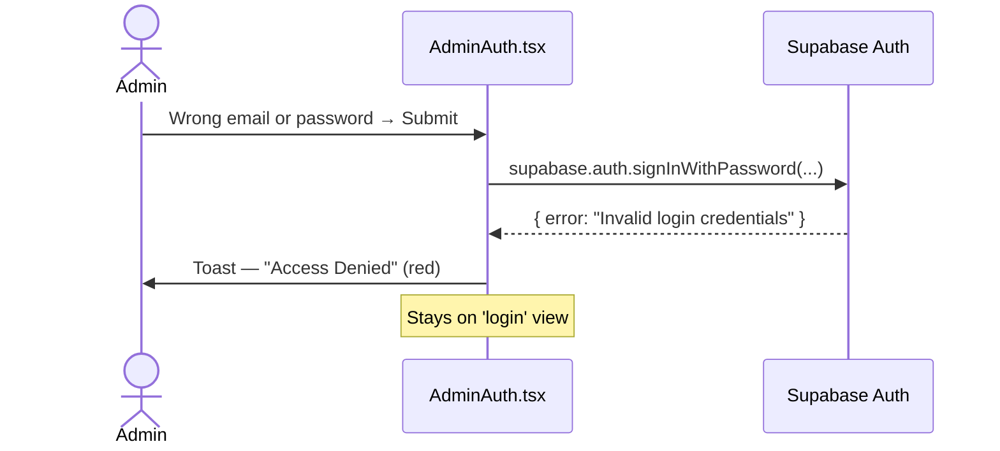
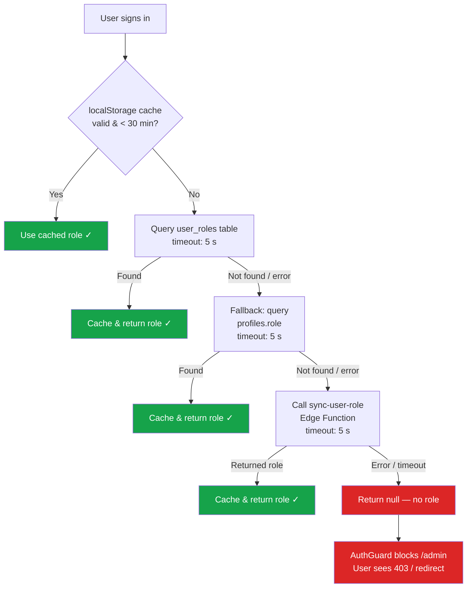
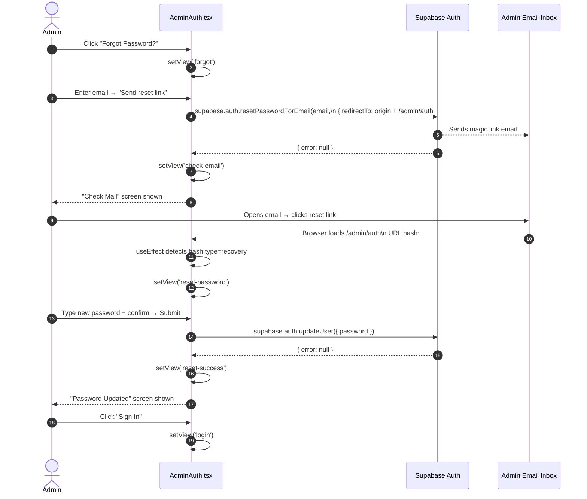
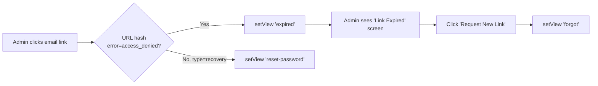
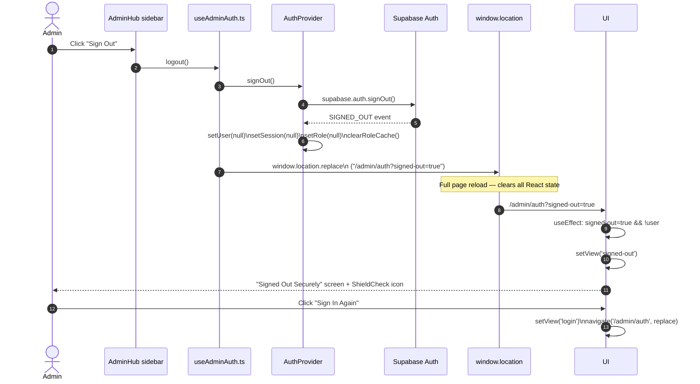
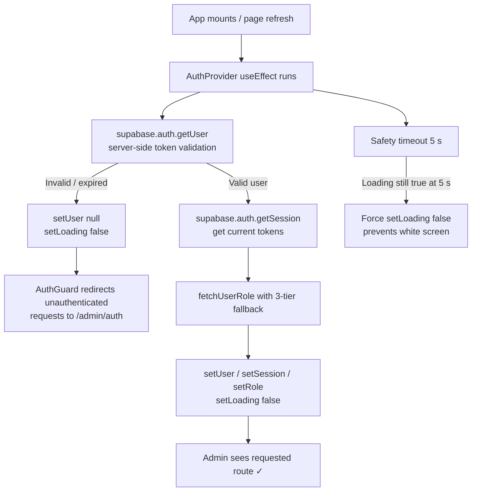

# Admin Authentication Flow

> **Source files**
> - `src/pages/admin/AdminAuth.tsx` — UI & view-state machine
> - `src/components/auth/AuthProvider.tsx` — session, role, signOut
> - `src/hooks/useAdminAuth.ts` — logout helper consumed by the admin sidebar

---

## 1. High-level View State Machine

The entire auth UI lives in a **single component** (`AdminAuth`) driven by one
`view` state variable of type:

```ts
type AuthView =
  | 'login'           // Default — email + password form
  | 'forgot'          // Enter email → get reset link
  | 'check-email'     // Confirmation screen after reset email sent
  | 'reset-password'  // New-password form (entered via email link)
  | 'reset-success'   // Password updated confirmation
  | 'expired'         // Reset link was stale / access_denied
  | 'signed-out'      // Post-logout confirmation
```



---

## 2. Sign-In Flow (Happy Path)



### What happens if credentials are wrong?



---

## 3. Role Resolution Detail

`AuthProvider` uses a **three-tier fallback** every time it needs a fresh role:



> **Token Refresh Note** — `TOKEN_REFRESHED` events (every ~1 hr) never
> re-fetch the role from DB. They only update the session and restore the cached
> role to avoid a "role flip to null" bug that previously broke admin access.

---

## 4. Forgot Password / Reset Flow



### Link Expiry / Access Denied Branch



---

## 5. Sign-Out Flow



> **Why `window.location.replace` not `navigate()`?**
> The hard redirect guarantees a full re-render, preventing stale React state
> from the authenticated session leaking into the sign-out screen.

---

## 6. AuthProvider Bootstrap (on every page load)



---

## 7. Complete View Map at a Glance

| `view` state | Screen | Entry trigger | Exit to |
|---|---|---|---|
| `login` | Sign-In form | App load / navigate | `forgot`, `/admin` |
| `forgot` | Email-for-reset form | "Forgot Password?" | `check-email`, `login` |
| `check-email` | Mail sent confirmation | `handleForgot` success | `login` |
| `reset-password` | New-password form | URL hash `#type=recovery` | `reset-success` |
| `reset-success` | Password updated confirmation | `handleReset` success | `login` |
| `expired` | Link expired error | URL hash `#error=access_denied` | `forgot` |
| `signed-out` | Signed out confirmation | URL param `?signed-out=true` | `login` |

---

## 8. Key Files Reference

| File | Responsibility |
|---|---|
| `src/pages/admin/AdminAuth.tsx` | All 7 view states, form handlers |
| `src/components/auth/AuthProvider.tsx` | Session bootstrap, role fetch (3-tier), `signOut`, token refresh guard |
| `src/hooks/useAdminAuth.ts` | `logout()` helper used by sidebar; wraps `signOut` + redirect |
| `src/components/auth/AuthGuard.tsx` | Protects `/admin/*` routes; redirects to `/admin/auth` if not authenticated |
| `src/components/admin/RoleGuard.tsx` | Protects individual admin pages by required role level |
| `src/lib/auth/rbac.ts` | Role hierarchy: `super_admin` → `admin` → `editor` → `viewer` |
