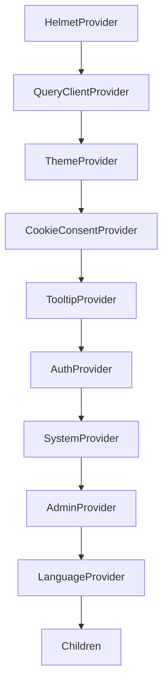
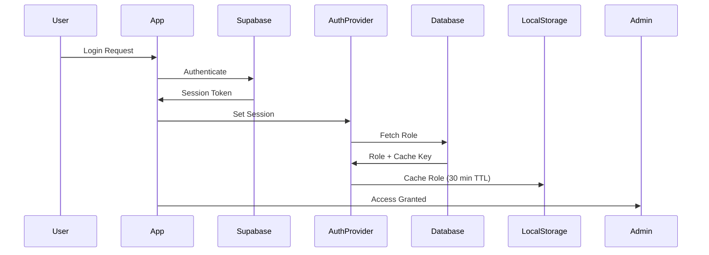
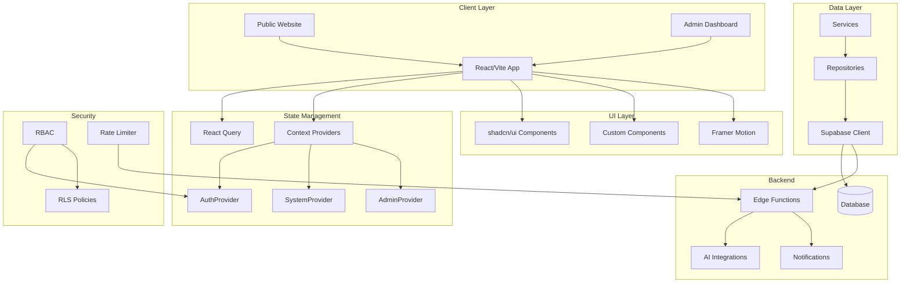
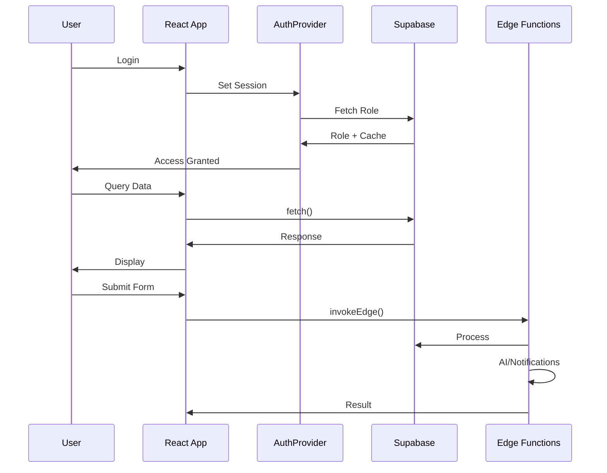

# CrossAngle Interior - Comprehensive Code Review Report

**Report Date:** April 17, 2026  
**Codebase Location:** `C:\Users\aayus\Desktop\main`  
**Analysis Scope:** Full-stack monorepo with React/Vite frontend and Supabase backend

---

## Executive Summary

The CrossAngle Interior codebase is a well-architected full-stack application built with React, Vite, and Supabase. The codebase demonstrates professional-grade patterns including lazy loading, repository/service layers, comprehensive RBAC, and real-time data subscriptions. However, several areas require attention to improve maintainability, type safety, and long-term scalability.

### Overall Assessment

| Category | Rating | Key Finding |
|----------|--------|-------------|
| **Architecture** | Good (8/10) | Clean separation, lazy loading, provider composition |
| **State Management** | Good (8/10) | React Query + Context, clear responsibilities |
| **API Integration** | Fair (6/10) | Repository pattern, but inconsistent usage |
| **Authentication** | Excellent (9/10) | Comprehensive RBAC, cache strategy, secure flows |
| **Database** | Fair (6/10) | Well-structured, but schema drift risk |
| **Code Quality** | Fair (6/10) | Some tech debt, magic strings, type casting |
| **Security** | Good (7/10) | RLS, edge function auth, CORS, rate limiting |

---

## 1. Architecture Analysis

### 1.1 System Overview

```
┌─────────────────────────────────────────────────────────────────┐
│                      MONOREPO STRUCTURE                         │
├─────────────────────────────────────────────────────────────────┤
│  apps/web/              │  packages/         │  supabase/        │
│  ─────────────────────  │  ───────────────   │  ──────────────  │
│  Main React/Vite app    │  Shared packages  │  Database        │
│  ├── components/        │  (empty)          │  ├── migrations/  │
│  │   ├── ui/ (46)      │                    │  └── functions/   │
│  │   ├── admin/        │                    │      (22 edge)    │
│  │   ├── auth/         │                    │                   │
│  │   └── magicui/      │                    │                   │
│  ├── pages/admin/      │                    │                   │
│  ├── addons/           │                    │                   │
│  │   ├── calculators/  │                    │                   │
│  │   └── discovery/    │                    │                   │
│  ├── services/         │                    │                   │
│  ├── repositories/     │                    │                   │
│  └── integrations/     │                    │                   │
└─────────────────────────────────────────────────────────────────┘
```

### 1.2 Provider Composition Pattern

The application uses a well-structured nested provider stack in `CoreProviders.tsx`:



**Strengths:**
- Clear dependency order
- Separation of concerns
- Easy to add/remove providers

**Concerns:**
- Deep nesting (9 levels) could impact performance
- Each provider adds re-render overhead

### 1.3 Lazy Loading Implementation

All routes use `React.lazy()` for code splitting (`App.tsx:24-102`):

```typescript
// Example: Public pages
const Index = lazy(() => import("./pages/Index"));
const AboutPage = lazy(() => import("./pages/AboutPage"));

// Admin modules with dynamic imports
const CmsModule = lazy(() =>
  import("./pages/admin/modules/CmsModule").then((module) => ({
    default: module.CmsModule,
  })),
);
```

**Strengths:**
- Excellent code splitting
- Reduces initial bundle size
- Admin routes are fully lazy-loaded

---

## 2. Component Architecture

### 2.1 UI Component Hierarchy

```
components/
├── ui/                    # Base shadcn/ui components (46 files)
│   ├── button.tsx
│   ├── dialog.tsx
│   ├── form.tsx
│   └── ... (42 more)
├── admin/               # Admin-specific components
│   ├── layout/          # AdminLayout, ModuleHeader
│   ├── leads/           # LeadPipeline, LeadTable, LeadDetailSheet
│   ├── analytics/       # Charts, KPI widgets
│   ├── media/           # MediaGrid, MediaUploadZone
│   └── blogs/           # RichTextEditor
├── auth/                # AuthProvider, AuthGuard
├── magicui/            # Custom effects (animated-beam, meteors)
├── ReactBits/          # Advanced animations
└── design-system/      # Design tokens and base components
```

### 2.2 Design System Structure

The codebase has a dedicated design system at `apps/web/src/design-system/`:

| Component | Purpose |
|-----------|---------|
| `Button.tsx` | Base button with variants |
| `Card.tsx` | Container component |
| `Input.tsx` | Form input base |
| `Table.tsx` | Data table base |
| `states/` | EmptyState, LoadingState, ErrorBanner |

**Recommendation:** Expand design system to include more shared components like Modal, Select, DatePicker.

---

## 3. State Management Analysis

### 3.1 React Query Configuration

```typescript
// CoreProviders.tsx:12-25
const queryClient = new QueryClient({
  defaultOptions: {
    queries: {
      staleTime: 5 * 60 * 1000,      // 5 minutes
      gcTime: 30 * 60 * 1000,        // 30 minutes
      refetchOnWindowFocus: false,
      refetchOnReconnect: false,
      retry: 1,
    },
    mutations: { retry: 0 },
  },
});
```

**Assessment:**
- `refetchOnWindowFocus: false` - Appropriate for admin dashboards
- `retry: 1` for queries - Good balance between resilience and UX
- `staleTime: 5 min` - Aggressive caching, may need adjustment for real-time data

### 3.2 Context Providers

| Provider | Location | Purpose |
|----------|----------|---------|
| `AuthProvider` | `components/auth/AuthProvider.tsx` (365 lines) | User session, role resolution |
| `SystemProvider` | `context/SystemContext.tsx` (84 lines) | Health monitoring, notifications |
| `AdminProvider` | `context/AdminContext.tsx` (31 lines) | Current module tracking |
| `ThemeProvider` | `components/theme-provider.tsx` | Dark/light mode |
| `CookieConsentProvider` | `components/cookies/CookieConsentProvider.tsx` | GDPR compliance |

### 3.3 Custom Hooks (19 total)

Notable hooks in `apps/web/src/hooks/`:

| Hook | Purpose | Quality |
|------|---------|---------|
| `useLeadsRealtime.ts` | Hybrid Supabase subscription | Good |
| `useLeadScoring.ts` | Lead scoring calculations | Good |
| `useOptimisticUpdate.ts` | Optimistic mutations | Good |
| `useSendEmail.ts` | Email notification | Fair |

---

## 4. API Integration Patterns

### 4.1 Supabase Client Setup

```typescript
// apps/web/src/integrations/supabase/client.ts
export const supabase = SUPABASE_URL && SUPABASE_PUBLISHABLE_KEY
  ? createClient<Database>(...)
  : null as any;  // ⚠️ Dangerous fallback
```

**Issue:** Null assertion (`as any`) bypasses type safety.

### 4.2 Data Access Layer

```
┌─────────────────────────────────────┐
│           lib/api.ts (473 lines)    │
│  Public read-only API layer         │
└──────────────┬──────────────────────┘
               │
┌──────────────▼──────────────────────┐
│         services/                   │
│  LeadService.ts, BlogService.ts     │
│  Business logic encapsulation       │
└──────────────┬──────────────────────┘
               │
┌──────────────▼──────────────────────┐
│        repositories/                │
│  SupabaseLeadRepo.ts                │
│  Interface-based data access        │
└──────────────┬──────────────────────┘
               │
┌──────────────▼──────────────────────┐
│     integrations/supabase/client.ts  │
│     Direct Supabase client          │
└─────────────────────────────────────┘
```

**Issue:** Duplicate operations exist in both Service and Repository layers.

### 4.3 Edge Function Invocation

```typescript
// apps/web/src/integrations/supabase/client.ts
export async function invokeEdge<T>(
  functionName: string,
  body: Record<string, unknown>,
): Promise<{ data: T | null; error: { message: string } | null }>
```

**Edge Functions (22 total):**
- Lead processing: `auto-score-lead`, `handle-new-lead`, `log-lead-activity`
- Notifications: `notify-telegram`, `notify-hot-lead`, `auto-reply-lead`
- Content: `generate-caption`, `submit-estimate`, `submit-discovery-lead`
- System: `health`, `sitemap`, `rate_limiter`

---

## 5. Authentication & Authorization

### 5.1 Authentication Flow



### 5.2 Role-Based Access Control

```typescript
// apps/web/src/lib/auth/rbac.ts
export const APP_ROLES = ["super_admin", "admin", "viewer"] as const;

export const MANAGEABLE_ROLES: Record<AppRole, readonly AppRole[]> = {
  super_admin: ["super_admin", "admin", "viewer"],
  admin: ["viewer"],
  viewer: [],
};
```

### 5.3 Route Protection

```typescript
// App.tsx:154-307
<Route element={<AuthGuard />}>
  <Route path="/admin" element={<AdminLayout />}>
    <Route path="access" element={
      <RoleGuard allowedRoles={["super_admin", "admin"]}>
        <AdminUsers />
      </RoleGuard>
    } />
  </Route>
</Route>
```

**Strengths:**
- Multi-layer protection (AuthGuard + RoleGuard)
- Role cache with 30-minute TTL
- Server-side session validation

**Issues:**
- Role cache version hardcoded (`AuthProvider.tsx:41`)

---

## 6. Database Schema Analysis

### 6.1 Key Tables

| Table | Rows | Purpose | RLS |
|-------|------|---------|-----|
| `leads` | High | Unified lead management | Yes |
| `projects` | Medium | Portfolio items | Partial |
| `blog_posts` | Medium | Blog content | Yes |
| `services` | Low | Service offerings | Yes |
| `testimonials` | Low | Client testimonials | Yes |
| `team_members` | Low | Team profiles | Yes |
| `media` | Medium | Asset library | Yes |
| `user_roles` | Low | Admin RBAC | Yes |
| `profiles` | Low | User profiles | Yes |

### 6.2 Lead Schema

```typescript
// apps/web/src/integrations/supabase/types.ts:493-614
leads: {
  Row: {
    id: string
    name: string
    email: string
    phone: string
    status: lead_status_enum  // new, contacted, qualified...
    score: number
    budget: budget_value_inr
    city: string
    lead_source: lead_source_enum
    estimate_breakdown: Json
    internal_notes: Json
  }
}
```

**Enums:**
```typescript
lead_status_enum: "new" | "contacted" | "qualified" | 
                  "consultation_scheduled" | "proposal_sent" | 
                  "negotiation" | "final_review" | "won" | "lost"

lead_source_enum: "website_contact" | "estimator" | "style_quiz" | 
                  "welcome_popup" | "discovery_engine" | "whatsapp" | 
                  "instagram" | "referral" | "other"
```

---

## 7. Issues & Technical Debt

### 7.1 Critical Issues

#### Issue 1: Nullable Supabase Client
```typescript
// apps/web/src/integrations/supabase/client.ts:10-19
export const supabase = SUPABASE_URL && SUPABASE_PUBLISHABLE_KEY
  ? createClient<Database>(...)
  : null as any;  // Dangerous!
```
**Impact:** Runtime errors if env vars missing  
**Fix:** Fail build at startup if env vars missing

#### Issue 2: Type Casting with `as unknown`
```typescript
// apps/web/src/pages/admin/AdminLeads.tsx:144
const leadsWithScore = (raw as unknown as Lead[]).map...
```
**Impact:** Type safety bypass  
**Fix:** Fix type definitions to match API response

#### Issue 3: Schema Drift Risk
- `supabase/schema.sql` is minimal (78 lines)
- Full types in `apps/web/src/integrations/supabase/types.ts` (2023 lines)
- **Risk:** Divergence between DB and typed client

### 7.2 Moderate Issues

#### Issue 4: Mixed Data Access Patterns
```typescript
// Pattern 1: lib/api.ts
const projects = await api.getProjects()

// Pattern 2: services/ProjectService.ts
const projects = await supabase.from('projects').select()
```
**Impact:** Inconsistent abstraction  
**Fix:** Consolidate to single pattern

#### Issue 5: Hardcoded Values
```typescript
// supabase/functions/notify-telegram/index.ts:50
const chatId = Deno.env.get("TELEGRAM_CHAT_ID") || "1228126069";
```
**Impact:** Security risk (exposed chat ID)

#### Issue 6: Unbounded Query
```typescript
// apps/web/src/repositories/SupabaseLeadRepo.ts:17
.limit(500); // Safety cap — but arbitrary
```
**Impact:** Performance at scale  
**Fix:** Server-side pagination

#### Issue 7: Missing Database Constraints
- `leads.email` should be UNIQUE
- Project slugs need validation at DB level

### 7.3 Minor Issues

#### Issue 8: Magic Strings
```typescript
// apps/web/src/lib/validations.ts:101-111
const STATUS_LABELS = {
  new: "New",
  contacted: "Contacted",
  // ...
}
```
**Fix:** Move to shared constants/enums

#### Issue 9: Role Cache Version Hardcoding
```typescript
// apps/web/src/components/auth/AuthProvider.tsx:41
const ROLE_CACHE_VERSION = "admin-rbac-v3";
```
**Fix:** Use hash or dynamic version

---

## 8. Security Analysis

### 8.1 Security Measures

| Feature | Implementation | Quality |
|---------|---------------|---------|
| Row-Level Security (RLS) | Database policies | Good |
| Edge Function Auth | Service role verification | Good |
| CORS | Configured per function | Good |
| Rate Limiting | `rate_limiter` edge function | Good |
| Input Validation | Zod schemas | Good |

### 8.2 Security Concerns

1. **Missing Input Sanitization** in `lib/api.ts` JSON parsing
2. **Hardcoded Telegram Chat ID** in edge function
3. **No rate limiting on client-side API calls**
4. **Potential XSS** in rich text editor content

---

## 9. Performance Analysis

### 9.1 Bundle Size Optimization

```typescript
// Lazy loading all pages
const Index = lazy(() => import("./pages/Index"));
// Admin pages also lazy-loaded
```

**Current:** All admin routes lazy-loaded  
**Recommendation:** Consider lazy-loading heavy components (RichTextEditor, Charts)

### 9.2 Query Optimization

```typescript
// Current: 5-minute stale time
staleTime: 5 * 60 * 1000,

// Issue: Real-time leads may feel stale
// Recommendation: Use invalidation on mutation for critical data
```

### 9.3 Image Optimization

The codebase has `OptimizedImage.tsx` component but:
- Lazy loading inconsistent across pages
- No WebP conversion in build pipeline
- No responsive images (srcset)

---

## 10. Recommendations

### High Priority

1. **Fix Type Safety Issues**
   - Replace `null as any` with proper validation
   - Remove `as unknown` casts
   - Generate types from Supabase schema

2. **Consolidate Data Access**
   - Choose either Service or Repository pattern
   - Remove duplicate operations
   - Add clear documentation

3. **Add Database Constraints**
   ```sql
   ALTER TABLE leads ADD CONSTRAINT unique_email UNIQUE (email);
   CREATE UNIQUE INDEX idx_projects_slug ON projects(slug);
   ```

### Medium Priority

4. **Move Magic Strings to Constants**
   ```typescript
   // lib/constants.ts
   export const LEAD_STATUS = {
     NEW: 'new',
     CONTACTED: 'contacted',
     // ...
   } as const;
   ```

5. **Improve Real-time Performance**
   - Add invalidation triggers for mutations
   - Consider WebSocket for critical updates

6. **Enhance Image Optimization**
   - Add WebP conversion
   - Implement responsive images
   - Add blur placeholder generation

### Low Priority

7. **Improve Error Boundaries**
   - Add granular error boundaries for each module
   - Implement error reporting to monitoring

8. **Add API Client Validation**
   ```typescript
   // Build-time validation
   if (!SUPABASE_URL || !SUPABASE_ANON_KEY) {
     throw new Error('Missing Supabase environment variables');
   }
   ```

9. **Document Migration Strategy**
   - Add rollback tests
   - Document critical migrations

---

## 11. Code Statistics

```
┌─────────────────────────────────────────────────────────────┐
│                    CODEBASE METRICS                          │
├─────────────────────────────────────────────────────────────┤
│  Total Files:           588                                  │
│  Total Lines of Code:   ~675,735                             │
│  TypeScript Files:      420                                  │
│  Migration Files:       53                                   │
│  Edge Functions:        22                                   │
│  UI Components:         46 (shadcn/ui) + 80+ custom          │
│  Test Files:            7 (Playwright e2e)                   │
├─────────────────────────────────────────────────────────────┤
│  KEY FILES BY SIZE:                                        │
│  1. types.ts:          2023 lines                            │
│  2. api.ts:            473 lines                            │
│  3. AdminAuth.tsx:     298 lines                            │
│  4. AuthProvider.tsx:  365 lines                            │
│  5. CoreProviders.tsx:  49 lines                            │
└─────────────────────────────────────────────────────────────┘
```

---

## 12. Conclusion

The CrossAngle Interior codebase demonstrates solid architectural decisions with modern React patterns, comprehensive authentication, and well-structured data access layers. The main areas for improvement are:

1. **Type Safety** - Address type casting and null assertions
2. **Data Access Consistency** - Consolidate patterns
3. **Database Constraints** - Add missing validations
4. **Code Organization** - Centralize magic strings and constants

The codebase is production-ready with good security practices, but addressing the technical debt will improve long-term maintainability and developer experience.

---

## 13. Architecture Visualization

### 13.1 System Architecture Diagram



### 13.2 Interactive Knowledge Graph

An interactive visualization of the codebase architecture is available at:
**`graphify-out/architecture-graph.html`**


The graph shows:
- **29 nodes** representing key components, features, and technologies
- **30 edges** showing relationships and dependencies
- **Color-coded categories**: Technology (blue), Features (green), Components (pink), Libraries (yellow), Services (purple), Security (red)

### 13.3 Data Flow Diagram



---

## Appendix: File Reference Guide

| Pattern | Location | Notes |
|---------|----------|-------|
| Lazy Routes | `App.tsx:24-102` | All pages code-split |
| Providers | `CoreProviders.tsx:27-48` | Nested provider stack |
| Auth Logic | `AuthProvider.tsx` | 365 lines, comprehensive |
| RBAC | `lib/auth/rbac.ts` | Role definitions |
| API Layer | `lib/api.ts` | Public read-only |
| Services | `services/*.ts` | Business logic |
| Repositories | `repositories/*.ts` | Data access |
| Database Types | `types.ts` | 2023 lines |

---

*Report generated using automated code analysis tools and manual review.*
