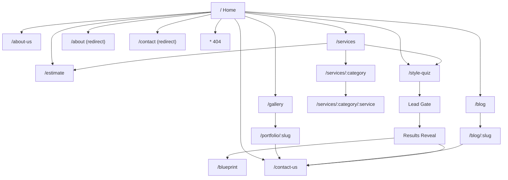

# Cross Angle Interior Website Reverse Engineering Documentation

Last updated: March 30, 2026

## 1. Purpose

This document reverse engineers the visitor-facing Cross Angle Interior website from the current `apps/web` implementation and maps what the website presents, how the pages connect, what each section contains, and which data sources power the experience.

It is written as a portfolio-style reference document for internal use, handoff, planning, redesign review, content operations, and stakeholder alignment.

## 2. Scope And Method

### Primary source of truth

- Codebase inspected: `apps/web`
- Public router inspected: `apps/web/src/App.tsx`
- Shared content/config inspected:
  - `apps/web/src/config/navigation.ts`
  - `apps/web/src/config/site-content.ts`
  - `apps/web/src/lib/api.ts`

### Supporting verification

- Public live domain checked: `https://crossangleinterior.com` on March 30, 2026

### Important note about the live site

The public live domain currently appears to expose an older or different website structure than the React app in this repository.

Observed on March 30, 2026:

- The live domain surfaced a navigation pattern closer to `Home / Works / Portfolio / About / Blog / Contact`.
- The repository app exposes a richer public IA with `Services`, `Gallery`, `Estimate`, `Style Quiz`, `Blueprint`, dynamic project pages, and dynamic service pages.
- The blog on the live domain shows WordPress-style URLs, for example `/blog/dining-room-design-tips-for-2024-create-a-space-to-savor-with-cross-angle-interior/`.

Because of that mismatch, this document is intentionally based on the current repository implementation, with the live-site divergence recorded as a strategic note rather than mixed into the route inventory.

## 3. Executive Summary

The repository website is a premium interior design marketing site with four distinct layers:

1. A cinematic brand/portfolio layer.
2. A service discovery and lead-generation layer.
3. A content marketing/blog layer.
4. Two interactive qualification tools:
   - a cost estimator
   - a style discovery engine

The site is built as a single React/Vite application with:

- public marketing routes
- dynamic detail routes
- private admin routes bundled into the same app but lazy-loaded
- Supabase-backed content for projects, blogs, services, hero media, testimonials, and team members

From a visitor perspective, the site is not just informational. It is designed to move users into one of four conversion paths:

- direct inquiry
- WhatsApp/call
- cost estimator
- style discovery quiz

## 4. Public Information Architecture

## 5. Route Inventory

| Route | Type | Visibility | Purpose | Main data source |
|---|---|---|---|---|
| `/` | Direct | Primary | Brand-led homepage | Mixed: static sections + Supabase for hero media, projects, testimonials |
| `/about-us` | Direct | Primary | Studio story and credibility page | Mostly static + Supabase `team_members` |
| `/services` | Direct | Primary | Service overview and category landing page | Supabase `services` with static fallbacks |
| `/services/:category` | Indirect | Secondary | Category-specific service listing | Supabase `services` + static `serviceCategories` |
| `/services/:category/:service` | Indirect | Secondary | Service detail page | Static `site-content.ts` service definitions |
| `/gallery` | Direct | Primary | Portfolio gallery archive | Supabase `projects` or static fallback projects |
| `/portfolio/:slug` | Indirect | Secondary | Individual project detail page | Supabase `projects` + related tables or static fallback |
| `/blog` | Direct | Primary | Blog index and content marketing hub | Supabase `blogs` |
| `/blog/:slug` | Indirect | Secondary | Individual article page | Supabase `blogs` |
| `/contact-us` | Direct | Primary | Lead capture and contact page | Static sections + lead submission via Supabase function |
| `/estimate` | Direct | Conversion tool | Cost estimator | Estimator store + pricing config + lead save |
| `/style-quiz` | Direct | Conversion tool | Style discovery engine | Discovery flow logic + Supabase lead capture |
| `/blueprint` | Direct or post-tool | Showcase/tool output | Visual blueprint/proposal-style page | Static handcrafted content |
| `/about` | Redirect | Alias | Redirects to `/about-us` | Router alias |
| `/contact` | Redirect | Alias | Redirects to `/contact-us` | Router alias |
| `*` | Fallback | Error | 404 page | Static |

## 6. Global Visitor-Facing Elements

These elements appear across multiple routes and form the persistent visitor experience.

### 6.1 Main navigation

File: `apps/web/src/components/Navbar.tsx`

Primary nav links:

- Home
- Services
- Projects
- About
- Blog

Persistent conversion elements:

- WhatsApp-linked phone: `+91 7909041132`
- CTA: `Book Free Consultation`
- Mobile slide-down menu variant

Behavior:

- Transparent over the homepage hero until scroll
- Dark blurred header after scroll
- Current-route highlighting

### 6.2 Footer

File: `apps/web/src/components/Footer.tsx`

Footer content:

- Brand statement: `We don't design interiors. We design how they feel.`
- CTA: `Start Your Project`
- Studio email: `hello@crossangle.com`
- Studio locations: `Jamshedpur`, `Kolkata`
- Social labels: `Instagram`, `LinkedIn`, `Pinterest`
- Back-to-top control

### 6.3 Fixed social bar

File: `apps/web/src/components/FixedSocialBar.tsx`

Channels exposed:

- Instagram
- YouTube
- WhatsApp
- Facebook
- Pinterest

Behavior:

- Desktop: left sticky vertical bar
- Mobile: floating bottom social tray that hides on downward scroll

### 6.4 WhatsApp floating button

File: `apps/web/src/components/WhatsAppButton.tsx`

Purpose:

- Persistent one-tap messaging conversion
- Opens WhatsApp with a prefilled interest message

### 6.5 Scroll progress bar

File: `apps/web/src/components/ScrollProgress.tsx`

Purpose:

- Top-edge read/scroll progress indicator

### 6.6 Section navigation dots

File: `apps/web/src/components/SectionNavDots.tsx`

Homepage section map:

- Home
- About
- Services
- Process
- Portfolio
- Why Us
- Testimonials
- Contact

Note:

- The homepage does not actually contain a `contact` section in `Index.tsx`, so the dot-nav includes a section target that is not present on that route.

### 6.7 Structured data and SEO

Files:

- `apps/web/src/App.tsx`
- page-level `Helmet` metadata in each route

Global structured data:

- `InteriorDesigner` / `LocalBusiness`
- location anchored to Jamshedpur, Jharkhand, India
- business hours
- social accounts

## 7. Homepage Documentation

Route: `/`

File: `apps/web/src/pages/Index.tsx`

### Purpose

The homepage is the main brand-and-conversion landing page. It combines cinematic hero media, portfolio proof, credibility, and lead-generation prompts.

### Section inventory

#### 7.1 Hero

File: `apps/web/src/components/Hero.tsx`

Core message:

- `Premier Interior Design Studio`
- `Design Your Dream Home.`
- supporting copy about award-winning interior design for homes and commercial spaces

Primary CTAs:

- `See Our Works` -> `/gallery`
- `More About Us` -> `/about-us`

Proof chips:

- `500+ Projects Delivered`
- `15+ Years of Design Experience`
- `Jamshedpur & Kolkata`

Sidebar proof panel:

- studio presence
- `500+ Projects`
- `45 Day Delivery Promise`

Data source:

- Supabase `hero_media`
- fallback video if no media exists

#### 7.2 About preview

File: `apps/web/src/components/About.tsx`

Content blocks:

- metrics band
- brand story preview
- four feature bullets
- logo animation / premium design standard badge

Primary CTA:

- `Discover Our Story` -> `/about-us`

#### 7.3 Services preview

File: `apps/web/src/components/Services.tsx`

Content blocks:

- intro copy about emotion and execution
- three service category rows from `serviceCategories`
  - Residential Design
  - Commercial Design
  - Specialized Executions
- hover-based image preview panel

Primary CTA:

- `Explore All Services` -> `/services`

#### 7.4 Process

File: `apps/web/src/components/Process.tsx`

Five-step timeline:

- Consult
- Measure & Plan
- Design
- Execute
- Handover

Purpose:

- explains the working method with scroll-responsive progress

#### 7.5 Marquee strip

File: `apps/web/src/components/MarqueeStrip.tsx`

Topics displayed:

- Residential
- Commercial
- Turnkey Projects
- Interior Design
- Modular Kitchen
- Lighting Design
- Consultation

#### 7.6 Portfolio preview

File: `apps/web/src/components/Portfolio.tsx`

Content blocks:

- editorial portfolio intro
- filter buttons using project categories
- alternating two-column masonry layout
- lightbox preview
- CTA to full archive

Primary CTA:

- `Explore Full Archive` -> `/gallery`

Data source:

- Supabase `projects`
- fallback static project set from `src/data/projects.ts`

#### 7.7 Trust and credibility

File: `apps/web/src/components/TrustSection.tsx`

Trust cards:

- 45-Day Delivery
- 10-Year Warranty
- 500+ Happy Homes
- No Hidden Costs
- Factory Finish
- Post-Project Support

Brand partner marquee:

- Asian Paints
- Hafele
- Godrej
- Philips
- Hettich
- Jaquar

#### 7.8 Before/after transformations

File: `apps/web/src/components/BeforeAfterShowcase.tsx`

Showcase items:

- Master Bedroom Makeover
- Kitchen Renovation
- Office Space Upgrade

Interaction:

- compare slider
- carousel of transformations

#### 7.9 Testimonials

File: `apps/web/src/components/Testimonials.tsx`

Content:

- rotating testimonial carousel
- star ratings
- client name, role, project label

Data source:

- Supabase `testimonials`
- fallback static testimonials

#### 7.10 Welcome popup

File: `apps/web/src/components/WelcomePrompt.tsx`

Trigger:

- appears after 5 seconds for first-time visitors

Fields:

- email
- phone

Value proposition:

- free consultation
- exclusive design tips

Data action:

- inserts a lead into `leads` with source `welcome_popup`

## 8. About Page Documentation

Route: `/about-us`

File: `apps/web/src/pages/AboutPage.tsx`

### Section inventory

#### 8.1 About hero

File: `apps/web/src/components/about/AboutHero.tsx`

Key elements:

- animated background mesh
- marquee background text
- title: `Cross Angle Interior`
- two-paragraph brand statement
- stat cards: `15+ Years`, `500+ Projects`, `98% Clients`
- embedded YouTube video
- scroll indicator

#### 8.2 Breadcrumb

File: `apps/web/src/components/AppBreadcrumb.tsx`

Purpose:

- auto-builds breadcrumb trail from the URL

#### 8.3 Values

File: `apps/web/src/components/about/AboutValues.tsx`

Four cards:

- Client-Centric Approach
- Innovation & Creativity
- Excellence in Execution
- Collaborative Partnership

#### 8.4 Impact stats

File: `apps/web/src/components/about/AboutStats.tsx`

Metrics:

- Years Experience
- Happy Clients
- Projects Completed
- Design Awards

#### 8.5 Timeline

File: `apps/web/src/components/about/AboutTimeline.tsx`

Milestones:

- 2010 The Beginning
- 2015 Expansion
- 2018 Milestone
- 2020 Innovation
- 2024 Recognition

#### 8.6 Team

File: `apps/web/src/components/about/AboutTeam.tsx`

Purpose:

- introduces the studio team
- hover-reveals bios and social/contact links

Data source:

- Supabase `team_members`

#### 8.7 About CTA

File: `apps/web/src/components/about/AboutCTA.tsx`

CTAs:

- `Get In Touch` -> `/contact`
- `Call Us Now` -> phone

Trust line:

- `Free consultation • Personalized designs • Trusted by 500+ clients`

## 9. Services Overview Documentation

Route: `/services`

File: `apps/web/src/pages/ServicesPage.tsx`

### Purpose

This page is a service architecture overview that blends positioning, category browsing, supporting tools, and process/credibility storytelling.

### Section inventory

#### 9.1 Services hero

File: `apps/web/src/components/services/ServicesHero.tsx`

Primary headline:

- `Turnkey Interior Projects Delivered with Hospitality Precision.`

Animated statement:

- `Architecture Without Intelligence/Execution/Experience Is Decoration/Incomplete/Cold.`

Tag chips:

- Strategic ROI
- Data-Driven Design
- End-to-End Turnkey

#### 9.2 Service marquee

File: `apps/web/src/components/services/ServicesMarquee.tsx`

Scrolling keywords:

- Turnkey Contracting
- Luxury Residential
- Commercial Architecture
- Hospitality Styling
- Strategic Planning
- Data-Driven Design
- Furniture Curation
- Lighting Architecture

#### 9.3 Our approach

File: `apps/web/src/components/services/OurApproach.tsx`

Message:

- `We Design. We Execute. We Deliver Complete Environments.`

Three approach pillars:

- Design Intelligence
- Turnkey Execution
- Hospitality Detailing

Performance card:

- `INR 2–20Cr+ Project Value Delivered`
- `95% Execution Match Rate`
- On-Time Delivery

#### 9.4 Residential category grid

Page section in `ServicesPage.tsx`

Category label:

- `Domain I`

Cards:

- populated from Supabase `services` filtered by `category_id = residential`
- uses fallback service cards if database is empty

#### 9.5 Commercial category grid

Page section in `ServicesPage.tsx`

Category label:

- `Domain II`

Cards:

- populated from Supabase `services` filtered by `category_id = commercial`
- uses fallback cards if empty

#### 9.6 Specialized category grid

Page section in `ServicesPage.tsx`

Cards:

- populated from Supabase `services` filtered by `category_id = specialized`
- uses fallback cards if empty

#### 9.7 Precision instruments

File: `apps/web/src/components/services/ServicesEngines.tsx`

Tool 1:

- `The Discovery Engine`
- CTA: `Begin Discovery` -> `/style-quiz`

Tool 2:

- `The Estimator Engine`
- CTA: `Get Your Estimate` -> `/estimate`

#### 9.8 Why CrossAngle

File: `apps/web/src/components/services/ServicesWhyUs.tsx`

Selling points:

- Single Point of Accountability
- In-House Manufacturing
- Transparent Pricing Matrix

#### 9.9 Services process

File: `apps/web/src/components/services/ServicesProcess.tsx`

Four phases:

- Discovery & Consultation
- Strategic Concept
- Procurement & Manufacturing
- Turnkey Execution & Delivery

#### 9.10 Services CTA

File: `apps/web/src/components/services/ServicesCTA.tsx`

Headline:

- `Ready to build your legacy?`

CTA:

- `Start Your Project` -> `/contact`

## 10. Service Category Pages

Route pattern: `/services/:category`

File: `apps/web/src/pages/ServiceCategoryPage.tsx`

### Purpose

Category pages act as secondary landing pages between the main services overview and individual service detail pages.

### Template structure

- hero image and category title
- category description
- list of services within the category
- per-service preview image
- first three feature bullets if available
- CTA button per service
- bottom CTA: `Contact Our Design Team`

### Category source

Static config from `serviceCategories`:

- Residential Design
- Commercial Design
- Specialized Executions

## 11. Service Detail Pages

Route pattern: `/services/:category/:service`

File: `apps/web/src/pages/ServiceDetailPage.tsx`

### Purpose

This is the detailed portfolio-style service template. It explains what the service is, why it matters, how it works, and how to convert.

### Template structure

#### 11.1 Breadcrumb

- Home
- Services
- Category
- Service title

#### 11.2 Hero

Content:

- category badge
- service title
- short description
- hero image

Primary CTAs:

- `Get a Free Quote` -> `/contact-us`
- `Calculate Cost` -> `/estimate`

#### 11.3 Long description

Markdown-supported narrative section for services that define `longDescription`

#### 11.4 Gallery carousel

If `galleryImages` exist:

- project gallery slider
- CTA to gallery filtered by service slug

#### 11.5 Features and process

Two-column block:

- left: feature reasons/benefits
- right: process steps

#### 11.6 Related services

Uses static `relatedServices` IDs from the service config

#### 11.7 FAQ

Accordion-driven FAQ section

#### 11.8 Final CTA

Headline:

- `Ready to transform your [service]?`

CTAs:

- `Book Free Consultation`
- `Discover Your Aesthetic`

### Service templates currently defined in code

- Living Room Design
- Bedroom Sanctuaries
- Kitchen & Dining
- Office Interiors
- Retail & Showroom
- Modular Kitchen Systems
- False Ceiling & Lighting

## 12. Gallery Documentation

Route: `/gallery`

File: `apps/web/src/pages/GalleryPage.tsx`

### Purpose

The gallery is the portfolio archive and visual browsing surface for project discovery.

### Section inventory

#### 12.1 Gallery hero

File: `apps/web/src/components/gallery/GalleryHero.tsx`

Headline:

- `Our Works`
- `Crafting Extraordinary Spaces`

Animated stats:

- Projects
- Years
- Happy Clients
- Awards

#### 12.2 Category and style filters

Files:

- `MagneticFilterTabs.tsx`
- select control inside `GalleryPage.tsx`

Categories:

- All
- Residential
- Commercial
- Modular Kitchen
- Bedroom Interior
- Living Room Interior
- Exterior

Styles:

- All
- Modern
- Luxury
- Contemporary
- Classic
- Industrial

#### 12.3 Masonry grid

Files:

- `GalleryMasonryGrid.tsx`
- `GalleryCard.tsx`

Behavior:

- masonry-like multi-column gallery
- featured sizing every fifth item
- hover tilt/parallax
- category badge, title, actions

#### 12.4 Lightbox

File: `GalleryLightbox.tsx`

Features:

- fullscreen preview
- keyboard left/right/escape navigation
- swipe navigation
- zoom toggle
- image download
- thumbnail strip
- project details link if slug is present

#### 12.5 Gallery CTA

File: `GalleryCTA.tsx`

CTAs:

- `Get Free Consultation` -> `/contact-us`
- `Explore Services` -> `/services`

## 13. Project Detail Documentation

Route pattern: `/portfolio/:slug`

File: `apps/web/src/pages/ProjectPage.tsx`

### Purpose

This is the detailed portfolio case-study template.

### Template structure

#### 13.1 Breadcrumb and hero

- breadcrumb
- project hero with image, title, category, style, location

#### 13.2 Stats bar

Fields displayed:

- location
- area
- duration
- style
- year
- budget

#### 13.3 The Brief

- high-level project problem or client ask

#### 13.4 Our Approach

- project delivery/design strategy narrative

#### 13.5 Transformation compare

- before/after compare if at least two images exist in first gallery group

#### 13.6 Project gallery

- grouped by room

#### 13.7 Materials & Finishes

- material cards with names and details

#### 13.8 Client testimonial

- quote, author, role

#### 13.9 Sidebar CTA

- `Interested in Similar Design?`
- CTA: `Get Free Consultation`

#### 13.10 Project navigation

- previous project
- next project
- `View All Projects`

#### 13.11 Related projects

- up to three same-type projects

### Data source

- Supabase `projects`
- joined `project_gallery`
- joined `project_materials`
- joined `project_categories`
- fallback static project data if Supabase is empty/unavailable

## 14. Blog Index Documentation

Route: `/blog`

File: `apps/web/src/pages/BlogPage.tsx`

### Purpose

The blog is a content marketing hub designed for discovery, authority, engagement, and newsletter capture.

### Section inventory

#### 14.1 Featured hero article

- first blog post becomes the hero article
- displays cover image, title, excerpt, category, read time, simulated view count, date
- CTA: `Read Full Article`

#### 14.2 Category/search/sort bar

Categories listed:

- All
- Hotel Design
- Restaurant Interiors
- Lighting
- Furniture Sourcing
- Sustainability
- Interior Design

Controls:

- search field
- sort selector (`Latest`, `Trending`)

#### 14.3 Trending slider

- top six posts
- horizontal slider with manual left/right buttons

#### 14.4 Main article grid

- paginated grid
- first visible card can expand to wider layout
- per-card metadata and `Read More` link

#### 14.5 Sidebar

Blocks:

- Categories with counts
- Popular Tags
- Most Read
- consultation CTA

#### 14.6 Newsletter

Headline:

- `Design Decoded Newsletter`

Data action:

- inserts into `newsletter_subscribers`

#### 14.7 Related case studies

Static CTA cards linking to `/gallery`

### Data source

- Supabase `blogs`
- published posts only

### Engagement instrumentation

File: `apps/web/src/hooks/useBlogTracking.ts`

Tracked events:

- article view
- scroll depth
- reading time
- CTA click
- tag click
- newsletter signup
- share click

## 15. Blog Detail Documentation

Route pattern: `/blog/:slug`

File: `apps/web/src/pages/BlogDetailPage.tsx`

### Template structure

#### 15.1 Reading progress bar

- fixed bar at top of page

#### 15.2 Article header

- category
- article title
- created date
- read time

#### 15.3 Cover image

- wide hero image if available

#### 15.4 Excerpt lead quote

- excerpt displayed as a highlighted introductory quote

#### 15.5 Body content

- HTML content rendered after DOMPurify sanitization

#### 15.6 Tags

- tag chips if present

#### 15.7 Share footer

- LinkedIn
- Twitter
- Copy link

#### 15.8 Consultation CTA

- `Inspired to transform your space?`
- CTA: `Request Consultation`

#### 15.9 Related articles

- up to three related posts

## 16. Contact Page Documentation

Route: `/contact-us`

File: `apps/web/src/pages/ContactPage.tsx`

### Purpose

This page is the main inquiry and contact conversion hub.

### Section inventory

#### 16.1 Contact hero

File: `ContactHero.tsx`

Headline:

- `Start your project with clarity.`

CTAs:

- `Start Your Inquiry` scrolls to form
- `Call +91 7909041132`

Trust points:

- reply within 24 hours
- Jamshedpur and Kolkata projects
- residential and commercial interiors

#### 16.2 Main contact and inquiry section

File: `CTAContact.tsx`

Primary form:

- first name
- last name
- email
- phone
- project description

Supporting quick paths:

- Call Now
- WhatsApp Us
- Try The Cost Estimator

Informational cards:

- Visit Us
- Call Us
- Email Us
- Working Hours

How we work steps:

- Tell us what you are planning
- We review and respond
- Move into consultation

Data action:

- submits to Supabase Edge Function `process-lead`

#### 16.3 Studio map

File: `InteractiveMap.tsx`

Content:

- Jamshedpur-centered map
- studio presence narrative
- working rhythm
- visits by discussion

#### 16.4 FAQ

File: `ContactFAQ.tsx`

Eight FAQ items currently shown:

- what happens after form submission
- project size/scope flexibility
- budget workability
- turnkey execution support
- typical timeline
- work outside Jamshedpur
- visualization before execution
- early-stage exploration reassurance

#### 16.5 Social follow block

File: `SocialBar.tsx`

Purpose:

- extends the relationship beyond the inquiry form
- gives visitors passive follow-up channels if they are not ready to contact directly

Channels presented:

- Instagram
- Pinterest
- LinkedIn
- YouTube

Messaging pattern:

- each network is paired with a short value statement describing what the visitor will see there

## 17. Cost Estimator Documentation

Route: `/estimate`

Files:

- `addons/calculators/pages/PriceEstimator.tsx`
- `addons/calculators/components/CostEstimator.tsx`

### Purpose

This is a qualification and cost-clarity tool intended to turn early-stage visitors into higher-intent leads.

### Entry screen

The first screen asks the visitor to choose a project path:

- Residential
- Commercial
- Renovation
- Custom Project

### Estimator engine structure

The full estimator is a seven-step guided flow.

Steps:

- Type
- Details
- Location
- Investment
- Services
- Bespoke
- Timeline

Step titles:

- Property Type
- Property Details
- Location
- Investment Scope
- Service Level
- Bespoke Commissions
- Timeline & Contact

Results mode:

- switches to a full-width result screen after completion
- automatically attempts to save lead data when results are shown

## 18. Style Discovery Documentation

Route: `/style-quiz`

Files:

- `addons/discovery/pages/DiscoveryPage.tsx`
- `addons/discovery/components/DiscoveryEngine.tsx`

### Purpose

This is the highest-concept interactive tool in the site. It is framed as a style/archetype assessment that turns qualitative taste into a structured design identity.

### Experience structure

#### 18.1 Welcome screen

File: `WelcomeScreen.tsx`

Sections on the welcome surface:

- hero introduction
- "Five inputs. One precise profile." explainer
- archetype preview cards
- CTA choice between full journey and quick quiz

#### 18.2 Stage map

The discovery engine uses the following visitor journey:

- Welcome
- Reflection
- Lifestyle
- Visual Instinct
- Adjective Selection
- Emotional Mapping
- Material Resonance
- Light Calibration
- Pattern Preview
- Analysis
- Mini Result
- Lead Gate
- Results

#### 18.3 Core question/input types

The tool asks for:

- reflection prompts
- lifestyle preference selections
- visual image picks
- adjective mapping
- emotional signal mapping
- material preference
- light preference

Underlying aesthetic axes:

- minimalism
- warmth
- social
- structure
- novelty

#### 18.4 Lead gate

File: `LeadGatePhase.tsx`

Fields:

- full name
- email
- phone optional

CTA:

- `Reveal My Results`

Data action:

- submits to Supabase Edge Function `submit-discovery-lead`

#### 18.5 Results reveal

File: `ResultsReveal.tsx`

Major result sections confirmed in the implementation:

- Emotional Mirror
- Aesthetic DNA
- Cognitive Profile
- Transformation Readiness
- Sensory Blueprint
- Core Strategy
- final design review CTA
- export/share actions

Actions:

- print/export PDF blueprint
- generate share card
- retake discovery
- book design review

## 19. Blueprint Page Documentation

Route: `/blueprint`

File: `addons/discovery/pages/BlueprintPage.tsx`

### Purpose

This page functions as a proposal-style, highly designed longform blueprint. It is visually separate from the rest of the site and reads like a design presentation artifact.

### Navigation structure

Side and top navigation sections:

- Cover
- Concept
- Tech Stack
- Components
- Animations
- Journey
- Responsive

### Section inventory

#### 19.1 Cover

Content:

- proposal framing
- title: redesigned with motion in mind
- technology tags
- performance/technique stats

#### 19.2 Overall Concept

Focus:

- immersive design philosophy
- cinematic scroll narrative
- living typography
- spatial 3D environments
- micro-interaction fabric
- material and morphism layers

#### 19.3 Technology Stack

Focus:

- chosen technologies and rationale
- performance targets

#### 19.4 UI Components

Focus:

- component architecture
- modular design references

#### 19.5 Animation & Interactivity Catalog

Focus:

- motion reference system
- parallax, scroll scrub, micro interactions, 3D previews

#### 19.6 Scroll Journey Map

Focus:

- zone-by-zone choreography from hero to CTA/footer

#### 19.7 Responsive Design

Focus:

- desktop/tablet/mobile adaptation
- reduced motion fallbacks
- GPU tiering and code-splitting strategy

#### 19.8 Footer CTA

Content:

- `Ready to Build Something Remarkable?`
- proposal footer metadata

## 20. 404 And Alias Pages

### 20.1 Redirect aliases

Configured in `App.tsx`:

- `/about` -> `/about-us`
- `/contact` -> `/contact-us`

### 20.2 404

Route: `*`

File: `apps/web/src/pages/NotFound.tsx`

Content:

- glassmorphism overlay
- `404`
- `Lost in Space?`
- current invalid pathname displayed
- CTA: `Return Home`

## 21. Dynamic Content Model

The site is partly hardcoded and partly CMS/data-driven.

### 21.1 Supabase-driven content/entities

- `hero_media`
- `projects`
- `project_gallery`
- `project_materials`
- `project_categories`
- `blogs`
- `services`
- `service_steps`
- `service_faqs`
- `testimonials`
- `team_members`
- `newsletter_subscribers`
- `leads`

### 21.2 Supabase functions and RPCs used by public visitors

- `process-lead`
- `submit-discovery-lead`
- `increment_project_view`
- `record_blog_event`

### 21.3 Static fallback or config-driven content

- service categories and service detail narratives in `site-content.ts`
- fallback projects in `src/data/projects.ts`
- homepage transformation images
- contact FAQ JSON
- discovery questions/assets/constants
- blueprint page content

## 22. Primary Visitor Journeys

### Journey A: portfolio-led inquiry

Home -> Gallery -> Project Detail -> Contact

### Journey B: service-led inquiry

Home or Services -> Service Category -> Service Detail -> Contact or Estimate

### Journey C: content-led inquiry

Blog Index -> Blog Detail -> Request Consultation

### Journey D: guided qualification

Home/Services -> Style Quiz -> Lead Gate -> Results -> Blueprint or Contact

### Journey E: budget-led qualification

Home/Services/Contact -> Estimate -> Result/lead save

## 23. Notable Reverse-Engineering Findings

These are not blockers for the document, but they matter for accuracy.

### 23.1 Live-site divergence

The live public domain and the repository app do not currently appear to represent the same information architecture.

### 23.2 Mixed data ownership in service pages

The services overview uses Supabase data, but service detail pages still rely on static `site-content.ts` definitions for long descriptions, galleries, and related services.

### 23.3 Some route/link assumptions appear inconsistent

Examples found in code:

- `SectionNavDots` includes a `contact` anchor on the homepage, but the homepage does not render a `contact` section.
- `ResultsReveal` includes a CTA to `/portfolio`, while the current public router defines `/gallery` and `/portfolio/:slug`, not `/portfolio`.
- Footer/social/contact links include some placeholders or likely provisional targets.

### 23.4 Schema naming drift exists across files

There are visible differences between the documented schema in `CROSSANGLE.md` and some live component queries, especially around testimonial fields.

## 24. Recommended Use Of This Document

This document is now suitable for:

- website handoff documentation
- CMS/content operations mapping
- redesign scoping
- QA route coverage
- stakeholder walkthroughs
- portfolio case-study packaging

If needed, the next logical extension would be a second companion document that adds:

- exact content inventory per database table
- screenshot references per route
- CTA/event tracking matrix
- page-by-page QA checklist
